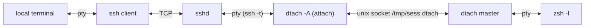
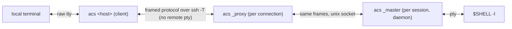
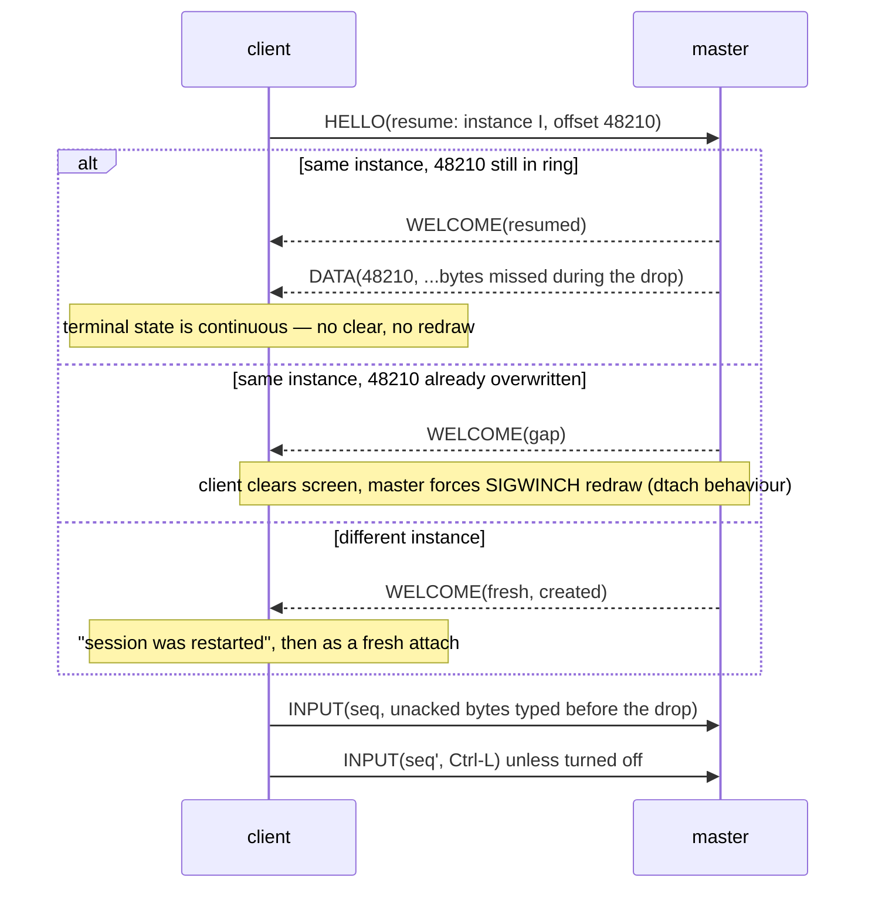
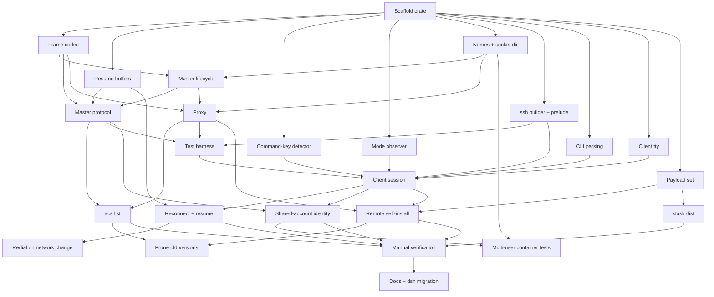

# acs — design

**Status:** Built — acs v1 implemented and verified (see
[VERIFICATION.md](VERIFICATION.md)).

`acs` (*Ad-hoc Connectivity Shell*) replaces the `dsh` shell function (`ssh` +
`dtach`) with **one Rust binary** that is both the local client and the remote
session holder. It keeps the property `dsh` exists for — an **unfiltered** byte
stream between the remote program and the local terminal — and adds what `dsh`
cannot do: lossless resume after a network drop, a local command key, and
self-installation on the remote.

## 1. What exists today

### 1.1 `dsh` (`~/.zshrc`)

```text
dsh <host> [session]        attach or create (session defaults to "main")
dsh <host> [session] -r     redial automatically after a drop
dsh <host> --list           list sessions on <host> and whether attached
```

It runs, per connection:

```sh
ssh -t "$host" "dtach -A /tmp/${sess}.dtach -r winch -z zsh -l"
```

- `-A` attach-or-create, `-r winch` redraw by SIGWINCH on attach, `-z` no
  suspend key; detach key is dtach's default **Ctrl-\\**.
- `-r` wraps that in a loop: `ServerAliveInterval=15`, `ServerAliveCountMax=3`,
  exponential backoff 1 s → 30 s (reset after a connection that lasted 30 s),
  and it **guesses** a clean end from the exit code (`0` or `130`).
- `--list` runs a `sh` script on the host that globs `/tmp/*.dtach` and counts
  `dtach` processes in `ps` output per socket: 0 = stale, 1 = detached,
  2+ = attached.
- Session names are restricted to `[A-Za-z0-9._-]`.

The comment above it states the requirement: *dtach proxies the pty
byte-for-byte, so the local terminal's scrollback keeps working — which is the
whole reason for not using mosh/screen/tmux.*

### 1.2 dtach (0.9, ~1.7 kLOC C)



- **Master**: `forkpty`s the command, `setsid`, listens on a unix socket, one
  `select` loop. Output is read in 4 KiB chunks and written raw to every
  *attached* client.
- **Client → master** is a fixed 10-byte packet: `type` (PUSH, ATTACH, DETACH,
  WINCH, REDRAW), `len`, and an 8-byte payload (keystrokes or a `winsize`).
  **Master → client** is the raw pty stream with no framing at all.
- **Attach** puts the local tty in raw mode, clears the screen (`ESC[H ESC[J`),
  sends ATTACH, then REDRAW with the window size; the master sets the size and
  `SIGWINCH`es the foreground process group.
- **With no attached client the master still reads the pty and discards the
  output**, so the program never blocks — and everything it printed while you
  were away is gone.
- **Backpressure**: while a client is attached but not writable, the master
  stops reading the pty, so a slow link slows the producer.
- The socket's `S_IXUSR` bit is set while a client is attached (usable as an
  "attached?" probe, which `dsh --list` does not use).

### 1.3 What that combination gets wrong

| Problem | Cause |
| --- | --- |
| Output while the link was down is lost | dtach discards output with no attached client, and bytes in flight in the dead TCP connection are gone |
| Drop detection takes up to 45 s | Relies on ssh `ServerAlive` (15 s × 3) |
| Clean end vs. drop is a guess | Only the ssh exit code (`0`/`130`) is available |
| Two ptys in the path | `ssh -t` allocates a remote pty just to carry dtach's raw stream |
| `TERM` travels only via `ssh -t` | No explicit negotiation of `TERM`/`COLORTERM` |
| Sessions in world-shared `/tmp` | `/tmp/<sess>.dtach` collides between users and leaks names |
| `--list` parses `ps` | No way to ask the master directly |
| Local terminal left in mouse/alt-screen mode after a drop | Nothing resets the modes the remote TUI turned on |
| Reconnect can hang on a dead ssh multiplexer | `~/.ssh/config` has `ControlMaster auto`; a reconnect can try the dead master's socket |
| Remote needs dtach installed | Package-manager dependency on every host |

## 2. Goals and non-goals

### Goals

1. **Unfiltered stream.** Pty output reaches the local terminal byte-for-byte,
   and keystrokes reach the pty byte-for-byte (except the command key, §6).
   No terminal emulation, no screen model, no rewriting — so local scrollback,
   mouse reporting, OSC 52 clipboard, hyperlinks, kitty graphics and keyboard
   protocols, and terminal queries/replies all work as if you had run `ssh -t`.
2. **One binary** for both sides and for both client platforms (macOS and
   Linux), statically linked on Linux, that can install itself on a remote
   (§8). Slim build < 1 MB; with the embedded Linux payloads < 2 MB.
3. **Survive network interruption** with no lost output, and detect a dead link
   in seconds rather than a minute.
4. **Command mode** on a double-tap of Ctrl-] (§6): `d` detach, `x` exit.
5. Drop-in for `dsh`: same arguments, same session names, same default shell.

### Non-goals

- A multiplexer (no panes, windows, or copy mode — that is tmux).
- Predictive local echo or UDP roaming (mosh). The transport stays ssh.
- Adopting existing dtach sessions — both can run side by side during migration.

## 3. Architecture

One executable, `acs`, with three roles. The user only ever types the first;
the other two are hidden subcommands the binary invokes on the remote.



| Role | Runs where | Lifetime | Job |
| --- | --- | --- | --- |
| **client** | local | one terminal session, across reconnects | raw mode, command key, resize, reconnect loop, renders pty bytes to stdout |
| **proxy** | remote, spawned by `sshd` | one ssh connection | find or start the master, then relay frames between ssh's stdio and the master's socket |
| **master** | remote, daemonised | the session | own the pty and child, keep the output ring, serve one active client |

Why keep a separate proxy rather than have the master talk to ssh: the master
must outlive every ssh connection, and `sshd` must see its channel close when
the connection ends. The proxy is a dumb relay — ~100 lines — so all state
lives in the master and the client.

**Transport** is `ssh -T -e none -o ControlMaster=no -o ControlPath=none
-o ServerAliveInterval=0 -o ConnectTimeout=10 <host> <remote command>`:

- `-T`: no remote pty. The ssh channel is an 8-bit clean pipe carrying frames;
  the only pty is the master's. One pty instead of two.
- `-e none`: ssh's `~.` escape is off (it is already off without a tty; this
  makes it explicit).
- `ControlMaster=no`, `ControlPath=none`: the session gets its own TCP
  connection, so a reconnect never waits on a dead multiplexer; the session
  menu rides that connection too (§4.4). Side commands (`acs list`, install)
  keep using the user's multiplexing; `acs list` on
  every alias adds `BatchMode=yes` and `ConnectTimeout=10` (§7.3).
- `ServerAliveInterval=0`: liveness is ours (§5.3), much faster than ssh's.
- `ConnectTimeout=10`: a redial into a dead network fails fast and the
  client returns to its backoff wait, where `d` still detaches (§6.1).
- Everything else — keys, agent, `ProxyJump`, host aliases — comes from the
  user's ssh config unchanged, plus any ssh options given on the `acs`
  command line (`-i`, `-p`, `-J`, `-F`, `-o`; §7.1). `acs` opens no ports
  and has no auth of its own.

**No ssh-side configuration.** The client runs the system `ssh` binary as a
child process; the `-o` options above are per-invocation overrides and never
touch `~/.ssh/config` or `sshd_config`. The remote needs only what `dsh`
needs today — `sshd` allowing a command, and a POSIX `sh` — plus `gzip` and a
writable `~/.local/share/acs` for self-install (§8). Hosts that pin what ssh
may run (`ForceCommand`, `command=` in `authorized_keys`, restricted shells)
cannot work, as they cannot with `dsh`.

**Noise before the protocol.** Shell startup files sometimes print to stdout
even for non-interactive sessions (an `echo` in `.bashrc`, a `motd` script),
and those bytes would arrive ahead of the first frame. The remote side
therefore writes a marker line, `ACS-READY <proto version>\n`, immediately
before its first frame; the client discards everything before the marker (and
shows it on stderr under `-v`), then switches to frames. `ACS-NEED` (§8) is
found the same way.

## 4. Remote side

### 4.1 Session directory and naming

- Directory: `$ACS_SOCKET_DIR` if set, otherwise `/tmp/acs-$UID/` — keyed by
  the numeric uid from `getuid()`, never `$USER`. Not `$TMPDIR`: it can differ
  between login paths for the same user (`pam_tmpdir`, macOS per-session
  values), and a session must be found the same way from every ssh login.
  Created `0700`; see §4.5 for how it is checked.
- Socket: `<dir>/<session>.sock`. Names keep `dsh`'s `[A-Za-z0-9._-]` rule;
  every session has one (§4.4).
- **Not `$XDG_RUNTIME_DIR`**: `systemd-logind` deletes it when the user's last
  login session ends, which would orphan every master. (On hosts with
  `KillUserProcesses=yes` the master itself is killed too — as dtach is today;
  the fix there is `loginctl enable-linger`, which `acs` should mention in its
  error when it detects a master died that way.)
- `systemd-tmpfiles` may age files out of `/tmp`; the master re-checks its
  socket every minute and re-binds it if the path is gone — recreating the
  directory, with the same checks, if that went too (tmux's `SIGUSR1`
  recovery, made automatic).

### 4.2 Master

- Started by the proxy when `connect()` gets `ENOENT`/`ECONNREFUSED` (stale
  socket is unlinked first). Double-fork, `setsid`, stdio to `/dev/null`, bind
  the socket **before** forking the shell, then report readiness to the proxy
  over a pipe so the proxy never races the bind (dtach's `statusfd`).
  Creation holds `flock(<dir>/<session>.lock)` so two simultaneous attaches do
  not start two masters.
- Child: `$SHELL -l` in `$HOME` by default (`dsh` hardcodes `zsh -l`),
  overridable with `acs <host> [session] -- <command…>`. Environment gets
  `TERM` and `COLORTERM` from the client's HELLO (ssh `-T` no longer sends
  `TERM`), plus `ACS_SESSION=<name>`.
- **Output ring**: every byte read from the pty is appended to a ring buffer
  (default 1 MiB, configurable) and given a monotonically increasing `u64`
  offset. The ring is what makes resume lossless (§5.2).
- **Backpressure**: while a client is attached, the master stops reading the
  pty once unsent bytes would overwrite ring data the client has not received —
  the same slow-link backpressure dtach has. **With no client attached** it
  keeps reading and lets the ring wrap, so a detached program never blocks.
- **One active client.** A new attach takes over and the previous client gets
  `TAKEOVER` and exits with a message. Takeover is required anyway: after a
  drop, the old connection can look alive on the server for a while. (dtach
  allows several mirrored clients; nobody uses that with `dsh`, and two
  terminals fighting over the window size is worse than a clean handover.)
  Takeover is silent only when the new client has the **same client
  identity** as the attached one; otherwise it needs confirmation (§4.5).
- **Resize**: `TIOCSWINSZ`, which makes the kernel `SIGWINCH` the foreground
  group when the size changes. To force a redraw when the size is *unchanged*
  (fresh attach), signal `tcgetpgrp(pty)` with `SIGWINCH` directly — dtach's
  `-r winch`.
- **Child exit**: the master reaps it, sends `EXIT{status}` to the client,
  unlinks the socket, and exits.
- **Kill** (`x`, §6): `SIGHUP` to the child's process group, then `SIGKILL`
  after 3 s if it is still alive; then as child exit.
- **Instance id**: a random `u64` minted at creation and sent in `WELCOME`, so
  a client resuming into a *new* master with the same name (the old session
  ended and something recreated it) is told so instead of being handed offsets
  from a different stream.

### 4.3 Proxy

`acs _proxy <session> [--create] [--proto N]` — connect (or start and connect)
the master, then splice bytes both ways until either side closes. It does not
parse frames beyond checking the protocol version in the HELLO. `acs _proxy
--list` enumerates `<dir>/*.sock`, sends each master `STATUS`, and prints name,
attached/detached, the client identity attached (or last attached), created-at,
idle time, child command, and size. Sockets that
refuse connections are reported stale and removed — no `ps` parsing.
`acs _proxy --pick` serves the session menu (§4.4) on the session's own
connection. After `ACS-READY` it sends the list as `--list` does, one
`STATUS_REPLY` per session, closed by `LIST_END`, since the connection
stays open. It then reads the client's frames:

- `END_SESSION <name>` (the menu's `x`): it sends that master `KILL`, as
  `x` inside the session does, and waits until the master has exited — it
  holds the connection open until then, at most the 3 s kill grace and
  some, 10 s in all — then sends the list again, after an `ERROR` frame if
  the session was not there or did not end. Only the user's own masters can
  be reached (the per-uid directory and the peer-uid check, §4.5), so
  nobody else's session can be ended this way.
- `HELLO`: the session and mode the client settled on, as the proxy's own
  arguments give them on a plain session call; an empty name with `create`
  is a new numbered session, chosen under the directory lock as `--new`
  does. The proxy connects to or starts that master and from there is the
  ordinary relay, the HELLO checked and forwarded as usual. It prints no
  second marker.
- End of input (the user left the menu): it exits, starting nothing.
  Anything else is an `ERROR` (bad request).

### 4.4 Session names and getting back in

"Reconnect" covers two different situations, and only one of them needs you to
know anything:

- **Resume** — the link dropped but the local `acs` process is still running.
  That process already holds the host, the session name, the master's
  instance id and the output offset, so it redials and resumes by itself
  (§5.2, §5.3). You never type a name. This is what "reconnect on by default"
  means.
- **Re-attach** — the local client is gone: you pressed `d`, closed the
  terminal window, rebooted the laptop, or the client was taken over. A new
  client has to name the session, so every session always has a name.

| Command | Session |
| --- | --- |
| `acs <host>` | a detached session picked from a menu; with none detached, a new one — `main` (or `$ACS_DEFAULT_SESSION`, §4.5) if that name is free, else as `--new` |
| `acs <host> <name>` | `<name>` — attach, or create it if absent |
| `acs <host> --new` | a new session named with the lowest free number: `1`, `2`, … (picked under the directory lock, so two `--new`s never collide) |
| `acs list <host>` | list sessions: name, attached/detached, idle time, command; in a terminal, the session menu below whatever is detached |
| `acs list` | the same for every host alias at once, with a HOST column; in a terminal, the session menu over every host (§7.3) |

So the unnamed case is covered two ways: plain `acs <host>` offers what is
there to get back into, and `--new` gives short numeric names (as tmux
does) for when you want a second session without inventing a name.

**The session menu.** Plain `acs <host>` dials its session connection
with `_proxy --pick` (§4.3) and gets the host's sessions on it first. The
menu, ending sessions with `x`, and the attach all go over that one
connection: one ssh handshake (and one hardware-key touch) from the list to
the session, where a separate `_proxy --list` side call used to cost a second
(decision 8). Then:

- **No session detached** (none at all, or all attached elsewhere): a new
  session, without a menu — named `main` (or `$ACS_DEFAULT_SESSION`) if no
  session has that name, otherwise the lowest free number, as `--new`.
  A host without acs has no sessions; the attach installs it (§8).
- **Some detached**: a menu (`menu.rs`, a pure state machine from keys to
  choices; `pick.rs` drives it), drawn on the **alternate screen** so that
  leaving it — by any way, including a fatal signal or a panic, through
  the same emergency restore as raw mode (§7) — puts back exactly what the
  terminal showed:

  ```text
  acs: detached sessions on devbox

       NAME  STATE     WHO           IDLE  AGE  COMMAND
  > 1  main  detached  (michel@mbp)  4m    1d   /bin/zsh -l
    2  work  detached  (michel@mbp)  2h    3d   htop
    n  new session
       exit

  1-9, or ↑↓ jk and Enter: attach   .: all   x: end   n: new   Esc: leave
  ```

  The cursor's row is reversed in a bar as wide as the widest row listed
  (or the terminal, if narrower), so it keeps its width from row to row;
  widths are in terminal columns, a wide character counting two.

| Key | Effect |
| --- | --- |
| `1`–`9` | attach that session at once; with more than nine, the rest have no number and are reached with the cursor |
| ↑ ↓, `k` `j` | move the cursor (it stops at the ends); a short screen scrolls to keep it in view |
| Enter | attach the session under the cursor; on *new session*, create one (named as above); on *exit*, leave |
| `n` | create a new session |
| `.` | show attached sessions too, or hide them again. Picking an attached session asks `session 'x' is attached from alice@laptop — take over? [y/N]`; `y` attaches with `force`, the `--force` path of §4.5 (and `--force` on the command line skips the question) |
| `x` | end the session under the cursor, after `end session 'x'? y (or x) ends it`: `END_SESSION` on the menu's connection (§4.3), then the menu shows the sessions left and what happened |
| Esc | leave, exit status 0 — at any point, a question pending or not. A lone ESC waits 100 ms for the rest of an arrow key's sequence (as the session's input does for an incomplete sequence, §6.3), so it is never taken for one |
| Ctrl-C | leave, exit status 130 |

- **Without a terminal** — stdout not a tty (stdin must be one anyway,
  §7) — there is no menu and no list call: plain `acs <host>` attaches
  `main` (or `$ACS_DEFAULT_SESSION`), creating it if absent, as before
  the menu.
- The list and the attach reach the **same machine**: an alias
  (`[user@]<alias>`, §7.3) is resolved once, before the list, and the
  first connection uses that resolution; only a redial resolves again.
- A host that cannot be reached, or answers the list with garbage, fails as
  `acs list <host>` does (255, or 1), with the same message. The first
  connection's deadlines (§5.3) apply: to its marker, then to each list.
- A host **without acs** answers the pick call with `ACS-NEED`, as any
  call: the client closes it and attaches `main` (or the default name) by
  the ordinary session call, which installs acs first (§8). A fresh host
  has no sessions to pick from.
- A session picked from the menu is attached with `attach-or-create`: if
  it ended in the meantime, the client says `new session '…'` as it would
  for a typo.
- The connection **sits idle** while the user reads the menu: no liveness
  pings run before `WELCOME` (§5.3). If it has died meanwhile — the attach
  on it is lost before any `WELCOME` — the client dials the chosen session
  once more with the ordinary session call instead of giving up. Redials
  later always use that call too: they know the session.

To keep a session findable, the client says what it did **outside** the
session's byte stream — on stderr, before raw mode starts or after the
terminal is restored:

- When it **creates** a session (by `--new` or because the name did not exist):
  `acs: new session 'mian' on devbox`. A typo in a name therefore shows up
  immediately instead of as a mystery session in a later `acs list`.
- When it **ends without the session ending** (detach, takeover, reconnect
  abandoned with `d`):
  `acs: detached from devbox/2 — reattach with: acs devbox 2`.
- Inside the session `ACS_SESSION=<name>` is set, so the shell prompt or
  `echo $ACS_SESSION` can show it.

If you still lose track, plain `acs <host>` shows what is detached there,
`acs list <host>` shows everything, and `acs list` does for every host
in the configuration. `acs <host> <name>` never depends on what else
happens to exist; plain `acs <host>` now does, on purpose (§12, decision 7).

### 4.5 Multiple users on one host

Nothing on the remote is shared between invocations except the filesystem:
no system daemon, no root, no shared socket, no port. Each master belongs to
the user who started it. Two cases need care.

#### Different Unix accounts — isolation

| Concern | Handling |
| --- | --- |
| Session names collide (`main` for everyone) | One directory per uid: `/tmp/acs-1000/main.sock` and `/tmp/acs-1001/main.sock` are unrelated |
| Another user pre-creates `/tmp/acs-<my uid>` (squatting, or a symlink to redirect sockets) | After `mkdir` (or on `EEXIST`), `lstat` the path: it must be a real directory, not a symlink, owned by my uid, mode `0700`. Otherwise refuse with an error naming the owner, and suggest `ACS_SOCKET_DIR`. The sticky bit on `/tmp` stops others from deleting it once it is mine |
| Another user connects to my socket | The directory is `0700`, and additionally the master checks the peer's uid on every accepted connection (`SO_PEERCRED` on Linux, `getpeereid` on macOS) and closes anything that is not its own uid. `root` can always get in; nothing can stop that |
| Binaries | Installed per user under `~/.local/share/acs/` (§8); no user runs another's binary |
| `x` kills something else | The master signals only its own child's process group |
| Session names visible to others | `ps` shows `acs _master <name>` to other users unless `/proc` is mounted with `hidepid`; the name is not a secret, but that is where it shows |

#### One account, several people — no accidents

On edge devices and shared lab boxes several people often log in as the same
account (`root`, `ubuntu`). There is no security boundary between them — the
same uid can always read the same sockets — so the aim is only that nobody
steals or breaks someone else's session **by accident**:

- **Client identity.** `HELLO` carries a display identity,
  `<local user>@<local hostname>` (for example `michel@mbp`), overridable with
  `ACS_IDENTITY`. The master records it for the attached client and for the
  session's creator.
- **Takeover across identities needs confirmation.** If the session is attached
  by a different identity, the master answers `BUSY{identity, since}` instead
  of `WELCOME`, and the client asks on the terminal:
  `session 'main' is attached from alice@laptop since 10:02 — take over? [y/N]`.
  `--force` skips the question; without a terminal the attach fails. The same
  identity (your own dropped connection, your own second terminal) takes over
  silently as before.
- **`acs list` shows who** is attached and who created each session, so picking
  another name is easy.
- **Default name per person** when an account is shared: `ACS_DEFAULT_SESSION`
  (e.g. set to `$USER` in each person's local shell) replaces `main` as the
  name plain `acs <host>` gives a new session, and as what it attaches
  without a terminal for the menu (§4.4). `main` stays the default
  otherwise, for `dsh` compatibility. The menu itself shows every detached
  session, with who last had each, and asks before taking over an attached
  one.
- **Different `acs` versions side by side.** Binaries are installed per
  version (§8), so a colleague with a newer or older client never overwrites
  the binary your sessions run on, and two clients never ping-pong upgrades.

## 5. Protocol

### 5.1 Frames

Length-prefixed, same format on the ssh leg and the unix-socket leg:

```text
+--------+-----------+-----------------+
| type u8| len u32 BE| payload[len]    |
+--------+-----------+-----------------+
```

| Type | Dir | Payload |
| --- | --- | --- |
| `HELLO` | c→m | proto version, session, mode (`attach`/`create`/`attach-or-create`), client identity, `force` flag, `TERM`, `COLORTERM`, cols, rows, xpixel, ypixel, optional `resume{instance, output_offset}` |
| `BUSY` | m→c | identity attached and since when; the client may retry `HELLO` with `force` (§4.5) |
| `WELCOME` | m→c | proto version, instance id, current output offset, `created` flag, `resumed` / `gap` / `fresh`, input sequence (bytes written to the pty so far — input sequence numbers count in the master's stream, so clients taking turns never collide) |
| `DATA` | m→c | `u64` offset of first byte, then raw pty bytes |
| `INPUT` | c→m | `u64` sequence of first byte, then raw bytes for the pty |
| `ACK` | m→c | highest input sequence written to the pty |
| `RESIZE` | c→m | cols, rows, xpixel, ypixel |
| `PING` / `PONG` | both | `u64` nonce |
| `DETACH` | c→m | — |
| `KILL` | c→m | — (also from the proxy for the menu's `END_SESSION`, before any HELLO: the master ends the session and holds that connection until it exits, §4.3) |
| `EXIT` | m→c | child wait status |
| `TAKEOVER` | m→c | — (another client attached) |
| `STATUS` / `STATUS_REPLY` | proxy↔m, proxy→c | session metadata for `acs list` and the session menu |
| `ERROR` | m→c | code, message |
| `END_SESSION` | c→proxy | session name: end it, then list again (`_proxy --pick`, §4.3) |
| `LIST_END` | proxy→c | — the `STATUS_REPLY` frames before it are the whole list (`_proxy --pick`) |

`END_SESSION` and `LIST_END` pass only between a client and a proxy of
its own version (§8), never to a master, so they need no protocol version
of their own.

Pty bytes are carried as opaque payload and written verbatim; framing is
invisible to the terminal. That is the unfiltered guarantee, restated in wire
terms.

### 5.2 Resume



- **Output**: the client records the offset of the last byte it wrote to its
  stdout. On reconnect the master replays from there. The local terminal has
  seen exactly the stream it would have seen without the drop, so its state —
  alternate screen, modes, scrollback — is correct with no redraw.
- **Input**: the client keeps bytes sent but not yet `ACK`ed and resends them
  on resume; the master discards any sequence it already wrote, so nothing is
  typed twice. Keys typed **while the client knows the link is down** are
  dropped rather than queued: blind typing into a frozen screen replayed
  seconds later is how accidents happen. (Command-mode keys still work — §6.)
- **Fresh attach** (new client, e.g. after an explicit detach or from another
  machine) does **not** replay the ring: the local terminal's state is unknown,
  and replaying mode-changing sequences into it is unsafe. It behaves like
  dtach: clear screen, set size, force redraw.
- **Ctrl-L after reconnecting.** Whenever the client attaches to a session
  that was already there — a resume (lossless or after a gap), a re-attach
  by a new client, a takeover — it sends the program one Ctrl-L (`0x0c`),
  which shells and most full-screen programs take as "repaint the screen".
  Not to a session it has just created (`WELCOME` says `created`): a new
  program has nothing to repaint.
  - It is **input**, not a terminal operation: an `INPUT` frame queued
    right after `WELCOME`, behind the resent unacked bytes and ahead of
    anything typed from then on — so the program sees the keys in the order
    they were typed, with the Ctrl-L where the reconnect happened. Being
    input, it is tracked like a key: if the link drops again before the
    `ACK`, the next resume resends it and the master's dedupe writes it
    once; that resume then adds its own.
  - It is **added** to the redraws above, not instead of them: a fresh
    attach or a gap still clears the screen and gets the master's
    `SIGWINCH`, and a resume after a status line still sends the two
    `RESIZE` frames (§5.4). Programs that ignore Ctrl-L repaint as before;
    a shell at its prompt, which redraws at most its own line on
    `SIGWINCH`, now clears the screen and repaints its prompt.
  - Never **inside a bracketed paste**: the client follows the paste
    markers in the input it has sent (`keys::PasteTracker`), and when the
    drop cut a paste off after its `CSI 200 ~` but before its `CSI 201 ~`,
    the Ctrl-L is left out — it would land in the pasted text.
  - A program reading raw input receives a form feed, and a line-reading one
    a `^L` at the start of the next line; vim in Insert mode inserts it.
    Hence the switch: `redraw_on_reconnect: false` (§7.2), globally or on an
    alias (§7.3), and `ACS_REDRAW_ON_RECONNECT` over both (`0` off, `1`
    on). The environment wins, then the alias's own setting, then the
    global one; the default is on.

### 5.3 Liveness and reconnect

- Each side sends `PING` after 3 s of silence. The client declares the link
  dead after **10 s** with no frame received, kills its ssh child, and redials.
  Drop detection falls from dsh's 45 s to 10 s.
- Reconnect is **on by default**: the protocol distinguishes a clean end (`EXIT`,
  `DETACH` acknowledged, `TAKEOVER`) from a drop, so there is nothing to guess.
  `--no-reconnect` restores `dsh`'s default behaviour. Backoff 1 s → 30 s,
  reset after a connection that lasted 30 s (as in `dsh`), plus an immediate
  retry when the local host's default route changes (Wi-Fi switch, laptop
  wake) where the platform exposes that cheaply.
- Authentication prompts on reconnect (password, hardware key touch) are
  passed through, because ssh gets the controlling tty for prompts even with
  `-T`; the client restores cooked mode while ssh is authenticating. With
  keys in an agent, reconnect is silent.
- **Before the first WELCOME there is a deadline too**: liveness only starts
  with WELCOME, and `ConnectTimeout` only covers the TCP connect, so a host
  that accepts and then says nothing would otherwise hold the client forever.
  A connection has 30 s on a redial — then it is dropped and the client goes
  back to its backoff wait, where the command keys work — and 120 s on the
  first connection (time for a password), then the client exits 255, for the
  marker and again for the handshake (`ACS_DIAL_TIMEOUT_MS` sets both). A
  takeover question restarts the handshake's clock.

**Persisting.** By default the client gives up where there is no session to
keep: no host of an alias answers at the start, the first connection fails,
or the link is lost before the first `WELCOME` — each exits 255. With
`--persist`, `persist: true` or `ACS_PERSIST=1`, a lost host is never given
up on; it is waited for with pings (`alias.rs`, the ping of §7.3) instead
of ssh dials:

- **The ping gate**: while the host is lost it is pinged every
  `reachability_interval` (default 5 s, §7.2), and dialled only once it
  answers — at once, too, after a network change (netwatch). An alias is
  resolved again each time, so the first of its hosts to answer is the one
  dialled (§7.3); a plain host is pinged itself. A host that answers but
  whose ssh is not up yet gets a dial that fails and the gate again.
- **Everywhere a host is lost**: after a drop (replacing the 1 s → 30 s
  backoff for a host that can be pinged), and at the start — an alias none
  of whose hosts answers, a menu (§4.4) or first connection that cannot be
  dialled, a link lost before any session. Before a session exists the
  terminal is still cooked: acs says it is waiting once, shows the status
  line of §5.4 while it waits, and Ctrl-C gives up; after one, the command
  keys work as in the backoff wait (Ctrl-] Ctrl-] `d` detaches).
- **Hosts that drop pings** cannot be gated: an alias whose hosts all have
  `reachability_check: false` keeps the dial backoff while persisting.
- **Which setting**: `--persist` over everything, then `ACS_PERSIST` (`0`
  off, `1` on), then the `persist` of the alias's entry in use, the
  alias's, the global one (default off). Before any entry answered, the
  alias's decides. `--persist` and `--no-reconnect` contradict each other
  and together are a usage error.

### 5.4 Status while disconnected

Anything the client prints corrupts the screen the remote program drew, and a
lossless resume will not repaint it. So:

1. While the link is merely quiet (< 10 s), print nothing.
2. Once declared dead, write one status line on the bottom row using
   save-cursor / restore-cursor, and set the window title with the xterm title
   stack (push `CSI 22;0 t`, pop `CSI 23;0 t`) so the remote's title comes
   back afterwards.
3. After a successful resume that followed a printed status line, force one
   redraw to clean up the line: the client sends two RESIZE frames (one row
   fewer, then the real size), since an unchanged size raises no `SIGWINCH`.
   Full-screen programs repaint; a plain shell prompt may leave the line in
   scrollback, which is acceptable. The Ctrl-L every resume sends (§5.2,
   unless turned off) makes a shell clear and repaint too.
4. Whatever ends the client — resume, detach, or the session ending while
   the link was down — pops the title and blanks the status row on the way
   out, so the terminal is left as it was. While offline, the command key
   uses the same key and window (`ACS_ESCAPE_TIMEOUT_MS`) as online.

## 6. Command mode

### 6.1 Behaviour

| Keys | Effect |
| --- | --- |
| Ctrl-] | Held for up to **400 ms**. If nothing else arrives, it is sent to the remote. |
| Ctrl-] then any other key within 400 ms | Both keys sent to the remote, in order, immediately. |
| Ctrl-] Ctrl-] within 400 ms | Enter command mode: the next key is a command. The terminal bell rings. |
| … then `d` | **Detach.** `DETACH` to the master, restore the local terminal, exit 0. The session keeps running. Works even while the link is down (it is purely local then). |
| … then `x` | **Exit.** `KILL` to the master, wait for `EXIT`, restore the terminal, exit with the child's status. Needs the link; if it is down the client says so and stays in the session. |
| … then any other key, or nothing for 2 s | All the held keys are sent to the remote as typed. |

The only cost is that a lone Ctrl-] reaches the remote up to 400 ms late. The
window is a setting (`ACS_ESCAPE_TIMEOUT_MS`), and so is the key.

Command mode prints nothing on the screen — it only rings the bell (below):
the local terminal shows only what the remote sent. The table is intended to
grow — `r` (force redraw) and `?` (help, followed by a redraw) are obvious
next entries — but only `d` and `x` are in scope.

**The bell.** Entering command mode rings the terminal bell (`BEL`, `0x07`),
so the user knows the next key is a command. It is on by default;
`command_bell: false` (§7.2) turns it off, and `ACS_COMMAND_BELL` overrides
the file (`0` off, `1` on). The bell does not break the transparent stream:

- The client writes it to the **local terminal**, as it writes the status
  line (§5.4). Nothing is added to the program's input, and the output bytes
  are unchanged — the bell goes between them.
- It goes only at a **boundary** of the output: not inside an escape
  sequence, not inside a UTF-8 character, and above all not inside an
  OSC/DCS/APC/PM/SOS string, which a `BEL` would end early (an unfinished
  title or OSC 52 copy would be cut short). The mode observer (§6.4) already
  lexes the output and knows where it is. If the output is inside such a
  sequence, the bell waits and is written as soon as the output reaches a
  boundary — right after the ST or `BEL` that ends the string. It is dropped
  if command mode ends first (a key, or the 2 s timeout), so a late bell never
  announces a command mode that is over.
- It rings only when command mode arms and then waits: Ctrl-] Ctrl-] and the
  command key arriving in one read (a paste without bracketed paste, or
  typed faster than the terminal is read) need no announcement. Inside a
  bracketed paste the escape key is never recognised (§6.3), so it never
  rings there.
- The same holds while the link is down (§5.4), where the offline wait arms
  command mode with the same detector.

### 6.2 Is Ctrl-] a good choice?

Ctrl-] is byte `0x1D`. Who uses it:

| Program | Use | Double-tap within 400 ms plausible? |
| --- | --- | --- |
| vim / neovim | jump to tag (`:help` links, ctags, LSP go-to-definition) | Rare. Two jumps in a row is possible but not fast |
| emacs | `abort-recursive-edit` | Rare |
| telnet | escape character | Only if you run telnet inside the session |
| bash / zsh line editors | jump to next occurrence of a character (readline `character-search`, zsh `vi-find-next-char`) | No — rarely used, and a double tap only searches for `^]` |
| Claude Code, less, htop, git TUIs | nothing | No |

The alternatives are worse. **Ctrl-\\** (dtach's default) is SIGQUIT in every
shell. **Ctrl-^** is vim's alternate-buffer switch, which people double-tap
constantly. **Ctrl-_** is undo in readline and emacs. **Ctrl-]** is the
traditional escape for remote-terminal tools (telnet, `virsh console`), and
the double tap makes a clash with vim's tag jump very unlikely.
**Recommendation: keep Ctrl-] Ctrl-]**, configurable.

### 6.3 Recognising the key — three encodings

Modern TUIs change how the local terminal encodes Ctrl-]. The detector must
match all of these, or command mode silently breaks inside exactly the
programs this tool exists for:

| Mode (turned on by the remote program) | Bytes for Ctrl-] |
| --- | --- |
| legacy | `1D` |
| kitty keyboard protocol (`CSI > flags u`) | `CSI 93 ; 5 u`; with event types `CSI 93 ; 5 : 1 u` (press), `: 2` repeat, `: 3` release |
| xterm `modifyOtherKeys` level 2 | `CSI 27 ; 5 ; 93 ~` |

Rules:

- The detector sits on the **input** path and consumes whole escape sequences,
  so it never matches inside a longer sequence, and a sequence split across two
  `read()`s is buffered until complete.
- A release event for a held or consumed Ctrl-] goes where its press went
  (forwarded together, or swallowed together), so the remote never sees an
  unmatched release.
- **Bracketed paste** (`CSI 200 ~` … `CSI 201 ~`) is forwarded untouched: a
  pasted `0x1D 0x1D d` must not detach you.
- Terminal replies to remote queries (DA, OSC 11, `CSI ? u`, XTVERSION) start
  with `ESC`, never with a held key, so they are never delayed. They, mouse
  reports and focus events are forwarded at once and do not break a pending
  double tap.
- One exception to reassembly: a read that ends in a **lone `ESC`** is the Esc
  key and is sent at once — vim users press it constantly, and delaying it is
  worse than missing the rare escape-key sequence split right after its first
  byte. An incomplete `CSI` at the end of a read is held for at most 100 ms.

### 6.4 Restoring the local terminal on detach

The remote program may have turned on terminal modes that should not outlast
the session: mouse reporting, bracketed paste, alternate screen, hidden cursor,
the kitty keyboard stack, `modifyOtherKeys`, focus events. dtach leaves them on,
which is why moving the mouse after a dropped `dsh` prints garbage.

The client runs a **passive observer** over the output stream: it scans for
the few mode-setting sequences above and records what is on. It never modifies,
delays or reorders the stream. On detach, exit, or an abandoned reconnect, the
client writes the matching resets (for example `CSI ? 1000 l`, `CSI ? 1049 l`,
`CSI < u`) and restores the original `termios`. On a successful resume it does
nothing, because the terminal state is still correct. A resume after a **gap**
clears the screen but keeps the recorded modes: the program is the same one,
still in them, so a later detach still resets them. A **fresh** attach to
another program (the session was restarted) writes the old program's resets
before clearing the screen and forgetting them.

## 7. Client

- Argument parsing matches `dsh`: `acs [ssh options] [user@]<host> [session]
  [--new] [--no-reconnect] [-- command…]` (§4.4, §7.1). `-r` is accepted and
  ignored, since reconnecting is the default.
- **Listing is a command**: `acs list [ssh options] [-v] [[user@]<host>]`
  lists one host's sessions, or without a host every alias's (§7.3). `list`
  is a reserved first argument, as `config` and `upgrade` are (§7.4), and
  the ssh options come after it. `dsh`'s `-l`/`--list` are gone: either is
  a usage error pointing to `acs list` (decision 9).
- `cfmakeraw`-equivalent `termios` (dtach's flags), restored on every exit
  path: normal, signal (`SIGHUP`, `SIGTERM`, `SIGINT` before raw mode), and
  panic (`panic = "abort"` plus a restore in a drop guard and a signal handler).
- `SIGWINCH` → `RESIZE`.
- Single-threaded `poll` loop over stdin, the ssh child's pipes, a self-pipe for
  signals, and a timer (escape timeout, pings) — the same shape as dtach.
- Exit status: the child's status after `EXIT` (128+n for signals), 0 on detach,
  and distinct codes for "host unreachable", "remote install failed" and
  "taken over".

### 7.1 ssh options

A handful of ssh's own options are accepted with ssh's spelling and meaning,
and passed **verbatim** to every ssh call `acs` makes — the session transport,
reconnects, `acs list` and remote install — so a host reachable as
`ssh -i ~/.ssh/id_work -p 2222 me@box` is reachable as
`acs -i ~/.ssh/id_work -p 2222 me@box`:

| Option | Meaning (as in ssh) |
| --- | --- |
| `-i <identity_file>` | private key to use; repeatable, ssh tries them in order |
| `-p <port>` | port |
| `-J <destination>` | jump host(s) |
| `-F <configfile>` | alternative ssh config file |
| `-o <option=value>` | any ssh config option; repeatable (e.g. `-o IdentitiesOnly=yes` to use **only** the `-i` key rather than the agent's keys first) |
| `[user@]host` | login name in the destination, as with ssh |

- **No `-l`**: ssh's `-l <login>` is not accepted (and `dsh`'s `-l`, its
  `--list`, is now `acs list`). The login name goes in `user@host` or
  `-o User=<login>`.
- `acs` does not interpret these values (a `~` in `-i` is expanded by ssh, as
  usual). `ACS_SSH` or `--ssh <path>` picks the ssh binary; default is `ssh`
  on `PATH`.
- **A key from the configuration**: an alias or one of its entries may name
  an `identity_file` (§7.2, §7.3), which `acs` passes as `-i` after the
  user's options — but only when those name no key, neither `-i` nor
  `-o IdentityFile` (any case, `=` or space): a key on the command line
  replaces the configured one rather than being tried alongside it.
- **Precedence**: ssh keeps the *first* value it sees for an option, so `acs`
  places the options its transport depends on (§3: `-T`, `-e none`,
  `ControlMaster=no`, `ControlPath=none`, `ServerAliveInterval=0`) **before**
  the user's. A stray `-o ControlMaster=auto` cannot break reconnects; every
  other option, including all `-i` keys, applies as given.

### 7.2 Configuration file

The client reads YAML settings from two files, following the XDG Base
Directory spec; either may be missing:

1. **global** `/etc/acs/config.yaml` (`ACS_GLOBAL_CONFIG` names another file,
   for packagers and tests), then
2. **local** `$XDG_CONFIG_HOME/acs/config.yaml`, by default
   `~/.config/acs/config.yaml`.

```yaml
install_on_remote: true        # install acs on a host that lacks it (§8)
update_check: true             # look for a newer release once a week (§7.6)
command_bell: true             # ring the bell when command mode arms (§6.1)
redraw_on_reconnect: true      # send Ctrl-L after reconnecting (§5.2)
reachability_timeout: 500ms    # how long hosts have to answer a ping (§7.3)
persist: false                 # wait for a lost host, pinging it (§5.3)
reachability_interval: 5s      # how often a lost host is pinged (§5.3)
aliases:                       # acs devbox tries its hosts in order
  devbox:
    - host: devbox.lan
      reachability_check: true # ping once first (the default)
    - host: devbox.example.com
      user: michel             # otherwise ~/.ssh/config decides
      identity_file: ~/.ssh/id_outside # this host's ssh key (-i)
      persist: true            # wait for this host when it is lost (§5.3)
      prefer: true             # used over devbox.lan when both answer (§7.3)
  lab:                         # an alias with settings of its own
    identity_file: ~/.ssh/id_lab # the key of every host naming none
    redraw_on_reconnect: false # over the global setting, for this alias
    reachability_timeout: 2s   # so is this
    persist: true              # and this, unless an entry says otherwise
    reachability_interval: 30s # and this
    prefer_local_network: true # hosts on this machine's networks first
    hosts:
      - host: lab.lan
```

- **Merging**: a setting in the local file replaces the global one — an
  alias's own settings too; mappings (`aliases`) merge key by key; lists
  (an alias's hosts) concatenate, global entries first. An empty value (`key:`)
  sets nothing.
- **Errors are not defaults**: a malformed file, an unknown key or a value of
  the wrong type stops the client with the file and line
  (`~/.config/acs/config.yaml:3: install_on_remote: expected true or false`).
  `--help` and `--version` do not read the files. The aliases' key was
  once `hosts`; a file that still says so is refused with
  `<file>:<line>: 'hosts' is now 'aliases': rename the key`, not as an
  unknown key. The words keep one meaning each: `aliases` maps alias names
  to their definitions, an alias's `hosts` lists its ways to reach it, and
  each entry's `host` is one address for ssh.
- **`install_on_remote: false`**: when the prelude reports `ACS-NEED` (§8)
  the client installs nothing; it says which host lacks which version, where
  the setting came from, and exits with the install-failed code (254).
- `aliases` is parsed and validated: `host` is required, `user`,
  `identity_file`, `reachability_check` (default `true`), `prefer`
  (default `false`, §7.3) and `persist` are optional, and one entry may be
  written without the list. How an alias is resolved is §7.3.
- **An alias's own settings**: an alias is a list of entries (or one entry,
  a mapping with `host`), or a mapping of its settings — `identity_file`,
  `redraw_on_reconnect`, `reachability_timeout`, `persist`,
  `reachability_interval` and `prefer_local_network` — and its `hosts`,
  that list. The list form
  stays the usual one; the mapping is only needed for a setting shared by
  the entries. A file may give the mapping without
  `hosts`, to set the key (or another setting) of an alias whose hosts are
  in the other file, but an alias with no host in either is an error (at
  its first definition). An `identity_file` is one path, not a list:
  several keys are a job for `~/.ssh/config`.
- **`reachability_timeout`** is a duration: `500ms`, `0.5s`, `2s`, or a
  bare number of seconds (`0.5`), to the millisecond, from 1 ms to 60 s;
  anything else is an error. The default is `500ms`, and an alias's own
  value replaces the global one (§7.3). `acs config` writes it back as
  `500ms` or `2s`. `reachability_interval` is written the same way, from
  100 ms to an hour (default `5s`).
- **`persist`** (§5.3) is true or false at three levels: a host entry's
  beats its alias's, which beats the global one; `--persist` and
  `ACS_PERSIST` beat them all.
- Only the local client reads the files; `_proxy`, `_master` and `_install`
  never do.

**Parser.** The files use a small subset of YAML — block mappings and lists,
plain and quoted scalars, one-line `[…]`/`{…}`, comments — parsed by hand in
`yaml.rs`, which refuses anchors, tags, block scalars and multi-line flow
collections with the line they are on. The tree keeps every node's line and
the comments around it, so a file rewritten by the client keeps its comments
and order. Measured on the release profile, a minimal load-and-dump binary
grows by about 100 KB with `yaml-rust2` and 150 KB with `serde_yaml`, and
neither keeps comments; the hand-written parser adds 17 KB to `acs` (slim
build 490 → 507 KB).

### 7.3 Host aliases

`acs [user@]<name>`, where `<name>` is a key of `aliases` (§7.2), connects to
one of the alias's entries instead of `<name>`:

- Entries are chosen **in order**: the first that answers a ping is used. One
  with `reachability_check: false` is used without a ping, for hosts that
  drop ICMP, as soon as every entry before it has not answered.
- **Preferred entries** (`prefer: true`) come first: the order is the
  preferred entries, then the rest, each group in configured order
  (`alias::ranked`; `acs config host list` shows it). So a preferred host
  that answers wins over an earlier unpreferred one that answered first —
  the choice waits for the preferred hosts' pings up to the deadline — and
  one that does not answer leaves the choice to the rest, in order. Several
  entries may be preferred; a preferred entry with
  `reachability_check: false` is used at once, as if listed first. This
  also lets a user's file pick the primary host of an alias whose other
  entries come from the global file, listed ahead of its own (§7.2). `-v`
  says when a host was used because it is preferred.
- **On a local network** (`prefer_local_network: true`, global or per
  alias, default off): entries whose host is on a network this machine is
  on come before all others — then `prefer`, then configured order. The
  client's networks are its up interfaces' addresses with their prefixes
  (`getifaddrs`: an IPv4 netmask, an IPv6 prefix length; `netmatch.rs`),
  leaving out loopback, link-local (it needs a scope) and a /0; a host is
  on one when any address its name resolves to (A and AAAA, the system
  resolver) falls inside it. Example: at home on 192.168.1.0/24, with
  `devbox.lan` resolving to 192.168.1.20, `devbox.lan` is used even when
  listed after `devbox.example.com`. A matched host must still answer its
  ping (unless `reachability_check: false`): the match only ranks it.
  - The names are resolved while the hosts are pinged, all at once and by
    the same deadline (`reachability_timeout`), so choosing still takes at
    most one deadline; every checked host is pinged, since the rank is
    known only once the names are. A name that does not resolve in time,
    or on no local network, is ranked as without the setting.
  - `-v` names the network a host is on (`devbox.lan is on the local
    network 192.168.1.0/24`) and says it when the host is used.
  - A redial resolves the alias again (below), so after a network change
    the match is made against the networks the machine is on then.
- The pings run **at once**: every entry with `reachability_check: true`
  (the default) that could be chosen — those before the first unchecked
  one — is pinged when the alias is resolved, each from a thread of its
  own. Entry *k* is taken as soon as it has answered and every checked entry
  before it has not, so the choice is exactly the one trying them one after
  another would make, only in at most one deadline instead of one per host.
  A later host that answers first waits for the earlier ones; `-v` lines
  and the "tried …" error keep the configured order.
- **The deadline** is `reachability_timeout` (§7.2): 500 ms by default, the
  alias's own value over the global one. An answer after it counts as none.
  acs keeps the deadline itself, to the millisecond, since macOS `ping -t`
  and BusyBox `-W` take whole seconds (and iputils `-W` fractions only in
  newer releases): it runs `ping -c 1` with a backstop of its own a second
  or more past the deadline (`-t` on macOS, `-W` on Linux), and when the
  deadline passes kills and reaps it. Once a host is chosen the others'
  pings are not waited for; they end at the deadline. `ACS_PING` names
  another program, which is how the tests avoid ICMP.
- The chosen entry becomes the ssh destination: `user@host` if it has a
  `user`, otherwise `host`, so `~/.ssh/config` decides the login name.
- **`user@<alias>`** goes through the alias the same way — same order, same
  pings, same fallback — and logs in as `user` on whichever entry is chosen,
  replacing the entry's own `user`. The destination is split at its **last**
  `@`, as ssh splits it (`a@b@devbox` is user `a@b`); an alias cannot
  contain `@` (§7.2), so the split is never ambiguous. `-v` says the login
  name came from the command line.
- **The ssh key** is the first of: a key on the command line (`-i` or
  `-o IdentityFile`, §7.1), the chosen entry's `identity_file`, the alias's
  `identity_file`. Only that one is passed; with none, ssh chooses as usual
  (`~/.ssh/config`, the agent). A leading `~/` (or a bare `~`) is expanded
  with `$HOME` by `acs`, as the shell expands a typed `-i`; `~user/…` and
  relative paths go to ssh as written (ssh tilde-expands `-i` itself, from
  the password database rather than `$HOME`). `-v` names the key and where
  it was set, or says the command line's replaces it. ssh still offers the
  agent's and its default keys after it unless `IdentitiesOnly` is set.
- **Ctrl-L after reconnecting** (§5.2): the alias's `redraw_on_reconnect`,
  when it has one, replaces the global setting for sessions reached through
  it, as `<alias>` or `user@<alias>`; `ACS_REDRAW_ON_RECONNECT` still wins.
- **None answers**: the client names every host it tried and exits with the
  unreachable code (255) without calling ssh — or, persisting (§5.3),
  pings them every `reachability_interval` until one answers.
- It applies to every ssh call — the session, `acs list`, install — since they
  share one destination and key. `-v` says which entry was chosen and why.
- **Redial**: a reconnect (§5.3) resolves the alias again, so after a network
  change the client reaches the host through whichever address answers now.
  A change of host is always shown (`devbox: now using … (was …)`). The
  session is found only if the new address is the **same machine**: entries
  of one alias should be ways to reach one host; if they are different
  machines, the redial reports that the session has ended. A redial of
  `user@<alias>` keeps the user; the key follows the entry, so a redial onto
  a fallback host uses that host's key (or the alias's).
- Messages and the `reattach with: acs <name>` hints use the name as given
  (`devbox`, `me@devbox`), not the resolved host.
- A name that is not an alias, with or without `user@`, behaves exactly as
  before.
- **A host whose name is also an alias** is reached by another name for it —
  its FQDN or address (`acs devbox.example.com`). To keep a `~/.ssh/config`
  `Host devbox` in play, list it in the alias (`- host: devbox`): an entry's
  `host` goes to ssh as is and is never itself resolved as an alias.

**Every alias at once.** `acs list [ssh options]` without a host lists the
sessions on every alias of the configuration (`list.rs`):

```text
HOST    NAME  STATE     WHO           IDLE  AGE  COMMAND
devbox  main  attached  michel@mbp    3s    2h   /bin/zsh -l
devbox  work  detached  (michel@mbp)  4m    1d   htop
no sessions on nas
no sessions on pi (acs 0.4.0 is not installed there)
acs: lab: no host for 'lab' is reachable (tried lab.lan)
```

- Each alias is resolved as above, pings and fallbacks included, and asked
  with the same `_proxy --list` side call as `acs list <alias>`. The
  aliases are asked **in parallel**, a thread each, so a slow or dead host
  holds up only its own line; each has the redial's answer limit (§5.3:
  30 s, `ACS_DIAL_TIMEOUT_MS`) for the whole exchange, not only for the
  marker. (`acs list <host>` bounds its whole exchange the same way, with
  the first connection's 120 s.)
- **No prompts**: several ssh cannot share the terminal for a password or a
  host key, so these calls put `-o BatchMode=yes -o ConnectTimeout=10`
  before the user's options (`ssh::BATCH_OPTS`). A host that needs a
  password fails here and is listed on its own with `acs list <alias>`.
- **Output**: one table with the alias in a HOST column, in configuration
  order, then a line for each alias with no sessions or without acs of this
  version, on stdout. An alias that could not be asked gets an
  `acs: <alias>: <why>` line on stderr, not a failed command.
- **Exit status**: 0 when every host answered — one without acs answered,
  as it does for `acs list <host>` — and the unreachable code (255) when
  any did not. With no aliases configured there is nothing to list: it says
  how to add one and exits with the usage code (2) — from the table and
  from the menu alike. It tells two cases apart: no configuration file at
  all (`no configuration (looked for /etc/acs/config.yaml and
  ~/.config/acs/config.yaml)`, the two paths §7.2 reads), and a file,
  empty or not, that defines no alias (`no host aliases in the
  configuration`).
- **Spawns are serialized** (`sys::spawn`): without `pipe2` (macOS) the
  standard library marks a child's pipes close-on-exec only after creating
  them, and a child another thread forks in between would hold one host's
  pipe open, so that host's list would not end until the other child did.

**The session menu on every host.** The table is what `acs list` prints
into a pipe. In a terminal (stdin and stdout both ttys) it is the session
menu of §4.4 over every alias, with the table's HOST column (`pick.rs`
`every_host`, `menu.rs` rows grouped by host):

```text
acs: detached sessions on every host

     HOST    NAME  STATE     WHO           IDLE  AGE  COMMAND
> 1  devbox  work  detached  (michel@mbp)  4m    1d   htop
  2  nas     main  detached  (michel@mbp)  2h    3d   /bin/zsh -l
     exit

     asking pi…
     lab: no host for 'lab' is reachable (tried lab.lan)

1-9, or ↑↓ jk and Enter: attach   .: all   x: end   n: new there   Esc: leave
```

- The hosts are asked as for the table — resolved, in parallel, BatchMode,
  the redial's answer limit — and each host's rows come in **as it
  answers**: the threads wake the menu through a pipe, so a slow host holds
  up only its own `asking …` line. Rows keep configuration order; the
  cursor stays on its session as rows arrive above it (while nothing has
  answered it rests on *exit*, and the first rows to come take it).
- A host with no row to offer gets a line under the rows, as the table
  prints it: no sessions, only attached ones while `.` hides them (`.`
  shows them), not installed, unreachable or a bad reply.
- The keys are the one-host menu's. Enter or a number attaches as
  `acs <alias> <session>` does: the menu is left, the alias resolved again,
  and the ordinary session call made with its key and user — the one that
  may prompt. `.` shows attached sessions too, a takeover asking first.
- `x` ends a session on its row's host over a short `_proxy --pick` call
  of its own, in BatchMode (the menu holds the terminal), and refreshes
  only that host's rows. A host that needs a password is reached for this
  with `acs <alias>`.
- There is no *new session* row (it would need a host); `n` makes a new
  numbered session (as `--new`) on the host of the row under the cursor.
- `acs list <host>` in a terminal is that host's menu of §4.4, shown even
  with nothing detached (plain `acs <host>` then creates a session
  instead); into a pipe it is that host's table.

### 7.4 `acs config`

`acs config …` reads and edits the files of §7.2, so nobody has to remember
their YAML shape:

| Command | Effect |
| --- | --- |
| `show` | the merged configuration as YAML, each value commented with its file and line (or `default`) |
| `get <key>` / `set <key> <value>` / `unset <key>` | one setting (`install_on_remote`, `update_check`, `command_bell`, `redraw_on_reconnect`, `reachability_timeout`, `persist`, `reachability_interval`, `prefer_local_network`); `set` checks the type |
| `host list` | every alias and its hosts, in the order they are tried, with the key each is reached with (its own or the alias's) and where each is defined |
| `host add <alias> <host> [--user U] [--identity-file K] [--no-reachability-check] [--prefer] [--persist]` | append an entry, so repeated adds give an alias its fallback hosts in order |
| `host remove <alias> [<host>]` | remove one host (the alias goes with its last one, settings and all), or the alias |
| `host set <alias> <setting> <value>` / `host unset <alias> <setting>` | one of the alias's own settings (§7.2, §7.3): `identity_file <K>`, `redraw_on_reconnect true\|false`, `reachability_timeout <duration>`, `persist true\|false`, `reachability_interval <duration>`, `prefer_local_network true\|false` (checked); `set` rewrites a list-form alias as the mapping of its settings and `hosts`, `unset` of its last setting turns it back into a list |
| `path` | the two files and whether they exist |

- Edits go to the local file; `--global` edits the global one (and needs
  write access to it — the error says to use sudo).
- An edit changes the YAML tree (`yaml.rs`), not the text, so comments,
  blank lines and the order of everything else survive; indentation is
  written as two spaces. The result is parsed and validated again before it
  replaces the file (atomically, keeping its mode), so an edit never saves a
  file the client would refuse — nor overwrites one that is already broken.
  It is also checked merged with the other file, so the hosts under an
  alias's key in one file cannot be removed from the other; `host set` on an
  alias that has no host yet says to add one first.
- Removing something that lives in the other file fails with a pointer to it
  (`it is set in /etc/acs/config.yaml:1 (use --global)`).
- `config` is a reserved **first** argument (as are `upgrade`, §7.5, and
  `list`, §7). A host literally called `config` (or `upgrade`, or `list`) is
  reached as `user@config`, or with any option before it
  (`acs -p 22 config`); `acs list list` lists a host called `list`.

### 7.5 `acs upgrade`

`acs upgrade [--version X.Y.Z] [--check]` replaces the running acs with the
latest (or the given) GitHub release (`release.rs`, `upgrade.rs`):

- **What is newest** comes from the release's `SHA256SUMS`
  (`…/releases/latest/download/SHA256SUMS`): its archive names carry the
  version, and it holds the checksum the download must match — the same file
  the one-line installer reads, so the two always agree. No GitHub API call,
  so no rate limit. `ACS_RELEASES_URL` points both elsewhere (a mirror, the
  tests' server).
- **Downloads use `curl`** (or `wget` when there is no curl, as on Alpine):
  an HTTP and TLS client of our own would cost more than the whole binary
  (§9).
- **Decisions**: a newer release installs; the same version does nothing; a
  client newer than the latest release does nothing unless `--version` asks
  for that release, which is how to downgrade. `--check` only reports.
- **Checks before replacing**: the directories it will write are probed
  first, so an unwritable one (`/usr/local/bin`) fails before any download
  with `re-run with sudo: sudo acs upgrade`; the archive must match its
  SHA-256; the new binary must run and report the expected version. Only
  then is it copied next to the destination under a temporary name and
  renamed over it, keeping the old file's mode — the path is never missing or
  half-written, and a running acs keeps its old inode.
- **Layouts**: a plain file (a manual install, `ACS_INSTALL_DIR`) is replaced
  in place. A versioned install — `…/acs/<version>/acs`, as the installer and
  the remote install lay it out (§8) — gets the new version beside it, and
  the links that pointed at the running binary (the path it was run as,
  `~/.local/bin/acs`, `/usr/local/bin/acs`, `acs` on `PATH`) are repointed.
  The old version stays: clients of that version may still use it on this
  host, and `prune.rs` removes it once unused.
- **Homebrew**: a binary whose real path is in a keg —
  `<prefix>/Cellar/acs/<version>/bin/acs`, for `/opt/homebrew`, `/usr/local`
  or `/home/linuxbrew/.linuxbrew` — is brew's to replace, and replacing it
  behind brew's back would leave brew's records wrong. `acs upgrade` refuses
  before any download (exit 1) with `upgrade it with: brew upgrade acs`;
  `--check` still reports, naming that command (`upgrade::brewed`).
- **macOS**: a curl download carries no quarantine attribute, and the
  ad-hoc signature is part of the file, so it still verifies after the
  rename (VERIFICATION.md).
- **Remote hosts need nothing**: the upgraded client's next connection finds
  no binary of its version there and installs it (§8).
- `upgrade` is a reserved first argument, like `config` (§7.4).

### 7.6 Update check

The client looks for a newer release **at most once a week** and says so:

```text
acs: acs 0.3.0 is available (you have 0.2.0) — run: acs upgrade
```

- **Only the local client** checks, when it starts a session or `acs list`;
  `_proxy`, `_master`, `_install`, `acs config` and `acs upgrade` never do.
- **It never delays connecting.** When the last check is 7 days old (or in
  the future: the clock went back), the client records the time, starts
  `acs _update-check` in the background — detached through `sh … &`, so it
  is nobody's child — and carries on. That process fetches the latest
  `SHA256SUMS` the way `acs upgrade` does (§7.5), with curl's 3 s limit, and
  writes the version it found. A later start shows the message on stderr,
  before raw mode and outside the session stream, **once per new version**.
  For a Homebrew install (§7.5) it ends `run: brew upgrade acs`.
- **State** is `$XDG_STATE_HOME/acs/update-check` (default
  `~/.local/state/acs/update-check`): `checked=<unix time>`,
  `latest=<version>`, `shown=<version>`. It is a cache — unreadable or
  garbled means "never checked". The client writes it before starting the
  check, which re-reads it before adding `latest`, so neither undoes the
  other.
- **Silent when it cannot ask**: offline, rate-limited or no curl, nothing is
  shown and the next attempt is a week later.
- **Off** with `ACS_NO_UPDATE_CHECK=1` or `update_check: false` (§7.2). The
  test harness sets the variable, so the suite never contacts GitHub.

## 8. Installing the remote binary

The one-line installer (`scripts/install.sh`, published with every release;
README "Install") uses the same layout — `~/.local/share/acs/<version>/acs`,
or `/usr/local/lib/acs/<version>/acs` as root — so a host set up with it
serves clients of that version without an upload. It is also what the client
suggests when `install_on_remote` is off (§7.2). Homebrew
(`brew install michel-onstein/acs/acs`, docs/VERSIONING.md) installs the same
complete release binary into its own keg, which the prelude below does not
look in: a client reaching a brewed host installs its version as usual.

Remote binaries are installed **per version**:
`~/.local/share/acs/<version>/acs`. A client always runs exactly its own
version on the remote, so different users of one account, or one user with
two laptops on different releases, never replace each other's binary. The
remote command is a short POSIX `sh` prelude with the client's version baked
in, so a missing binary is detected in the same ssh round trip:

```sh
v=0.3.1
for b in "$HOME/.local/share/acs/$v/acs" "/usr/local/lib/acs/$v/acs"; do
  [ -x "$b" ] && exec "$b" _proxy main --create
done
printf '\nACS-NEED %s %s\n' "$(uname -s)" "$(uname -m)"
```

The marker — `ACS-NEED` here, `ACS-READY` from the proxy, and the
finisher's `ok` — is printed after a newline of its own, so a startup file
that printed without one (`printf foo`) cannot put it mid-line, where it
would not be recognised.

- `/usr/local/lib/acs/<version>/` is an optional system-wide location an
  administrator can populate once for all users; `acs` never writes there.
- After an install, `~/.local/bin/acs` is pointed (symlink created under a
  temporary name, then renamed over) at the installed version, so the remote
  can be used as a client for the next hop — but only when it is missing, or
  a link into `~/.local/share/acs/` to an **older or pruned** version. A file
  or link the user put there is left alone, and an older client never moves
  the link back from a newer version. Nothing in the protocol depends on
  that link.
- `acs _proxy` touches its version directory on start; versions untouched for
  30 days whose sessions have all ended are removed by the next proxy start —
  only under the user's own `~/.local/share/acs`, never in the system-wide
  `/usr/local/lib/acs`, which holds other users' versions.

When the client reads `ACS-NEED`, it maps the `uname` pair to a target,
installs a binary for it (below), and redials. Protocol versions are checked in
`HELLO`; a new proxy that finds an older master tells the user to finish or
kill the session rather than guess across versions.

### 8.1 Every copy can install every remote

The rule: **any complete `acs` binary — whether it runs on macOS or Linux —
can install a complete `acs` on any supported Linux remote, with no network
access on either end and no second file.** Linux is a client platform as much
as macOS, and a host reached with `acs` can itself be the client for the next
hop.

Two kinds of build:

- **slim** — just the program. What `cargo build` produces.
- **complete** — a slim binary plus a **payload set** `P`: the slim builds for
  the remote targets, each gzip-compressed. Default remote targets are
  `x86_64-unknown-linux-musl` and `aarch64-unknown-linux-musl` (statically
  linked, so they run on any distribution); `armv7-unknown-linux-musleabihf`
  can be added at build time.

How `P` is attached depends on the executable format:

| Format | Attachment | Why |
| --- | --- | --- |
| ELF (Linux) | appended trailer: `[slim][P entries][index][magic + index offset]`, read back through `current_exe()` | The loader ignores bytes past the last segment, and a trailer lets an installed copy be **reassembled** on the remote from parts (below) |
| Mach-O (macOS) | linked in with `include_bytes!` in a second build stage, before signing | `codesign` refuses a file whose `__LINKEDIT` does not reach the end, so appending is not an option |

Installing on a remote whose target is `r`:

1. **`r` is my own target and I am ELF** — send my own file. It is already the
   complete binary for `r`. (Linux → Linux, same architecture.)
2. **`r` is a Linux target in `P`** — send `slim_r` from `P`, then `P` itself.
   The remote ends up with `slim_r` + `P`, byte-identical to the released
   complete binary for `r`, so it can install onward. (macOS → Linux,
   Linux x86_64 → Linux aarch64.)
3. **`r` is macOS** — macOS remotes are only installed by a macOS client of
   the same architecture copying itself; anything else gets a message to
   install by hand. macOS as a remote is rare, and carrying Mach-O payloads
   would add ~0.4 MB to every binary.

On the wire, with no decompressor needed inside `acs` (gzip is on every
Linux, busybox included), in two ssh calls that may use the user's
multiplexed connection:

```sh
# 1: unpack the slim binary; stdin is gz(slim_r) from P
d=~/.local/share/acs/0.3.1; mkdir -p $d && gzip -dc > $d/acs.new.<token> && chmod 755 $d/acs.new.<token>
# 2: stdin is P; append it as a trailer, check the SHA-256 the client
#    computed, then rename over $d/acs and repoint ~/.local/bin/acs
$d/acs.new.<token> _install --finish --sha256 <digest>
```

Step 2 is skipped in case 1 (the file sent is already complete, and step 1
then uses `cat` rather than `gzip -dc`). `<token>` is random per install, so
two clients installing the same version at once write separate files and the
final atomic rename puts identical content in place either way. A version's
binary is never replaced by different content, so running masters are never
affected by someone else's install.

**Size** (measured with `cargo xtask dist`, release profile):

| Target | Slim | Complete |
| --- | --- | --- |
| `x86_64-unknown-linux-musl` | 602 KB | 1.21 MB |
| `aarch64-unknown-linux-musl` | 553 KB | 1.16 MB |
| `aarch64-apple-darwin` | 473 KB | 1.10 MB |
| `x86_64-apple-darwin` | 494 KB | 1.13 MB |

The payload set (both Linux builds, gzip'd) is 609 KB.

**Build** is `cargo xtask dist`: (1) build slim for every target with
`cargo-zigbuild`; (2) gzip them into `P`; (3) complete the Linux builds by
appending the trailer and the macOS builds by rebuilding with
`--features embed-payloads`, then signing. A plain `cargo build` binary is
slim: it can still self-copy (case 1) and says `cargo xtask dist` is needed
for anything else.

## 9. Implementation

- **Crates, chosen for size**: only `libc` (termios, pty, poll, signals,
  `flock`, peer credentials — wrapped in `sys.rs`) and `lexopt` for arguments
  (clap adds hundreds of KB); hand-written frame codec; no compression crate
  (the remote's `gzip` unpacks payloads, §8.1); an in-crate SHA-256 for the
  install digest; a hand-written parser for the YAML subset of the
  configuration file (§7.2). **No async runtime**: the single-threaded poll
  loops do not need tokio.
- **Profile**: `opt-level = "z"`, `lto = true`, `codegen-units = 1`,
  `panic = "abort"`, `strip = true`.
- **Targets**: `aarch64-apple-darwin` (local, installed), `x86_64-apple-darwin`,
  `x86_64-unknown-linux-musl`, `aarch64-unknown-linux-musl` via
  `cargo-zigbuild` (not installed yet; the installed
  `aarch64-unknown-linux-gnu` target would produce a glibc-linked binary, which
  is not what a copy-anywhere remote needs).
- **Layout** (single crate plus `xtask`):

```text
src/
  lib.rs        role dispatch (client | _proxy | _master | _install), --version
  cli.rs        dsh-compatible arguments, ssh option passthrough
  client.rs     dial, handshake, session loop, detach/exit, messages
  reconnect.rs  liveness, backoff, offline status line, takeover prompt
  keys.rs       Ctrl-] Ctrl-] command-key detector
  modes.rs      passive terminal-mode observer and resets
  netwatch.rs   network-change watcher (PF_ROUTE / NETLINK_ROUTE)
  tty.rs        raw mode and emergency restore
  proto.rs      frames, messages, ACS-READY / ACS-NEED markers
  resume.rs     output ring, input ack tracking
  ssh.rs        ssh argv builder, remote prelude, quoting
  session.rs    session names, per-uid socket directory, locks
  proxy.rs      acs _proxy: connect-or-spawn, relay, --list
  master.rs     acs _master: pty, child, ring, protocol
  list.rs       `acs list` table, for one host or every alias in parallel
  pick.rs       plain acs <host>: list, then create or run the menu
  menu.rs       the session menu: keys to choices, and its screen
  config.rs     configuration files: locations, merging, validation
  config_cmd.rs acs config: show, get/set/unset, host list/add/remove
  release.rs    published releases: SHA256SUMS, versions, curl downloads
  upgrade.rs    acs upgrade: replace this binary with a newer release
  update_check.rs  weekly check for a newer release (_update-check)
  alias.rs      host aliases: ping check and fallback hosts
  netmatch.rs   the machine's networks and a host's addresses, for prefer_local_network
  yaml.rs       the YAML subset those files use, parsed and written back
  install.rs    remote self-install and _install --finish
  payload.rs    payload set format, ELF trailer, Mach-O embed
  prune.rs      pruning of unused remote versions
  sha256.rs     SHA-256 for install checks
  sys.rs        libc wrappers
xtask/          cargo xtask dist
tests/          integration tests (tests/common: fake remote, pty runner)
scripts/        verify.sh, test_linux.sh, e2e_ssh.sh
```

### 9.1 Testing

- **Unit**: frame codec round-trips and truncation; ring buffer offsets and
  wrap-around; the command-key detector as a table of `(bytes, timings) →
  (forwarded bytes, action)` over an injected clock, covering all three
  encodings, split reads, key release events and bracketed paste; the mode
  observer on sequences split at every byte boundary; the ssh argv builder
  (session calls put the transport options first; the user's
  `-i`/`-p`/`-J`/`-F`/`-o` follow in order and are identical for session,
  `acs list` and install calls).
- **Integration** (no ssh): `--transport-cmd` makes the client exec
  `acs _proxy …` locally instead of `ssh host acs _proxy …`. Tests start a
  session running a deterministic producer, kill the transport mid-stream,
  and assert that the bytes on the client's stdout are identical to the
  producer's output — lossless resume as a byte-for-byte equality check.
  Plus: detach and re-attach, `x` killing the child's process group, takeover,
  a stale socket, two concurrent creates racing on the lock, and a gap after
  ring overflow.
- **Multi-user** (integration, needs a second test uid or root in CI):
  a squatted or symlinked socket directory is refused; a peer with another
  uid is disconnected; same-identity takeover is silent and cross-identity
  takeover returns `BUSY` until `force`; two versions installed side by side
  each serve their own clients; concurrent same-version installs converge.
- **Manual matrix**: vim (tag jump, mouse), Claude Code, htop, `less`, OSC 52
  copy, kitty-protocol TUIs, over a link broken with `pfctl` or by switching
  Wi-Fi.

## 10. Migration

`acs` uses its own socket directory and does not touch `/tmp/*.dtach`, so both
run side by side. Once it has been in use for a while, `dsh` becomes
`alias dsh=acs` and the function and the dtach dependency are deleted.

## 11. Implementation plan

Tracked as beads (`br`) under the epic **"acs v1: single-binary persistent ssh
sessions"** — `br show` on it, or `bv --robot-plan`, gives the live state.
Every bead carries its DESIGN section references and acceptance tests.
Blocking order:



The first usable milestone is **Client session**: attach, detach and exit
over ssh to a host where `acs` was installed by hand. **Reconnect + resume**
and **Remote self-install** make it a `dsh` replacement.

## 12. Decisions

| # | Question | Decision |
| --- | --- | --- |
| 1 | Name | `acs`, after the repository |
| 2 | Remote binary provisioning | Every complete binary, macOS or Linux, carries slim Linux payloads and can install a complete copy on any Linux remote; ELF self-copies (§8.1) |
| 3 | Reconnect on by default | Yes. Resume after a drop is automatic because the running client knows the session; re-attaching from a new client uses the session name, which always exists — `main` for the first session by default, numbered with `--new`, and picked from a menu by plain `acs <host>` (§4.4, decision 7) |
| 4 | Takeover vs. mirrored clients | Takeover (§4.2) |
| 5 | Escape key | Ctrl-] Ctrl-] with a 400 ms window, configurable (§6.2) |
| 6 | Multiple users per host | Per-uid socket directory with ownership and peer-uid checks; per-version installs; on shared accounts, client identity with confirmed cross-identity takeover (§4.5) |
| 7 | What plain `acs <host>` attaches | Revisited at the user's request (2026-09-18). It used to mean `main` always, created if absent, so that the default "never depends on what else happens to exist". In use that meant a detached session under another name (`--new`'s `2`, a named one) was only found by `acs list` and retyping its name, and `acs <host>` with `main` attached elsewhere took it over (or asked to) instead of giving a fresh shell. Now it lists the sessions first: with none detached it creates one (`main` if free, else numbered), otherwise it shows a menu of the detached ones (§4.4). The list costs no second connection since decision 8. The predictable form stays: `acs <host> <name>`, and without a terminal plain `acs <host>` is still `main` |
| 8 | One connection for the session menu and the attach | Revisited at the user's request (2026-09-19). The menu first listed with a `_proxy --list` side call and the attach dialed its own connection, since "reusing one connection for both is not worth a second proxy mode". In use the second full ssh handshake (TCP, key exchange, auth) cost a few hundred ms before every plain `acs <host>`, more through a jump host, and a hardware key needed two touches. The session call cannot share a multiplexed connection (it opts out on purpose, §3), so the fix is the proxy mode after all: `_proxy --pick` lists, ends sessions and then relays the session the client's HELLO names, on one connection (§4.3, §4.4) |
| 9 | Listing: an option or a command | Revisited at the user's request (2026-09-19). Listing was `dsh`'s `-l`/`--list` option, and without a host it listed every alias — an option doing a whole-program action, as a command would. Now it is the command `acs list [<host>]`, beside `acs config` and `acs upgrade`: one host with a host, every alias without. The per-host form moved too rather than staying `acs <host> --list`, so that listing has one spelling. `list` is reserved as a first argument (a host of that name: `user@list`, an option first, or `acs list list`), and `-l`/`--list` are removed outright, with a usage error pointing to `acs list` — acs has no compatibility contract to keep yet (§7, §7.4) |
