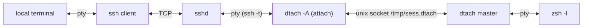
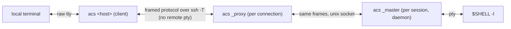
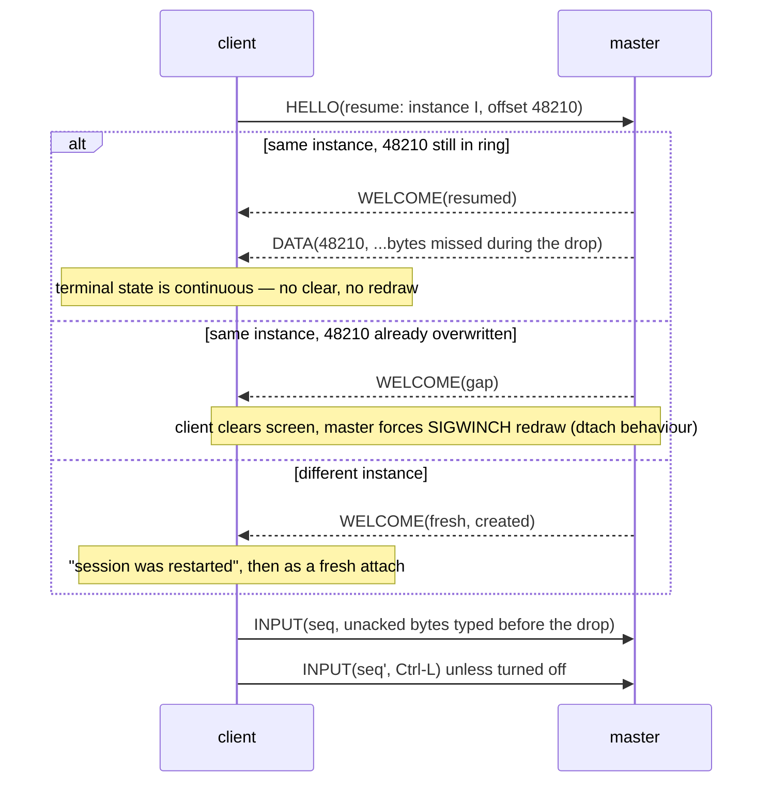
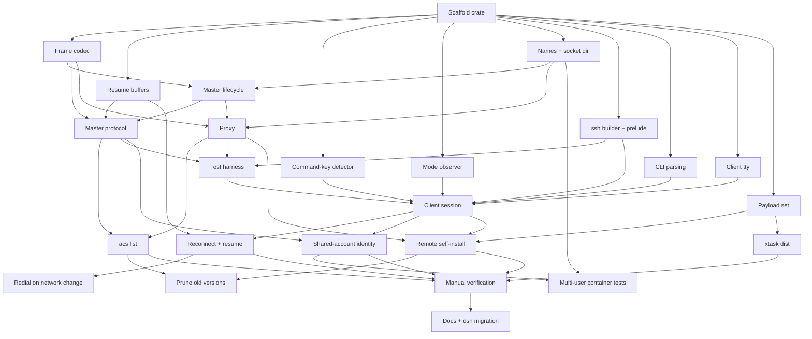

# acs — design

**Status:** Built — acs v1 implemented and verified (see
[VERIFICATION.md](VERIFICATION.md)).

`acs` (*Ad-hoc Connectivity Shell*) replaces the `dsh` shell function (`ssh` +
`dtach`) with **one Rust binary** that is both the local client and the remote
session holder. It keeps the property `dsh` exists for — an **unfiltered** byte
stream between the remote program and the local terminal — and adds what `dsh`
cannot do: lossless resume after a network drop, a local command key, and
self-installation on the remote.

## 1. What exists today

### 1.1 `dsh` (`~/.zshrc`)

```text
dsh <host> [session]        attach or create (session defaults to "main")
dsh <host> [session] -r     redial automatically after a drop
dsh <host> --list           list sessions on <host> and whether attached
```

It runs, per connection:

```sh
ssh -t "$host" "dtach -A /tmp/${sess}.dtach -r winch -z zsh -l"
```

- `-A` attach-or-create, `-r winch` redraw by SIGWINCH on attach, `-z` no
  suspend key; detach key is dtach's default **Ctrl-\\**.
- `-r` wraps that in a loop: `ServerAliveInterval=15`, `ServerAliveCountMax=3`,
  exponential backoff 1 s → 30 s (reset after a connection that lasted 30 s),
  and it **guesses** a clean end from the exit code (`0` or `130`).
- `--list` runs a `sh` script on the host that globs `/tmp/*.dtach` and counts
  `dtach` processes in `ps` output per socket: 0 = stale, 1 = detached,
  2+ = attached.
- Session names are restricted to `[A-Za-z0-9._-]`.

The comment above it states the requirement: *dtach proxies the pty
byte-for-byte, so the local terminal's scrollback keeps working — which is the
whole reason for not using mosh/screen/tmux.*

### 1.2 dtach (0.9, ~1.7 kLOC C)



- **Master**: `forkpty`s the command, `setsid`, listens on a unix socket, one
  `select` loop. Output is read in 4 KiB chunks and written raw to every
  *attached* client.
- **Client → master** is a fixed 10-byte packet: `type` (PUSH, ATTACH, DETACH,
  WINCH, REDRAW), `len`, and an 8-byte payload (keystrokes or a `winsize`).
  **Master → client** is the raw pty stream with no framing at all.
- **Attach** puts the local tty in raw mode, clears the screen (`ESC[H ESC[J`),
  sends ATTACH, then REDRAW with the window size; the master sets the size and
  `SIGWINCH`es the foreground process group.
- **With no attached client the master still reads the pty and discards the
  output**, so the program never blocks — and everything it printed while you
  were away is gone.
- **Backpressure**: while a client is attached but not writable, the master
  stops reading the pty, so a slow link slows the producer.
- The socket's `S_IXUSR` bit is set while a client is attached (usable as an
  "attached?" probe, which `dsh --list` does not use).

### 1.3 What that combination gets wrong

| Problem | Cause |
| --- | --- |
| Output while the link was down is lost | dtach discards output with no attached client, and bytes in flight in the dead TCP connection are gone |
| Drop detection takes up to 45 s | Relies on ssh `ServerAlive` (15 s × 3) |
| Clean end vs. drop is a guess | Only the ssh exit code (`0`/`130`) is available |
| Two ptys in the path | `ssh -t` allocates a remote pty just to carry dtach's raw stream |
| `TERM` travels only via `ssh -t` | No explicit negotiation of `TERM`/`COLORTERM` |
| Sessions in world-shared `/tmp` | `/tmp/<sess>.dtach` collides between users and leaks names |
| `--list` parses `ps` | No way to ask the master directly |
| Local terminal left in mouse/alt-screen mode after a drop | Nothing resets the modes the remote TUI turned on |
| Reconnect can hang on a dead ssh multiplexer | `~/.ssh/config` has `ControlMaster auto`; a reconnect can try the dead master's socket |
| Remote needs dtach installed | Package-manager dependency on every host |

## 2. Goals and non-goals

### Goals

1. **Unfiltered stream.** Pty output reaches the local terminal byte-for-byte,
   and keystrokes reach the pty byte-for-byte (except the command key, §6).
   No terminal emulation, no screen model, no rewriting — so local scrollback,
   mouse reporting, OSC 52 clipboard, hyperlinks, kitty graphics and keyboard
   protocols, and terminal queries/replies all work as if you had run `ssh -t`.
2. **One binary** for both sides and for both client platforms (macOS and
   Linux), statically linked on Linux, that can install itself on a remote
   (§8). Slim build < 1 MB; with the embedded Linux payloads < 2 MB.
3. **Survive network interruption** with no lost output, and detect a dead link
   in seconds rather than a minute.
4. **Command mode** on a double-tap of Ctrl-] (§6): `d` detach, `x` exit.
5. Drop-in for `dsh`: same arguments, same session names, same default shell.

### Non-goals

- A multiplexer (no panes, windows, or copy mode — that is tmux).
- Predictive local echo or UDP roaming (mosh). The transport stays ssh.
- Adopting existing dtach sessions — both can run side by side during migration.

## 3. Architecture

One executable, `acs`, with three roles. The user only ever types the first;
the other two are hidden subcommands the binary invokes on the remote.



| Role | Runs where | Lifetime | Job |
| --- | --- | --- | --- |
| **client** | local | one terminal session, across reconnects | raw mode, command key, resize, reconnect loop, renders pty bytes to stdout |
| **proxy** | remote, spawned by `sshd` | one ssh connection | find or start the master, then relay frames between ssh's stdio and the master's socket |
| **master** | remote, daemonised | the session | own the pty and child, keep the output ring, serve one active client |

Why keep a separate proxy rather than have the master talk to ssh: the master
must outlive every ssh connection, and `sshd` must see its channel close when
the connection ends. The proxy is a dumb relay — ~100 lines — so all state
lives in the master and the client.

**Transport** is `ssh -T -e none -o ServerAliveInterval=0
-o ConnectTimeout=10 <control options> <host> <remote command>`:

- `-T`: no remote pty. The ssh channel is an 8-bit clean pipe carrying frames;
  the only pty is the master's. One pty instead of two.
- `-e none`: ssh's `~.` escape is off (it is already off without a tty; this
  makes it explicit).
- **The control options depend on which call it is** (`Call` in `ssh.rs`).
  The first connection and a side call (`acs list <host>`, install) reuse an
  ssh master **acs owns** — `ControlMaster=auto` on acs's own
  `ControlPath`, with `ControlPersist` — so a detach-and-reattach, or an
  `acs list <host>` followed by an attach, costs one round trip instead of a
  whole handshake and a second hardware-key touch. A **redial** gets
  `ControlMaster=no -o ControlPath=none` and its own TCP connection, so a
  reconnect never waits on a multiplexer — and where the evidence says the
  master's own connection is the one that just failed, the redial runs
  `ssh -O exit` on it first (§7.1, acs-n1m: not where only the channel on
  it broke, which would drop every other acs session sharing that master).
  `acs list` over every alias (`BatchMode=yes`,
  `ConnectTimeout=10`, §7.3) neither starts nor joins one. The whole
  arrangement, its failure modes and how to turn it off are in §7.1 under
  **The ssh master acs owns**, and the decision is §12 decision 10.
- `ServerAliveInterval=0`: liveness is ours (§5.3), much faster than ssh's.
- `ConnectTimeout=10`: a redial into a dead network fails fast and the
  client returns to its backoff wait, where `d` still detaches (§6.1).
- Everything else — keys, agent, `ProxyJump`, host aliases — comes from the
  user's ssh config unchanged, plus any ssh options given on the `acs`
  command line (`-i`, `-p`, `-J`, `-F`, `-o`; §7.1). `acs` has no auth of
  its own, and opens no port of its own: the only local socket it can
  listen on is one `-L` asked ssh for, on the session's connection alone
  (§7.1).

**No ssh-side configuration.** The client runs the system `ssh` binary as a
child process; the `-o` options above are per-invocation overrides and never
touch `~/.ssh/config` or `sshd_config`. The remote needs only what `dsh`
needs today — `sshd` allowing a command, and a POSIX `sh` — plus `gzip` and a
writable `~/.local/share/acs` for self-install (§8). Hosts that pin what ssh
may run (`ForceCommand`, `command=` in `authorized_keys`, restricted shells)
cannot work, as they cannot with `dsh`.

**Noise before the protocol.** Shell startup files sometimes print to stdout
even for non-interactive sessions (an `echo` in `.bashrc`, a `motd` script),
and those bytes would arrive ahead of the first frame. The remote side
therefore writes a marker line, `ACS-READY <proto version>\n`, immediately
before its first frame; the client discards everything before the marker (and
shows it on stderr under `-v`), then switches to frames. `ACS-NEED` (§8) is
found the same way.

**The client does not wait for it to speak first** (acs-trw). The marker says
where the remote's *output* turns into frames; it is not a turn to speak.
Nothing on the remote side reads stdin before the marker is out — the prelude
(§8) never reads it, and the proxy reads its first frame only after printing
the marker — so the client writes its `HELLO` into ssh's stdin the moment ssh
is spawned, and waits for the marker with the greeting already on its way.
Marker and `WELCOME` then come back together instead of a round trip apart,
on the first connection and on every redial (§5.3). Two consequences are
wanted: a `HELLO` left unread when the answer is `ACS-NEED` is discarded with
the connection, and a startup file that reads stdin itself breaks the
handshake either way — it used to eat the marker's turn and hang, and now
eats the `HELLO` — so neither is a case acs supports (§3, restricted
shells).

## 4. Remote side

### 4.1 Session directory and naming

- Directory: `$ACS_SOCKET_DIR` if set, otherwise `/tmp/acs-$UID/` — keyed by
  the numeric uid from `getuid()`, never `$USER`. Not `$TMPDIR`: it can differ
  between login paths for the same user (`pam_tmpdir`, macOS per-session
  values), and a session must be found the same way from every ssh login.
  Created `0700`; see §4.5 for how it is checked.
- Socket: `<dir>/<session>.sock`. Names keep `dsh`'s `[A-Za-z0-9._-]` rule;
  every session has one (§4.4).
- **Not `$XDG_RUNTIME_DIR`**: `systemd-logind` deletes it when the user's last
  login session ends, which would orphan every master. (On hosts with
  `KillUserProcesses=yes` the master itself is killed too — as dtach is today;
  the fix there is `loginctl enable-linger`, which `acs` should mention in its
  error when it detects a master died that way.)
- `systemd-tmpfiles` may age files out of `/tmp`; the master re-checks its
  socket every minute and re-binds it if the path is gone — recreating the
  directory, with the same checks, if that went too (tmux's `SIGUSR1`
  recovery, made automatic).

### 4.2 Master

- Started by the proxy when `connect()` gets `ENOENT`/`ECONNREFUSED` (stale
  socket is unlinked first). Double-fork, `setsid`, stdio to `/dev/null`, bind
  the socket **before** forking the shell, then report readiness to the proxy
  over a pipe so the proxy never races the bind (dtach's `statusfd`).
  Creation holds `flock(<dir>/<session>.lock)` so two simultaneous attaches do
  not start two masters.
- Child: `$SHELL -l` in `$HOME` by default (`dsh` hardcodes `zsh -l`),
  overridable with `acs <host> [session] -- <command…>`. Environment gets
  `TERM` and `COLORTERM` from the client's HELLO (ssh `-T` no longer sends
  `TERM`), plus `ACS_SESSION=<name>`.
  - **A session is not a login** (acs-aps). It outlives the ssh connection
    that created it, and everyone who attaches later would otherwise inherit
    *that* login's environment. `SSH_AUTH_SOCK` is the sharp one: attach to
    a session someone else created with agent forwarding, and your shell
    signs with their keys for as long as their connection lives — same uid,
    so nothing is escalated that `/proc` would not have given you, but acs
    hands it over without anyone asking. `SSH_CONNECTION`, `SSH_CLIENT`,
    `SSH_TTY`, `DISPLAY`, `XAUTHORITY`, `KRB5CCNAME`,
    `DBUS_SESSION_BUS_ADDRESS` and the `XDG_SESSION_*` pair are merely
    wrong for everyone but the creator. None can be kept accurate for one
    shell with many attachers over time, so none is passed on; anyone who
    wants an agent in there exports one.
- **Output ring**: every byte read from the pty is appended to a ring buffer
  (default 1 MiB, configurable) and given a monotonically increasing `u64`
  offset. The ring is what makes resume lossless (§5.2).
- **Backpressure**: while a client is attached, the master stops reading the
  pty once unsent bytes would overwrite ring data the client has not received —
  the same slow-link backpressure dtach has. **With no client attached** it
  keeps reading and lets the ring wrap, so a detached program never blocks.
- **One active client.** A new attach takes over and the previous client gets
  `TAKEOVER` and exits with a message. Takeover is required anyway: after a
  drop, the old connection can look alive on the server for a while. (dtach
  allows several mirrored clients; nobody uses that with `dsh`, and two
  terminals fighting over the window size is worse than a clean handover.)
  Takeover is silent only when the new client has the **same client
  identity** as the attached one; otherwise it needs confirmation (§4.5).
- **Resize**: `TIOCSWINSZ`, which makes the kernel `SIGWINCH` the foreground
  group when the size changes. To force a redraw when the size is *unchanged*
  (fresh attach), signal `tcgetpgrp(pty)` with `SIGWINCH` directly — dtach's
  `-r winch`.
- **Child exit**: the master reaps it, sends `EXIT{status}` to the client,
  unlinks the socket, and exits.
- **Kill** (`x`, §6): `SIGHUP` to the child's process group, then `SIGKILL`
  after 3 s if it is still alive; then as child exit.
- **Instance id**: a random `u64` minted at creation and sent in `WELCOME`, so
  a client resuming into a *new* master with the same name (the old session
  ended and something recreated it) is told so instead of being handed offsets
  from a different stream.

### 4.3 Proxy

`acs _proxy <session> [--create] [--proto N]` — connect (or start and connect)
the master, then splice bytes both ways until either side closes. It reads
nothing from the client until `ACS-READY` is out, which is what lets the
client send its `HELLO` ahead of the marker (§3): the frame is normally
waiting in the pipe by the time the proxy looks. It does not
parse frames beyond checking the protocol version in the HELLO. Whatever
arrived after that HELLO goes to the master ahead of the splice — complete
frames re-encoded, and the bytes of a frame that had only half arrived as
they are, so the master's decoder never sees a frame without its head. `acs _proxy
--list` enumerates `<dir>/*.sock`, sends each master `STATUS`, and prints name,
attached/detached, the client identity attached (or last attached), created-at,
idle time, child command, and size. Sockets that
refuse connections are reported stale and removed — no `ps` parsing.
`acs _proxy --pick` serves the session menu (§4.4) on the session's own
connection. After `ACS-READY` it sends the list as `--list` does, one
`STATUS_REPLY` per session, closed by `LIST_END`, since the connection
stays open. It then reads the client's frames:

- `END_SESSION <name, identity, force>` (the menu's `x`): it sends that
  master `KILL`, as `x` inside the session does, **carrying the identity
  and `force` the frame brought** (acs-fbo). Ending a session is as large a
  step as taking it over, so it goes through the same gate: a session
  another identity is attached to answers `BUSY`, which becomes an `ERROR`
  naming them rather than a dead session. Before that, a five-byte frame
  from any process of this uid ended any session, and a connection that had
  just been refused with `BUSY` could destroy the very session it was
  denied. It does **not** attach on the way — that would send the attached
  client `TAKEOVER`, and the session is about to end, not change hands. It
  then waits until the master has exited — it
  holds the connection open until then, at most the 3 s kill grace and
  some, 10 s in all — then sends the list again, after an `ERROR` frame if
  the session was not there or did not end. Only the user's own masters can
  be reached (the per-uid directory and the peer-uid check, §4.5), so
  nobody else's session can be ended this way.
- `HELLO`: the session and mode the client settled on, as the proxy's own
  arguments give them on a plain session call; an empty name with `create`
  is a new numbered session, chosen under the directory lock as `--new`
  does. The proxy connects to or starts that master and from there is the
  ordinary relay, the HELLO checked and forwarded as usual. It prints no
  second marker.
- End of input (the user left the menu): it exits, starting nothing.
  Anything else is an `ERROR` (bad request).

### 4.4 Session names and getting back in

"Reconnect" covers two different situations, and only one of them needs you to
know anything:

- **Resume** — the link dropped but the local `acs` process is still running.
  That process already holds the host, the session name, the master's
  instance id and the output offset, so it redials and resumes by itself
  (§5.2, §5.3). You never type a name. This is what "reconnect on by default"
  means.
- **Re-attach** — the local client is gone: you pressed `d`, closed the
  terminal window, rebooted the laptop, or the client was taken over. A new
  client has to name the session, so every session always has a name.

| Command | Session |
| --- | --- |
| `acs <host>` | a detached session picked from a menu; with none detached, a new one — `main` (or `$ACS_DEFAULT_SESSION`, §4.5) if that name is free, else as `--new` |
| `acs <host> <name>` | `<name>` — attach, or create it if absent |
| `acs <host> --new` | a new session named with the lowest free number: `1`, `2`, … (picked under the directory lock, so two `--new`s never collide) |
| `acs list <host>` | list sessions: name, attached/detached, idle time, command; in a terminal, the session menu below whatever is detached |
| `acs list` | the same for every host alias at once, with a HOST column; in a terminal, the session menu over every host (§7.3) |

So the unnamed case is covered two ways: plain `acs <host>` offers what is
there to get back into, and `--new` gives short numeric names (as tmux
does) for when you want a second session without inventing a name.

**The session menu.** Plain `acs <host>` dials its session connection
with `_proxy --pick` (§4.3) and gets the host's sessions on it first. The
menu, ending sessions with `x`, and the attach all go over that one
connection: one ssh handshake (and one hardware-key touch) from the list to
the session, where a separate `_proxy --list` side call used to cost a second
(decision 8). Then:

- **No session detached** (none at all, or all attached elsewhere): a new
  session, without a menu — named `main` (or `$ACS_DEFAULT_SESSION`) if no
  session has that name, otherwise the lowest free number, as `--new`.
  A host without acs has no sessions; the attach installs it (§8).
- **Some detached**: a menu (`menu.rs`, a pure state machine from keys to
  choices; `pick.rs` drives it), drawn on the **alternate screen** so that
  leaving it — by any way, including a fatal signal or a panic, through
  the same emergency restore as raw mode (§7) — puts back exactly what the
  terminal showed:

  ```text
  acs: detached sessions on devbox

       NAME  STATE     WHO           IDLE  AGE  COMMAND
  > 1  main  detached  (michel@mbp)  4m    1d   /bin/zsh -l
    2  work  detached  (michel@mbp)  2h    3d   htop
    n  new session
       exit

  1-9, or ↑↓ jk and Enter: attach   .: all   x: end   n: new   Esc: leave
  ```

  The cursor's row is reversed in a bar as wide as the widest row listed
  (or the terminal, if narrower), so it keeps its width from row to row;
  widths are in terminal columns, a wide character counting two.

  The key bar at the foot (`menu.rs` `keys`, acs-7zb) names **only the
  keys that act on the row under the cursor**, and names Enter for what it
  does there. A session row reads as above; *new session* and *exit* drop
  `x` and `n`, which do nothing there:

  ```text
  1-9: attach   ↑↓ jk: move   Enter or n: new session   .: all   Esc: leave
  1-9: attach   ↑↓ jk: move   .: all   Enter or Esc: leave
  ```

  `1-9` is dropped when no session is listed, and `↑↓ jk` when *exit* is
  the only row — the menu of every host before any host answers.

| Key | Effect |
| --- | --- |
| `1`–`9` | attach that session at once; with more than nine, the rest have no number and are reached with the cursor |
| ↑ ↓, `k` `j` | move the cursor (it stops at the ends); a short screen scrolls to keep it in view |
| Enter | attach the session under the cursor; on *new session*, create one (named as above); on *exit*, leave |
| `n` | create a new session — on a session row (its host, in the menu of every host), or on *new session*. Elsewhere it does nothing but say where it acts |
| `.` | show attached sessions too, or hide them again. Picking an attached session asks `session 'x' is attached from alice@laptop — take over? [y/N]`; `y` attaches with `force`, the `--force` path of §4.5 (and `--force` on the command line skips the question) |
| `x` | end the session under the cursor, after `end session 'x'? y (or x) ends it`: `END_SESSION` on the menu's connection (§4.3), then the menu shows the sessions left and what happened. Off a session row it does nothing but say what it ends |
| Esc | leave, exit status 0 — at any point, a question pending or not. A lone ESC waits 100 ms for the rest of an arrow key's sequence (as the session's input does for an incomplete sequence, §6.3), so it is never taken for one |
| Ctrl-C | leave, exit status 130 |

- **Without a terminal** — stdout not a tty (stdin must be one anyway,
  §7) — there is no menu and no list call: plain `acs <host>` attaches
  `main` (or `$ACS_DEFAULT_SESSION`), creating it if absent, as before
  the menu.
- The list and the attach reach the **same machine**: an alias
  (`[user@]<alias>`, §7.3) is resolved once, before the list, and the
  first connection uses that resolution; only a redial resolves again.
- A host that cannot be reached, or answers the list with garbage, fails as
  `acs list <host>` does (255, or 1), with the same message. The first
  connection's deadlines (§5.3) apply: to its marker, then to each list.
- A host **without acs** answers the pick call with `ACS-NEED`, as any
  call: the client closes it and attaches `main` (or the default name) by
  the ordinary session call, which installs acs first (§8). A fresh host
  has no sessions to pick from.
- A session picked from the menu is attached with `attach-or-create`: if
  it ended in the meantime, the client says `new session '…'` as it would
  for a typo.
- The connection **sits idle** while the user reads the menu: no liveness
  pings run before `WELCOME` (§5.3). If it has died meanwhile — the attach
  on it is lost before any `WELCOME` — the client dials the chosen session
  once more with the ordinary session call instead of giving up. Redials
  later always use that call too: they know the session.

To keep a session findable, the client says what it did **outside** the
session's byte stream — on stderr, before raw mode starts or after the
terminal is restored:

- When it **creates** a session (by `--new` or because the name did not exist):
  `acs: new session 'mian' on devbox`. A typo in a name therefore shows up
  immediately instead of as a mystery session in a later `acs list`.
- When it **ends without the session ending** (detach, takeover, reconnect
  abandoned with `d`):
  `acs: detached from devbox/2 — reattach with: acs devbox 2`.
- Inside the session `ACS_SESSION=<name>` is set, so the shell prompt or
  `echo $ACS_SESSION` can show it.

If you still lose track, plain `acs <host>` shows what is detached there,
`acs list <host>` shows everything, and `acs list` does for every host
in the configuration. `acs <host> <name>` never depends on what else
happens to exist; plain `acs <host>` now does, on purpose (§12, decision 7).

### 4.5 Multiple users on one host

Nothing on the remote is shared between invocations except the filesystem:
no system daemon, no root, no shared socket, no port. Each master belongs to
the user who started it. Two cases need care.

#### Different Unix accounts — isolation

| Concern | Handling |
| --- | --- |
| Session names collide (`main` for everyone) | One directory per uid: `/tmp/acs-1000/main.sock` and `/tmp/acs-1001/main.sock` are unrelated |
| Another user pre-creates `/tmp/acs-<my uid>` (squatting, or a symlink to redirect sockets) | After `mkdir` (or on `EEXIST`), `lstat` the path: it must be a real directory, not a symlink, owned by my uid, mode `0700`. Otherwise refuse with an error naming the owner, and suggest `ACS_SOCKET_DIR`. The sticky bit on `/tmp` stops others from deleting it once it is mine |
| Another user connects to my socket | The directory is `0700`, and additionally the master checks the peer's uid on every accepted connection (`SO_PEERCRED` on Linux, `getpeereid` on macOS) and closes anything that is not its own uid. `root` can always get in; nothing can stop that |
| Binaries | Installed per user under `~/.local/share/acs/` (§8); no user runs another's binary |
| `x` kills something else | The master signals only its own child's process group |
| Session names visible to others | `ps` shows `acs _master <name>` to other users unless `/proc` is mounted with `hidepid`; the name is not a secret, but that is where it shows |

#### One account, several people — no accidents

On edge devices and shared lab boxes several people often log in as the same
account (`root`, `ubuntu`). There is no security boundary between them — the
same uid can always read the same sockets — so the aim is only that nobody
steals or breaks someone else's session **by accident**:

- **Client identity.** `HELLO` carries a display identity,
  `<local user>@<local hostname>` (for example `michel@mbp`), overridable with
  `ACS_IDENTITY`. The master records it for the attached client and for the
  session's creator. It is asserted, never checked, so the master holds it to
  128 characters and strips anything that could steer a terminal before
  storing it (acs-ovq, acs-w1z) — it ends up in someone else's `acs list`.
  An **empty** identity is *unknown*, and matches nothing: not another
  name, and not another empty one. It used to short-circuit the comparison,
  so a client that simply left `ACS_IDENTITY` unset turned the question off
  for everyone — while it was attached, anyone took the session silently and
  `acs list` showed a dash where a name belongs.
- **Every attach, takeover and kill leaves a trace** (acs-ovq), in
  `<session>.log` beside the socket in the per-uid `0700` directory, written
  `0600` and never read back by acs. One line each: the time, what happened,
  the identity that asked, and the uid and pid the kernel reports. This model
  draws no security boundary inside one account, which is a fair trade — but
  it left no record either, and a boundary one chooses not to draw is a
  different thing from one nobody can see across. The line is written
  whatever `ACS_MASTER_LOG` is set to; the debug log is for debugging.
- **Takeover across identities needs confirmation.** If the session is attached
  by a different identity, the master answers `BUSY{identity, since}` instead
  of `WELCOME`, and the client asks on the terminal:
  `session 'main' is attached from alice@laptop since 10:02 — take over? [y/N]`.
  `--force` skips the question; without a terminal the attach fails. The same
  identity (your own dropped connection, your own second terminal) takes over
  silently as before.
  - **Agreement is spent by the attach it was given for** (acs-y5r). A `y`,
    or a `--force` on the command line, applies to the attach in front of
    the user and is then cleared, rather than riding along on every later
    redial for the life of the process. It is agreement about *the person
    who was attached at that moment*: hours later a dropped link may come
    back to find somebody else there, and that is a new question. A redial
    that meets a different identity therefore asks again.
- **`acs list` shows who** is attached and who created each session, so picking
  another name is easy.
- **Default name per person** when an account is shared: `ACS_DEFAULT_SESSION`
  (e.g. set to `$USER` in each person's local shell) replaces `main` as the
  name plain `acs <host>` gives a new session, and as what it attaches
  without a terminal for the menu (§4.4). `main` stays the default
  otherwise, for `dsh` compatibility. The menu itself shows every detached
  session, with who last had each, and asks before taking over an attached
  one.
- **Different `acs` versions side by side.** Binaries are installed per
  version (§8), so a colleague with a newer or older client never overwrites
  the binary your sessions run on, and two clients never ping-pong upgrades.

## 5. Protocol

### 5.1 Frames

Length-prefixed, same format on the ssh leg and the unix-socket leg:

```text
+--------+-----------+-----------------+
| type u8| len u32 BE| payload[len]    |
+--------+-----------+-----------------+
```

| Type | Dir | Payload |
| --- | --- | --- |
| `HELLO` | c→m | proto version, session, mode (`attach`/`create`/`attach-or-create`), client identity, `force` flag, `TERM`, `COLORTERM`, cols, rows, xpixel, ypixel, optional `resume{instance, output_offset}` |
| `BUSY` | m→c | identity attached and since when; the client may retry `HELLO` with `force` (§4.5) |
| `WELCOME` | m→c | proto version, instance id, current output offset, `created` flag, `resumed` / `gap` / `fresh`, input sequence (bytes written to the pty so far — input sequence numbers count in the master's stream, so clients taking turns never collide) |
| `DATA` | m→c | `u64` offset of first byte, then raw pty bytes |
| `INPUT` | c→m | `u64` sequence of first byte, then raw bytes for the pty |
| `ACK` | m→c | highest input sequence written to the pty |
| `RESIZE` | c→m | cols, rows, xpixel, ypixel |
| `PING` / `PONG` | both | `u64` nonce |
| `DETACH` | c→m | — |
| `KILL` | c→m | identity, `force` (acs-fbo). From the attached client, or from the proxy for the menu's `END_SESSION` before any HELLO; either way a session another identity is attached to answers `BUSY` unless `force`, and the master holds an outside killer's connection until it exits (§4.3) |
| `EXIT` | m→c | child wait status |
| `TAKEOVER` | m→c | — (another client attached) |
| `STATUS` / `STATUS_REPLY` | proxy↔m, proxy→c | session metadata for `acs list` and the session menu |
| `ERROR` | m→c | code, message |
| `END_SESSION` | c→proxy | session name: end it, then list again (`_proxy --pick`, §4.3) |
| `LIST_END` | proxy→c | — the `STATUS_REPLY` frames before it are the whole list (`_proxy --pick`) |

`END_SESSION` and `LIST_END` pass only between a client and a proxy of
its own version (§8), never to a master, so they need no protocol version
of their own.

Pty bytes are carried as opaque payload and written verbatim; framing is
invisible to the terminal. That is the unfiltered guarantee, restated in wire
terms.

**It covers the session's stream, and nothing else.** The strings acs draws
its *own* interface from — a session name, the identity attached to it, the
command it runs, the message of an `ERROR` frame — were chosen by the remote
host, and the listing, the session menu, the takeover question and every
`acs:` note are acs's drawing rather than the program's output. Printed raw,
one of them can move the cursor and erase its neighbours, so the row read as
`trusted-host  main  detached` need not be the row the cursor is on, and
`acs list` asks *every* alias, including hosts the user never meant to open a
session on. A sequence the terminal answers is worse still: the reply lands on
the client's stdin and becomes input to whichever session is attached next.

So every such string passes through `safe::display` (`src/safe.rs`) on its way
to the terminal, which replaces the C0 and C1 controls and the bidirectional
overrides with `?` and caps the field's length. Clipping by display width is
not enough on its own: `ESC` is one column wide, and truncation can cut a
sequence in half. Session names are held to the grammar of §4.1 on the way
**in** as well as out, so a `WELCOME` or `STATUS_REPLY` carrying anything else
is a malformed frame and is refused, exactly as bad UTF-8 is.

### 5.2 Resume



- **Output**: the client records the offset of the last byte it wrote to its
  stdout. On reconnect the master replays from there. The local terminal has
  seen exactly the stream it would have seen without the drop, so its state —
  alternate screen, modes, scrollback — is correct with no redraw.
- **Input**: the client keeps bytes sent but not yet `ACK`ed and resends them
  on resume; the master discards any sequence it already wrote, so nothing is
  typed twice. The `ACK` counts what the pty has **taken**, not what the
  master has queued for it, since that is what the client may forget: input
  still queued when the terminal hangs up is dropped and its sequence goes
  back, so the next resume sends it again. `WELCOME`'s input sequence is the
  same count. Keys typed **while the client knows the link is down** are
  dropped rather than queued: blind typing into a frozen screen replayed
  seconds later is how accidents happen. (Command-mode keys still work — §6
  — which is why what ends the wait early matters: only a change to this
  machine's own network does, §5.3.)
  That includes the redial itself, where the terminal is back in cooked mode
  for ssh's prompts: what was typed then is discarded when raw mode resumes
  on `WELCOME` (`TCSAFLUSH`), and the takeover question discards it before
  asking. A Ctrl-C there ends the client with the status line blanked and
  the title popped, as any fatal signal does.
- **Fresh attach** (new client, e.g. after an explicit detach or from another
  machine) does **not** replay the ring: the local terminal's state is unknown,
  and replaying mode-changing sequences into it is unsafe. It behaves like
  dtach: clear screen, set size, force redraw.
- **Ctrl-L after reconnecting.** Whenever the client attaches to a session
  that was already there — a resume (lossless or after a gap), a re-attach
  by a new client, a takeover — it sends the program one Ctrl-L (`0x0c`),
  which shells and most full-screen programs take as "repaint the screen".
  Not to a session it has just created (`WELCOME` says `created`): a new
  program has nothing to repaint.
  - It is **input**, not a terminal operation: an `INPUT` frame queued
    right after `WELCOME`, behind the resent unacked bytes and ahead of
    anything typed from then on — so the program sees the keys in the order
    they were typed, with the Ctrl-L where the reconnect happened. Being
    input, it is tracked like a key: if the link drops again before the
    `ACK`, the next resume resends it and the master's dedupe writes it
    once; that resume then adds its own.
  - It is **added** to the redraws above, not instead of them: a fresh
    attach or a gap still clears the screen and gets the master's
    `SIGWINCH`, and a resume after a status line still sends the two
    `RESIZE` frames (§5.4). Programs that ignore Ctrl-L repaint as before;
    a shell at its prompt, which redraws at most its own line on
    `SIGWINCH`, now clears the screen and repaints its prompt.
  - Never **inside a bracketed paste**: the client follows the paste
    markers in the input it has sent (`keys::PasteTracker`), and when the
    drop cut a paste off after its `CSI 200 ~` but before its `CSI 201 ~`,
    the Ctrl-L is left out — it would land in the pasted text.
  - A program reading raw input receives a form feed, and a line-reading one
    a `^L` at the start of the next line; vim in Insert mode inserts it.
    Hence the switch: `redraw_on_reconnect: false` (§7.2), globally or on an
    alias (§7.3), and `ACS_REDRAW_ON_RECONNECT` over both (`0` off, `1`
    on). The environment wins, then the alias's own setting, then the
    global one; the default is on.

### 5.3 Liveness and reconnect

- Each side sends `PING` after 3 s of silence. The client declares the link
  dead after **10 s** with no frame received, kills its ssh child, and redials.
  Drop detection falls from dsh's 45 s to 10 s — and to **2 s** when this
  machine's own network changed under the link, which is the one moment acs
  has independent evidence that the silence means something (acs-ft1,
  below).
- **Bytes count, not only decoded frames**: anything read from the link marks
  the host heard. Writing output to the terminal blocks while the terminal is
  not reading (an emulator stalled, flow control), and the frames read in that
  time are only decoded on the next pass — so judging by the last decode alone
  turned a stalled terminal into a lost link, with `PONG`s waiting in the pipe.
  The one exception is the deadline a network change brings forward, which
  only its own `PONG` clears (acs-br2, below): there the bytes in the pipe may
  be older than the question.
- The master does the same for its attached client, which answers `PING`
  with `PONG`: a client silent for 10 s is dropped, freeing the pty from
  its backpressure (§4.2). Without it a client that vanished without closing
  — a laptop powered off, no FIN reaching the host — would hold the session
  for sshd's keepalive period, the program stalled once the ring filled.
  Output queued ahead of a `PING` is capped (64 KiB), so a live client
  answers in time; one that does not only costs a resume.
- Reconnect is **on by default**: the protocol distinguishes a clean end (`EXIT`,
  `DETACH` acknowledged, `TAKEOVER`) from a drop, so there is nothing to guess.
  `--no-reconnect` restores `dsh`'s default behaviour.
- **The first redial goes at once** (acs-iyq). Only the attempts after it
  wait: backoff 1 s → 30 s, reset after a connection that lasted 30 s (as in
  `dsh`), plus an immediate retry when this machine's own network changes
  (Wi-Fi switch, laptop wake) where the platform exposes that cheaply — that
  retry *is* the immediate attempt, so the backoff resumes at its base rather
  than handing out a second dial with nothing in between. A drop has already
  cost 10 s of silence before it is a drop at all (§5.3), and most of them
  are momentary, so a wait before looking once put a second on every resume
  to buy nothing; a host that is really gone refuses the attempt (or times
  out, below) and the backoff starts from there. What it costs: the offline
  wait is where typed command keys are honoured (§5.4), so the second
  between a drop and the first dial is no longer one in which `d` detaches
  — it is a dial like any other, and keys typed into a dial are dropped.
- **What counts as a network change** (acs-6p8). The watcher
  (`netwatch.rs`) has two halves, and the socket is only the first: a
  `PF_ROUTE` (macOS) or `NETLINK_ROUTE` (Linux) message says the kernel
  touched the network, which on a laptop it does the whole time — an
  unrelated interface appearing, a VPN churning its routes, an interface
  flapping while the link's own path is untouched, an IPv6 probe. What
  makes a hint a *change* is the second half: the set of networks this
  machine could dial from — every up interface's address with its prefix,
  loopback and link-local left out (§7.3's `getifaddrs`) — differing from
  the set as of the hint before it. A hint that leaves them as they were
  ends nothing, and the wait runs to its deadline.
  - Why it matters beyond tidiness: cutting the wait short starts a
    redial, and keys typed into a redial are discarded (§5.2). Reporting
    every hint meant a laptop redialled over and over through one outage,
    so `d` typed while disconnected did nothing at all — the opposite of
    what §5.2 and §5.4 promise. It also made three of the reconnect tests
    fail together, at random, on whatever the developer's own network was
    doing.
  - What it costs: a change that this machine's addresses do not show —
    the same lease on a different physical path, a change upstream — no
    longer shortens the wait. The backoff does that instead, within 30 s.
    Joining a network, waking, a VPN coming up or going away all move an
    address, so the case the watcher exists for is as fast as it was. Two
    changes inside two seconds are still one redial (`early_every()`,
    `ACS_EARLY_MS`).
  - **The networks held move when a caller acts, not when it reads**
    (acs-0n8). `changed()` hands out a `Change`; the set it was judged
    against is replaced by `Change::acted` and nowhere else. The two
    callers that cannot always act — the offline wait inside its rate
    limit, and the serving loop before the `WELCOME` — drop it instead,
    and the next hint about the same move names the same change rather
    than being answered "not a change" against a set that has already
    moved. Before this the hint was spent either way: the change was not
    deferred but lost, and only a covering deadline recovered it (the dial
    timeout, the backoff). It is the one way a hint can go missing, which
    made it the standing suspect whenever something that should have
    reacted did not.
    - **Nothing is queued by that**, so acs-6p8's storm stays fixed: a
      change is not a message in a box, it is `local_networks()` compared
      against the last set anybody acted on, made afresh on each hint.
      Four changes with nobody acting are one change when somebody does,
      and the rate limit is untouched — a flapping interface still costs
      at most one redial per `ACS_EARLY_MS`, exactly as when the change
      was thrown away.
  - The tests drive both halves rather than the developer's laptop:
    `ACS_NETWATCH_FIFO` is the hint (one per write) and `ACS_NETWATCH_NETS`
    a file of the machine's networks, one CIDR per line. The harness points
    every other client at a watcher path that does not exist, so no test
    but the watcher's own is exposed to the host's network.
  - **The platform half is the kernel's, and on Linux the kernel does it**
    (acs-4i2). Everything above tests the *decision*; what neither stand-in
    can say is that a real roam emits a message the socket is subscribed to
    **and** moves an address `local_networks()` reports — and both have to
    hold or the feature is dead with nothing to show for it.
    `tests/netns.rs`, a step of `scripts/test_linux.sh` with
    `CAP_NET_ADMIN`, creates a dummy interface in the container's own
    network namespace, brings it up, gives it an address and tears it down
    again. Nothing in the test ever writes to the netlink socket, so a
    descriptor that becomes readable after an `ip` command is the kernel's
    own multicast; it is polled for before every decision, which is what
    separates a watcher that saw nothing from one that saw something and
    judged it. Both cases are covered against the real kernel: a bare
    interface is a message and not a change, an addressed one is both.
    macOS `PF_ROUTE` has no equivalent — a Mac's network cannot be moved
    from inside CI — and stays a by-hand item in
    [VERIFICATION.md](VERIFICATION.md).
  - **`-v` says what every hint was worth**, because the interesting
    failure is silent (acs-4i2). A watcher that is working while nothing
    moves and a watcher that has stopped emitting are the same thing seen
    from outside, and the second now costs more than a slow redial: since
    acs-ft1 it also removes the evidence that shortens the dead-link
    timeout on a wake. So `netwatch.rs` writes one line per hint —
    `network changed: <old> → <new>`, `network hint: still on <nets> — not
    a change`, or, on macOS where the filter can reject everything read,
    `network: N bytes from the kernel, no address or interface message`.
    A change that is read and not acted on adds `network change not acted
    on — the next hint reports it again`, so a reader who sees a change
    named and no redial follow is not left guessing whether it was spent
    (acs-0n8). The lines read the decision and are no part of it: they
    touch neither the networks held nor the rate limit, and the tests that
    assert the decision run beside the ones that assert the text.
- **A network change while the link is up shortens the dead-link timeout;
  it does not redial** (acs-ft1). The watcher is polled by the serving loop
  too, not only by the offline wait, because the two cases a laptop
  actually has — a Wi-Fi switch and a wake from sleep — change the network
  *while acs believes it is connected*, and the connection they break
  neither closes nor errors: it simply goes quiet. Waiting out the full
  10 s for silence that is already certain is the delay this removes.
  - What happens is a **question, not a redial**: a `PING` goes out at once
    and the host has `ACS_NETCHECK_MS` (**2 s**) to answer it. If it does,
    the change cost nothing whatever: the link stands, and no byte of what
    was typed is anywhere near a `WELCOME`. If it does not, the link is dead
    and the redial of the rule above follows, which is immediate, so a real
    drop is replaced in 1–2 s rather than 10.
  - **The answer is the `PONG` for that `PING`, and nothing else**
    (acs-br2). This is the one place in this section where a byte from the
    host is *not* proof that it is there, and it took a test failing only
    on a loaded machine to see why: the frames already in flight when the
    network moved were written before it moved. They are the frozen link's
    last gasp. A client that has just lost the CPU — a laptop waking is
    exactly that — reads them in the same pass of its poll that sends the
    `PING`, so by the clock they arrive *after* the question was asked
    however stale they are, and taking them for the answer left a link that
    was already gone standing for the whole `ACS_DEAD_MS`. A `PONG` for an
    earlier `PING` is refused on the same ground: it came back over the
    path that has gone. The nonce is the `PING`'s own timestamp, so the
    match is a comparison and costs nothing.
  - **Why not redial on the change itself.** Keys typed into a redial are
    discarded (§5.2), so a redial the link did not need is directly
    user-visible: the session blinks, the screen repaints and what was
    being typed at that moment is gone. A change the link survived is
    common — a VPN coming up, a second interface appearing, a phone
    tethering while Wi-Fi keeps working — and on those the address moves
    while the path does not. Probing costs one frame and makes the
    difference observable instead of guessed at.
  - **Bounded by the dead interval either way.** `ACS_NETCHECK_MS` only
    ever brings the deadline *forward*: a change cannot extend a link past
    `ACS_DEAD_MS` of silence, and a second change while the question is
    outstanding is the same question — a flapping interface neither pushes
    the deadline out nor spends another round trip. (The offline wait's own
    rate limit, `early_every()`, is separate and untouched: that one guards a
    redial, this one a ping.)
  - **The wake case needs this, not a shorter `ACS_DEAD_MS`.** The client's
    clock is monotonic and stops with the machine (`sys::now_ms`), so the
    hours a laptop spends asleep are not silence that anything measured:
    on wake the 10 s window starts from zero however long the sleep was.
    The address that moved is the only evidence available at that moment,
    and it is what this uses.
- Authentication prompts on reconnect (password, hardware key touch) are
  passed through, because ssh gets the controlling tty for prompts even with
  `-T`; the client restores cooked mode while ssh is authenticating. With
  keys in an agent, reconnect is silent.
- **The greeting goes out with the dial** (acs-trw): the `HELLO` is written
  into ssh's stdin as it is spawned, before the marker is awaited (§3), so a
  redial costs the ssh handshake and one trip for the `WELCOME` rather than
  two. The size it carries is the terminal's as of the dial; a `SIGWINCH`
  while the handshake is in flight sends no `RESIZE` of its own — only a
  welcomed link does — so the client compares the size again on the
  `WELCOME` and sends one then if the window moved.
- **Before the first WELCOME there is a deadline too**: liveness only starts
  with WELCOME, and `ConnectTimeout` only covers the TCP connect, so a host
  that accepts and then says nothing would otherwise hold the client forever.
  A connection has 30 s on a redial — then it is dropped and the client goes
  back to its backoff wait, where the command keys work — and 120 s on the
  first connection (time for a password), then the client exits 255, for the
  marker and again for the handshake (`ACS_DIAL_TIMEOUT_MS` sets both). A
  takeover question restarts the handshake's clock.

**Persisting.** By default the client gives up where there is no session to
keep: no host of an alias answers at the start, the first connection fails,
or the link is lost before the first `WELCOME` — each exits 255. With
`--persist`, `persist: true` or `ACS_PERSIST=1`, a lost host is never given
up on; it is waited for with pings (`alias.rs`, the ping of §7.3) instead
of ssh dials:

- **The ping gate**: while the host is lost it is pinged every
  `reachability_interval` (default 5 s, §7.2), and dialled only once it
  answers — at once, too, after a network change (netwatch). An alias is
  resolved again each time, so the first of its hosts to answer is the one
  dialled (§7.3); a plain host is pinged itself. A host that answers but
  whose ssh is not up yet gets a dial that fails and the gate again.
- **Everywhere a host is lost**: after a drop (replacing the 1 s → 30 s
  backoff for a host that can be pinged), and at the start — an alias none
  of whose hosts answers, a menu (§4.4) or first connection that cannot be
  dialled, a link lost before any session. Before a session exists the
  terminal is still cooked: acs says it is waiting once, shows the status
  line of §5.4 while it waits, and Ctrl-C gives up; after one, the command
  keys work as in the backoff wait (Ctrl-] Ctrl-] `d` detaches).
- **Hosts that drop pings** cannot be gated: an alias whose hosts all have
  `reachability_check: false` keeps the dial backoff while persisting.
- **Which setting**: `--persist` over everything, then `ACS_PERSIST` (`0`
  off, `1` on), then the `persist` of the alias's entry in use, the
  alias's, the global one (default off). Before any entry answered, the
  alias's decides. `--persist` and `--no-reconnect` contradict each other
  and together are a usage error.

### 5.4 Status while disconnected

Anything the client prints corrupts the screen the remote program drew, and a
lossless resume will not repaint it. So:

1. While the link is merely quiet (< 10 s, or < 2 s when this machine's
   network has just changed under it, §5.3), print nothing.
2. Once declared dead, write one status line on the bottom row using
   save-cursor / restore-cursor, and set the window title with the xterm title
   stack (push `CSI 22;0 t`, pop `CSI 23;0 t`) so the remote's title comes
   back afterwards. The link died where it died, which may be inside a
   sequence the last frame opened, so the line is written **over** that
   sequence and not into it: ended with an `ST` before it and written again
   after it (§7, acs-p4u). The cursor, the title and the stream all come
   back.
3. After a successful resume that followed a printed status line, force one
   redraw to clean up the line: the client sends two RESIZE frames (one row
   fewer, then the real size), since an unchanged size raises no `SIGWINCH`.
   Full-screen programs repaint; a plain shell prompt may leave the line in
   scrollback, which is acceptable. The Ctrl-L every resume sends (§5.2,
   unless turned off) makes a shell clear and repaint too.
4. Whatever ends the client — resume, detach, or the session ending while
   the link was down — pops the title and blanks the status row on the way
   out, so the terminal is left as it was. While offline, the command key
   uses the same key and window (`ACS_ESCAPE_TIMEOUT_MS`) as online — it is
   the same detector, which outlives both the wait and the link (§6.1), so a
   press held when a backoff expires into a redial is still held when the
   wait comes back.

## 6. Command mode

### 6.1 Behaviour

| Keys | Effect |
| --- | --- |
| Ctrl-] | Held for up to **400 ms**. If nothing else arrives, it is sent to the remote. |
| Ctrl-] then any other key within 400 ms | Both keys sent to the remote, in order, immediately. |
| Ctrl-] Ctrl-] within 400 ms | Enter command mode: the next key is a command. The terminal bell rings. |
| … then `d` | **Detach.** `DETACH` to the master, restore the local terminal, exit 0. The session keeps running. Works even while the link is down (it is purely local then). |
| … then `x` | **Exit.** `KILL` to the master, wait for `EXIT`, restore the terminal, exit with the child's status. Needs the link; if it is down the client says so and stays in the session. |
| … then any other key, or nothing for **2 s** (longer if the escape window is, below) | All the held keys are sent to the remote as typed. |

The only cost is that a lone Ctrl-] reaches the remote up to 400 ms late. The
window is a setting (`ACS_ESCAPE_TIMEOUT_MS`), and so is the key.

**One window setting, covering both halves of the gesture.** The gesture has
two clocks — the gap allowed *between* the presses, and the time to then
*choose* a command key — and `ACS_ESCAPE_TIMEOUT_MS` sets both. Precisely:
it is the gap between the presses outright, and the window to choose is that
value or **2 s**, whichever is longer.

Until acs-mq0 the second window was a bare 2 s constant with no knob at all,
which got the person most likely to set the variable exactly backwards:
someone who widens it because 400 ms is too quick for them has said "I am
slower than the default", and acs answered by relaxing the half of the
gesture they had not complained about while leaving the other half as it
was. Two settings would be more precise — the double tap could stay crisp
while the choice was relaxed — but that is a distinction nobody has asked
for, it costs a seventh timer knob (acs-r1k), and "give me longer" is one
thought, so it is one setting.

The floor is what keeps the single setting honest in the other direction. A
*tighter* window, `ACS_ESCAPE_TIMEOUT_MS=150` for a user whose Ctrl-] is
busy in vim, says the double tap should be crisp; it says nothing about how
fast they can pick `d`, and taking the choice down to 150 ms with it would
be a worse bug than the one this fixes. So the setting widens both windows
and narrows only the first.

This widens the meaning of an existing variable, which is a behaviour change
for anyone already setting it — a small one, since the default is unchanged
either way (400 ms and 2 s), and in the direction they asked for.

**The detector's lifetime.** There is **one** detector, and it lives as long
as the client does — not as long as a link, and not as long as one wait
between redials. It belongs to the local terminal, whose byte stream never
reconnects. A Ctrl-] held when the link dies, when a backoff expires into a
redial attempt, or when the session comes back is therefore still the first
press of the double tap on the other side, and **the escape window is the
only thing that ends a half-finished gesture**.

Until acs-e80 it was not: the offline wait (§5.4) built a fresh detector on
every entry and the online loop one per link, so a press that straddled
either boundary was dropped without a trace — invisible at the default
400 ms, where a boundary almost never falls inside the window, and reachable
as soon as someone widened `ACS_ESCAPE_TIMEOUT_MS` past their backoff
because 400 ms was too quick for them.

Clearing the detector at a link boundary would put a second, invisible
expiry on the window the user configured, and it picks the worse of the two
failures. A press silently dropped mid-gesture means the command key that
follows lands in the program instead — `Ctrl-] Ctrl-] d` types a `d` at the
shell. The failure in the other direction, a stale press arming command mode
much later, cannot happen: `Held` and `Command` expire on their own clocks
whatever the link is doing.

One consequence is deliberate. A lone press held while the link was down and
released after it came back **is** sent to the program, where a key typed
into a dead link is dropped (§5.2). The escape key is not typed at the
program: the client consumes it and only releases it once it turns out not
to be a command. What §5.2 drops is input the user aimed at a program that
could not receive it; what this forwards is one escape press, no older than
the escape window, released into a live link exactly as the online path
would have released it.

Command mode prints nothing on the screen — it only rings the bell (below):
the local terminal shows only what the remote sent. The table is intended to
grow — `r` (force redraw) and `?` (help, followed by a redraw) are obvious
next entries — but only `d` and `x` are in scope.

**The bell.** Entering command mode rings the terminal bell (`BEL`, `0x07`),
so the user knows the next key is a command. It is on by default;
`command_bell: false` (§7.2) turns it off, and `ACS_COMMAND_BELL` overrides
the file (`0` off, `1` on). The bell does not break the transparent stream:

- The client writes it to the **local terminal**, as it writes the status
  line (§5.4). Nothing is added to the program's input, and the output bytes
  are unchanged — the bell goes between them.
- It goes only at a **boundary** of the output: not inside an escape
  sequence, not inside a UTF-8 character, and above all not inside an
  OSC/DCS/APC/PM/SOS string, which a `BEL` would end early (an unfinished
  title or OSC 52 copy would be cut short). The mode observer (§6.4) already
  lexes the output and knows where it is. If the output is inside such a
  sequence, the bell waits and is written as soon as the output reaches a
  boundary — right after the ST or `BEL` that ends the string. It is dropped
  if command mode ends first (a key, or the window to choose running out),
  so a late bell never announces a command mode that is over. An `acs:` note
  printed under `-v` waits for the same boundary and is written at the same
  point (§7), with
  the difference that it is never dropped: an announcement nobody needs any
  more is noise, a diagnostic that never arrives is a bug.
- It rings only when command mode arms and then waits: Ctrl-] Ctrl-] and the
  command key arriving in one read (a paste without bracketed paste, or
  typed faster than the terminal is read) need no announcement. Inside a
  bracketed paste the escape key is never recognised (§6.3), so it never
  rings there.
- The same holds while the link is down (§5.4), where the offline wait arms
  command mode with that same detector — literally the same one, as above.

### 6.2 Is Ctrl-] a good choice?

Ctrl-] is byte `0x1D`. Who uses it:

| Program | Use | Double-tap within 400 ms plausible? |
| --- | --- | --- |
| vim / neovim | jump to tag (`:help` links, ctags, LSP go-to-definition) | Rare. Two jumps in a row is possible but not fast |
| emacs | `abort-recursive-edit` | Rare |
| telnet | escape character | Only if you run telnet inside the session |
| bash / zsh line editors | jump to next occurrence of a character (readline `character-search`, zsh `vi-find-next-char`) | No — rarely used, and a double tap only searches for `^]` |
| Claude Code, less, htop, git TUIs | nothing | No |

The alternatives are worse. **Ctrl-\\** (dtach's default) is SIGQUIT in every
shell. **Ctrl-^** is vim's alternate-buffer switch, which people double-tap
constantly. **Ctrl-_** is undo in readline and emacs. **Ctrl-]** is the
traditional escape for remote-terminal tools (telnet, `virsh console`), and
the double tap makes a clash with vim's tag jump very unlikely.
**Recommendation: keep Ctrl-] Ctrl-]**, configurable.

### 6.3 Recognising the key — three encodings

Modern TUIs change how the local terminal encodes Ctrl-]. The detector must
match all of these, or command mode silently breaks inside exactly the
programs this tool exists for:

| Mode (turned on by the remote program) | Bytes for Ctrl-] |
| --- | --- |
| legacy | `1D` |
| kitty keyboard protocol (`CSI > flags u`) | `CSI 93 ; 5 u`; with event types `CSI 93 ; 5 : 1 u` (press), `: 2` repeat, `: 3` release |
| xterm `modifyOtherKeys` level 2 | `CSI 27 ; 5 ; 93 ~` |

Rules:

- The detector sits on the **input** path and consumes whole escape sequences,
  so it never matches inside a longer sequence, and a sequence split across two
  `read()`s is buffered until complete.
- A release event for a held or consumed Ctrl-] goes where its press went
  (forwarded together, or swallowed together), so the remote never sees an
  unmatched release.
- **Bracketed paste** (`CSI 200 ~` … `CSI 201 ~`) is forwarded untouched: a
  pasted `0x1D 0x1D d` must not detach you.
- Terminal replies to remote queries (DA, OSC 11, `CSI ? u`, XTVERSION) start
  with `ESC`, never with a held key, so they are never delayed. They, mouse
  reports and focus events are forwarded at once and do not break a pending
  double tap. Inside a reply's string — OSC, DCS or APC (kitty graphics),
  the only ones terminals send — the escape key is not looked for until
  `BEL` or ST, until 100 ms pass without a byte, or after 64 KiB: a Meta key
  sends the same two bytes (Alt+_ is `ESC _`), and without the timeout it
  would leave command mode deaf until the next `BEL`. `ESC ^` and `ESC X`
  (PM, SOS) are keys. The byte cap covers what the timeout cannot (acs-55v):
  the timeout only fires once the bytes *stop*, so a remote that keeps them
  coming — a multi-megabyte clipboard set with OSC 52 and read back in a
  loop — would otherwise hold the detector inside the string for as long as
  it liked, sending `Ctrl-] Ctrl-] d` to the attacker instead of detaching
  and leaving no way out but killing the terminal.
- One exception to reassembly: a read that ends in a **lone `ESC`** is the Esc
  key and is sent at once — vim users press it constantly, and delaying it is
  worse than missing the rare escape-key sequence split right after its first
  byte. An incomplete `CSI` at the end of a read is held for at most 100 ms.

### 6.4 Restoring the local terminal on detach

The remote program may have turned on terminal modes that should not outlast
the session: mouse reporting, bracketed paste, alternate screen, hidden cursor,
the kitty keyboard stack, `modifyOtherKeys`, focus events. dtach leaves them on,
which is why moving the mouse after a dropped `dsh` prints garbage.

The client runs a **passive observer** over the output stream: it scans for
the few mode-setting sequences above and records what is on. It never modifies,
delays or reorders the stream. On detach, exit, or an abandoned reconnect, the
client writes the matching resets (for example `CSI ? 1000 l`, `CSI ? 1049 l`,
`CSI < u`) and restores the original `termios`. On a successful resume it does
nothing, because the terminal state is still correct. A resume after a **gap**
clears the screen but keeps the recorded modes: the program is the same one,
still in them, so a later detach still resets them. A **fresh** attach to
another program (the session was restarted) writes the old program's resets
before clearing the screen and forgetting them.

The observer also knows *where in a sequence* the stream is: between them
(the boundary a bell or an `acs:` note waits for, §6.1, §7), and, for a write
that cannot wait, which bytes end the open sequence and which write it again
(§7, acs-p4u).

## 7. Client

- Argument parsing matches `dsh`: `acs [ssh options] [user@]<host> [session]
  [--new] [--no-reconnect] [-- command…]` (§4.4, §7.1). `-r` is accepted and
  ignored, since reconnecting is the default.
- **Listing is a command**: `acs list [ssh options] [-v] [[user@]<host>]`
  lists one host's sessions, or without a host every alias's (§7.3). `list`
  is a reserved first argument, as `config` and `upgrade` are (§7.4), and
  the ssh options come after it. `dsh`'s `-l`/`--list` are gone: either is
  a usage error pointing to `acs list` (decision 9).
- `cfmakeraw`-equivalent `termios` (dtach's flags), restored on every exit
  path: normal, signal (`SIGHUP`, `SIGTERM`, `SIGINT` before raw mode), and
  panic (`panic = "abort"` plus a restore in a drop guard and a signal handler).
- `SIGWINCH` → `RESIZE`, once a link is welcomed; one that lands while the
  handshake is in flight is caught up on the `WELCOME` (§5.3).
- Single-threaded `poll` loop over stdin, the ssh child's pipes, a self-pipe for
  signals, and a timer (escape timeout, pings) — the same shape as dtach.
- Exit status: the child's status after `EXIT` (128+n for signals), 0 on detach,
  and distinct codes for "host unreachable", "remote install failed" and
  "taken over".
- **`acs:` notes go where the bell goes** (acs-z22, §6.1). A note is written
  to fd 2 and the session's bytes to fd 1, and under `-v` both land on the
  same terminal with nothing in the stream to separate them. A note raised
  while the program is halfway through an escape sequence, an OSC string or
  a UTF-8 character therefore used to be written *into* it: the sequence
  split, or the note's own text swallowed as the body of a title. That is at
  its worst under `-v`, which is what someone reaches for when something is
  already wrong — the corruption arrives exactly where it looks like the bug
  being investigated. So, while the frame loop is relaying, a note raised
  with the stream mid-sequence waits for the first **boundary** the mode
  observer (§6.4) reaches and is written there, spliced between the two
  halves of the frame that gets to it exactly as the bell is. The
  boundary is the stream's and not the frame's: a sequence is split across
  two frames precisely because the host framed it that way, so waiting for a
  frame that happens to *end* at a boundary would leave the note behind
  steady output for as long as the output lasts.
  - **Never reordered, never dropped.** Held notes queue oldest first and are
    written in that order, ahead of anything raised after the boundary.
  - **Nothing outside the frame loop waits.** The dial, the offline wait and
    alias resolution have no frame in flight, and inside the loop a note
    raised at a boundary — which is where the stream is between frames, and
    always before the first one — is written at once. A note about a dial
    that is still hanging is worth nothing once the dial has finished.
  - **A quiet session cannot swallow one.** A program that stops
    mid-sequence, or a link that dies there, would hold a note for ever:
    the wait ends after `ACS_NOTE_HOLD_MS` (500 ms) or when the frame loop
    does, whichever comes first, and the note is then written where it
    stands. Late and ugly beats lost.
  - The status line (§5.4) and the other writes acs makes to fd 1 cannot
    wait for a boundary at all, and step out of the sequence and back in
    instead — next bullet.
- **acs's own writes step out of the program's sequence and back into it**
  (acs-p4u, §5.4, §6.4). A note can wait, and waiting is the whole of the
  rule above. The status line cannot: it goes up **because** a link was
  lost, it exists to explain a terminal that has just stopped responding,
  and the boundary it would wait for may never come — the decoder delivers
  whole frames, so the frame the drop cut in half is discarded and the last
  one delivered may well end mid-CSI or mid-OSC. Written straight out, the
  explanation the frozen terminal is owed is itself what corrupts it.

  So these writes are made **over** the stream rather than into it: an `ST`
  (`ESC \`) ends whatever is open before them, and where acs can do it
  faithfully the sequence is written again afterwards, byte for byte, so the
  program's next byte still means what the program meant by it. The mode
  observer (§6.4) already knows which sequence is open and has its bytes.

  - **A CSI, a bare `ESC` and a half-read character are handed back.** None
    of them has done anything to the terminal yet — a CSI acts on its final
    byte — so writing the parameters again is exact. A colour split across
    the drop (`ESC [ 1;31` … `m`) still arrives as one colour, minutes and
    a reconnect later. C0 controls the terminal already executed inside the
    CSI are not repeated, and a CSI longer than the 64 parameter bytes the
    observer keeps is not handed back, because its bytes are no longer all
    known.
  - **A string is ended and not handed back.** The body of an OSC, DCS, APC,
    PM or SOS may already have had its effect — a DCS is passed through as
    it arrives, and ending one dispatches what there is of it — so writing
    it again would do it twice, which is worse than the junk. **This is the
    cost that was chosen:** the rest of the program's string arrives on the
    resume and is printed as text. What ending it buys is that acs's own
    line is readable at all, and that is not hypothetical — a terminal that
    reads `ESC` as part of the string (which is how acs's own observer reads
    it) swallowed the title push, acs's title and the whole status line as
    the body of the program's title.
  - **The three writes are not treated alike, because their streams are
    not.** The status line and its clearing hand the sequence back: a
    `Resumed` attach carries the stream on from exactly where it stopped.
    The resets `leave` writes do not: acs is going, nothing more of that
    stream will ever arrive, and a terminal left inside a CSI would eat the
    first bytes of whatever runs next — including acs's own parting `acs:`
    note, which is raised after the frame loop and so is not covered by the
    hold above. Neither does the clear a `Fresh` or `Gap` attach writes:
    another program is talking now, or the same one across a gap whose next
    byte may start anywhere (§6.4). Those three end the sequence and stop
    there; the end is written even when there is no reset and no clear,
    since the status line may have put the terminal back inside it.
  - **The save/restore around the line does not help with this.** `ESC 7` /
    `ESC 8` bring back the cursor, the SGR attributes, the character set,
    origin mode and the wrap flag, and the xterm title stack brings back the
    title — which is why the line leaves no trace of *what it drew*. Neither
    of them is a parser state: the sequence the line is written inside of is
    outside everything they save.
  - **One write cannot ask the observer**: the emergency restore in the
    signal handler (a Ctrl-C while ssh redials, §7). It is async-signal-safe
    and writes static bytes, so it opens with an unconditional `ST` — an
    `ST` with no string open is ignored — and, being a way out, hands
    nothing back.
- **Connect timings** under `-v` (acs-pgn, `timing.rs`): one line per phase
  of a connection, `acs: timing: <connection>: <phase> +<step> ms (<total>
  ms total)`, for the first connection and for every redial. The phases, in
  order: `alias resolved` (an alias's pings and lookups), `ssh spawned`,
  `ACS-READY seen`, `session list received` (the menu's `_proxy --pick`,
  §4.4), `WELCOME received`, `first output byte`; a phase a connection does
  not go through is not told, and nothing is told after the first output
  byte. They exist to show what dominates connect latency on a real host —
  the ssh handshake, remote startup files or the reachability deadline —
  before any of it is optimised.

### 7.1 ssh options

A handful of ssh's own options are accepted with ssh's spelling and meaning,
and passed **verbatim** to every ssh call `acs` makes — the session transport,
reconnects, `acs list` and remote install — so a host reachable as
`ssh -i ~/.ssh/id_work -p 2222 me@box` is reachable as
`acs -i ~/.ssh/id_work -p 2222 me@box`. `-L` is the one exception, and goes
to the session's ssh alone:

| Option | Meaning (as in ssh) |
| --- | --- |
| `-i <identity_file>` | private key to use; repeatable, ssh tries them in order |
| `-p <port>` | port |
| `-J <destination>` | jump host(s) |
| `-F <configfile>` | alternative ssh config file |
| `-o <option=value>` | any ssh config option; repeatable (e.g. `-o IdentitiesOnly=yes` to use **only** the `-i` key rather than the agent's keys first) |
| `-L [bind_address:]port:host:hostport` | forward a local port; repeatable — but on the session's connection only, see below |
| `[user@]host` | login name in the destination, as with ssh |

- **No `-l`**: ssh's `-l <login>` is not accepted (and `dsh`'s `-l`, its
  `--list`, is now `acs list`). The login name goes in `user@host` or
  `-o User=<login>`.
- `acs` does not interpret these values (a `~` in `-i` is expanded by ssh, as
  usual). `ACS_SSH` or `--ssh <path>` picks the ssh binary; default is `ssh`
  on `PATH`.
- **A key from the configuration**: an alias or one of its entries may name
  an `identity_file` (§7.2, §7.3), which `acs` passes as `-i` after the
  user's options — but only when those name no key, neither `-i` nor
  `-o IdentityFile` (any case, `=` or space): a key on the command line
  replaces the configured one rather than being tried alongside it.
- **Precedence**: ssh keeps the *first* value it sees for an option, so `acs`
  places the options its transport depends on (§3: `-T`, `-e none`,
  `ServerAliveInterval=0`, and the control options below) **before** the
  user's. A stray `-o ControlMaster=auto` cannot break reconnects; every
  other option, including all `-i` keys, applies as given.

**The ssh master acs owns.** A full handshake is six to eight round trips
plus, on a hardware key, a touch — and until acs-9n3 it was paid again on
every `acs <host>`, detach-and-reattach included, and again on every
`acs list <host>`. OpenSSH can skip all of it by opening another channel on
a connection that is already up. acs therefore keeps **its own** master:
never the user's `ControlPath`, and never on a connection acs did not open.

- **Which calls use it.** The session's **first** connection (the menu's
  connection is that same one, §4.4) and **side** calls. A **redial** never
  does, and `acs list` over every alias (a *batch* call) neither starts nor
  joins one: it asks a dozen hosts at once, so a master per host would
  leave a dozen authenticated connections behind a listing, and several
  `ControlMaster=auto` racing for one host wedge each other.
- **Why the redial is the exception.** §3 opted out of multiplexing because
  a reconnect can hang on a dead multiplexer (§1.3). That hazard is the
  redial's, not a fresh start's: a redial happens *because* a connection
  died, and the master's connection is very likely the one that died. So a
  redial always gets `ControlMaster=no -o ControlPath=none`.
  The master it may end is the one the lost link **ran on**, which is not
  necessarily the one the transport now points at: an alias is resolved
  again before every redial (§7.3), and by then the destination may be
  another host — whose master is a live connection of somebody else's.
- **When the redial ends the master, and when it does not** (acs-n1m). Only
  when the link it lost was itself a channel on that master, *and* what
  ended the link says the **connection** failed rather than only that one
  channel on it. `LinkEnd` in `client.rs` is the whole of that judgement,
  and it carries only what the serve loop observed:

  | How the link ended | The master |
  | --- | --- |
  | The transport is gone — EOF on its pipes, a write to it that failed, the poll watching them failing, or a redial that could not be dialled at all | **Ended.** ssh exits when its connection does; `ServerAliveInterval=0` (§3) leaves that to the TCP stack, so an ssh that has gone is a connection that has gone |
  | Nothing came back in time — `ACS_DEAD_MS` of silence, `ACS_NETCHECK_MS` after this machine's network moved (§5.3), or a handshake accepted and then quiet | **Ended.** Ambiguous, and deliberately on the blunt side: a master whose TCP died without noticing looks exactly like a network that stopped answering. A network change is the least ambiguous of the three — our own addresses moved, so a connection pinned to the old path is gone with them |
  | Bytes arrived and could not be read as a frame | **Kept.** The connection carried those bytes a moment ago, so it is up; the conversation on this one channel is what broke |
  | The far end said the session ended, that somebody took it over, or that we are refused | **Kept**, and not by this rule: none of those is a lost link. `acs` leaves on them (`Outcome::Exit`) without redialling, so nothing touches the master at all |

  Ending it is the safe direction and stays the default when there is no
  evidence either way: keeping a wedged master strands whoever joins it
  next, where ending a good one only drops the sibling sessions on it —
  each of which redials onto a connection of its own and loses what its
  user had typed (§5.2) for nothing. A master that *is* dead and is left
  up is caught by the next bullet at the cost of one fallback window.
- **A master must answer fast or not at all.** Joining one costs a round
  trip. So when a dial would join a master that is up (the socket is there
  and `ssh -O check` answers), it is given `ACS_CONTROL_FALLBACK_MS` (2 s)
  rather than the usual answer timeout; past that the master is ended and
  the dial made again on a connection of its own, with the whole timeout —
  where a password or a key touch may legitimately take a minute. This is
  what catches the failure a shared master adds: a master whose control
  socket still answers while its TCP connection is dead, which
  `ServerAliveInterval=0` (§3) means it will never notice by itself.
- **Who kills it.** `ControlPersist`, and nothing else, which is why it is
  a bounded number of seconds and never `yes`: an `acs` that is killed
  outright, or crashes, leaves a master that reaps itself
  `ACS_CONTROL_PERSIST` seconds (300 by default) after its last channel
  closes. Nothing is leaked past that window, and no cleanup depends on acs
  running.
- **The socket.** `$ACS_CONTROL_DIR`, else `/tmp/acs-mux-<uid>` — keyed by
  the numeric uid, as the remote's session directory is (§4.1), and *not*
  that directory, which is listed and pruned as session sockets. It is made
  and checked exactly as §4.5 checks that one: `0700`, not a symlink, owned
  by us, with no ancestor a stranger could replace (ssh makes the socket
  itself `0600`). A control socket is an authenticated shell on the far
  end, so every one of those checks is load-bearing, and **any of them
  failing costs the speed-up, never the connection**: acs says so under
  `-v` and dials exactly as it always did.
  The socket's name is a hash of everything that decides *which* connection
  it is — the ssh binary, the user's options, the key in use, the
  destination — so two calls share a master only when they would have
  authenticated the same way. ssh's own `%C` is deliberately not used: it
  hashes the host, port and remote user but not `-i` or `-J`, so two `acs`
  calls naming different keys would share one authenticated connection.
  A format tag in the hash means a master an older acs left is never
  joined by a newer one that would ask for something else; it simply
  expires.
- **Turning it off.** `ACS_CONTROL_PERSIST=0` restores exactly the dial acs
  made before: `ControlMaster=no`, `ControlPath=none`, every call its own
  connection.

**Local forwards (`-L`)** are the one option `acs` does not hand to every ssh
call, and the one whose value it checks before running any:

- **The session's ssh, and no other call.** `acs` makes three kinds of ssh
  call (`Call` in `ssh.rs`): the session transport, a *side* call
  (`acs list <host>`, remote install, ending a session from the menu) and a
  *batch* call (`acs list` over every alias, §7.3). They are separate ssh
  processes, often several at once, so a forward handed to all of them would
  have each one try to bind the same local port. ssh's default
  `ExitOnForwardFailure=no` makes that a warning per call rather than a
  failure — noise on a terminal `acs` otherwise keeps clean, and wrong. `-L`
  is therefore emitted for the session call only, after the user's options.
  The menu's connection *is* the session's (§4.4), so a plain
  `acs -L … host` binds the port once, as soon as it connects.
- **Checked by `acs`, not per dial by ssh.** A malformed spec would otherwise
  be found by ssh on every dial, mid-reconnect-loop, as a line of ssh stderr
  across the session's screen. `acs` parses
  `[bind_address:]port:host:hostport` — an IPv6 literal in `[…]`, an empty
  bind address or `*` for every interface — and refuses a bad one with its
  own error before spawning anything.
- **`-o LocalForward=…` still works, and differs.** It is an unchecked
  pass-through like any other `-o`, so it reaches *every* ssh call (the
  duplicate bind above is exactly what it gets wrong), and it takes the
  config file's spelling — `-o LocalForward="8080 localhost:80"`, a space
  where `-L` has a colon. It stays as the escape hatch for what `-L` does
  not accept: unix-socket forwards, whose grammar is ambiguous enough that
  validating it would reject specs ssh takes.
- **A session that forwards anything has no master.** A `-L` asked of a
  *client* of an ssh master is opened by the **master**, which outlives the
  session — so the listener would stay bound after `acs` had exited, for as
  long as `ControlPersist` allows, which is the opposite of what the next
  bullet promises. Rather than special-case the teardown, a transport
  carrying `-L` (or a `-o LocalForward`/`RemoteForward`/`DynamicForward`)
  starts and joins no master at all, and keeps the connection of its own it
  has always had. `acs` says which under `-v`.
- **The forward drops briefly across a redial.** It belongs to the ssh child,
  which dies with the link, and the listening socket goes with it; the next
  dial rebinds it, since the argv is rebuilt from `Transport` every time
  (§5.3). Connections through it do not survive — nothing tunnels their TCP
  state — and if the port cannot be rebound (a second `acs` took it
  meanwhile, a stale `TIME_WAIT`) ssh warns and the session continues
  without it. `ExitOnForwardFailure=yes` is deliberately *not* set: losing
  the shell because a convenience port is busy is the worse trade. Anyone
  who wants the other one can pass `-o ExitOnForwardFailure=yes`, which
  costs a redial loop for as long as the port stays taken.
- **Not a runtime control** (non-goal). Command mode (§6) cannot add or drop
  a forward on a running session: ssh's `~C` prompt is off (`-e none`), and
  a session that forwards anything has no control socket either (the bullet
  above), so there is no channel to reconfigure a live ssh — changing a
  forward means tearing the link down and redialling — and command mode has
  no prompt or line editor to type a spec into.
- **No `-R`, no `-D`.** Only the forward the local user asked for is taken;
  `-o RemoteForward=…` and `-o DynamicForward=…` remain available, with the
  every-call caveat above.

### 7.2 Configuration file

The client reads YAML settings from two files, following the XDG Base
Directory spec; either may be missing:

1. **global** `/etc/acs/config.yaml` (`ACS_GLOBAL_CONFIG` names another file,
   for packagers and tests), then
2. **local** `$XDG_CONFIG_HOME/acs/config.yaml`, by default
   `~/.config/acs/config.yaml`.

```yaml
install_on_remote: true        # install acs on a host that lacks it (§8)
update_check: true             # look for a newer release once a week (§7.6)
command_bell: true             # ring the bell when command mode arms (§6.1)
redraw_on_reconnect: true      # send Ctrl-L after reconnecting (§5.2)
reachability_timeout: 500ms    # how long hosts have to answer a ping (§7.3)
persist: false                 # wait for a lost host, pinging it (§5.3)
reachability_interval: 5s      # how often a lost host is pinged (§5.3)
aliases:                       # acs devbox tries its hosts in order
  devbox:
    - host: devbox.lan
      reachability_check: true # ping once first (the default)
    - host: devbox.example.com
      user: michel             # otherwise ~/.ssh/config decides
      identity_file: ~/.ssh/id_outside # this host's ssh key (-i)
      persist: true            # wait for this host when it is lost (§5.3)
      prefer: true             # used over devbox.lan when both answer (§7.3)
    - host: devbox.site
      local_networks:          # first when THIS machine is on one of these
        - 172.16.0.0/16
  lab:                         # an alias with settings of its own
    identity_file: ~/.ssh/id_lab # the key of every host naming none
    redraw_on_reconnect: false # over the global setting, for this alias
    reachability_timeout: 2s   # so is this
    persist: true              # and this, unless an entry says otherwise
    reachability_interval: 30s # and this
    prefer_local_network: true # hosts on this machine's networks first
    hosts:
      - host: lab.lan
```

- **Merging**: a setting in the local file replaces the global one — an
  alias's own settings too; mappings (`aliases`) merge key by key; lists
  (an alias's hosts) concatenate, global entries first. An empty value (`key:`)
  sets nothing.
- **Errors are not defaults**: a malformed file, an unknown key or a value of
  the wrong type stops the client with the file and line
  (`~/.config/acs/config.yaml:3: install_on_remote: expected true or false`).
  `--help` and `--version` do not read the files. The aliases' key was
  once `hosts`; a file that still says so is refused with
  `<file>:<line>: 'hosts' is now 'aliases': rename the key`, not as an
  unknown key. The words keep one meaning each: `aliases` maps alias names
  to their definitions, an alias's `hosts` lists its ways to reach it, and
  each entry's `host` is one address for ssh.
- **`install_on_remote: false`**: when the prelude reports `ACS-NEED` (§8)
  the client installs nothing; it says which host lacks which version, where
  the setting came from, and exits with the install-failed code (254).
- `aliases` is parsed and validated: `host` is required, `user`,
  `identity_file`, `reachability_check` (default `true`), `prefer`
  (default `false`, §7.3), `persist` and `local_networks` (§7.3) are
  optional, and one entry may be
  written without the list. How an alias is resolved is §7.3.
- **An alias's own settings**: an alias is a list of entries (or one entry,
  a mapping with `host`), or a mapping of its settings — `identity_file`,
  `redraw_on_reconnect`, `reachability_timeout`, `persist`,
  `reachability_interval` and `prefer_local_network` —
  and its `hosts`, that list. The list form
  stays the usual one; the mapping is only needed for a setting shared by
  the entries. A file may give the mapping without
  `hosts`, to set the key (or another setting) of an alias whose hosts are
  in the other file, but an alias with no host in either is an error (at
  its first definition). An `identity_file` is one path, not a list:
  several keys are a job for `~/.ssh/config`.
- **`reachability_timeout`** is a duration: `500ms`, `0.5s`, `2s`, or a
  bare number of seconds (`0.5`), to the millisecond, from 1 ms to 60 s;
  anything else is an error. The default is `500ms`, and an alias's own
  value replaces the global one (§7.3). `acs config` writes it back as
  `500ms` or `2s`. `reachability_interval` is written the same way, from
  100 ms to an hour (default `5s`).
- **`persist`** (§5.3) is true or false at three levels: a host entry's
  beats its alias's, which beats the global one; `--persist` and
  `ACS_PERSIST` beat them all.
- Only the local client reads the files; `_proxy`, `_master` and `_install`
  never do.

**Parser.** The files use a small subset of YAML — block mappings and lists,
plain and quoted scalars, one-line `[…]`/`{…}`, comments — parsed by hand in
`yaml.rs`, which refuses anchors, tags, block scalars and multi-line flow
collections with the line they are on. A key may be separated from its
value by a space or a tab, as YAML 1.2 says, and a leading byte-order mark
is skipped; a tab for *indentation* is still refused, with that advice.
The tree keeps every node's line and
the comments around it, so a file rewritten by the client keeps its comments
and order. Measured on the release profile, a minimal load-and-dump binary
grows by about 100 KB with `yaml-rust2` and 150 KB with `serde_yaml`, and
neither keeps comments; the hand-written parser adds 17 KB to `acs` (slim
build 490 → 507 KB).

### 7.3 Host aliases

`acs [user@]<name>`, where `<name>` is a key of `aliases` (§7.2), connects to
one of the alias's entries instead of `<name>`:

- Entries are chosen **in order**: the first that answers a ping is used. One
  with `reachability_check: false` is used without a ping, for hosts that
  drop ICMP, as soon as every entry before it has not answered.
  - The ping is the system's (`ACS_PING`). macOS's is IPv4-only and exits 68
    ("cannot resolve") for an IPv6 address, so that answer is taken as "ask
    `ping6`" (`ACS_PING6`), which takes no timeout flag — acs's own deadline
    ends it. Linux's ping is dual-stack and never exits that way.
- **Preferred entries** (`prefer: true`) come first: the order is the
  preferred entries, then the rest, each group in configured order
  (`alias::ranked`; `acs config host list` shows it). So a preferred host
  that answers wins over an earlier unpreferred one that answered first —
  the choice waits for the preferred hosts' pings up to the deadline — and
  one that does not answer leaves the choice to the rest, in order. Several
  entries may be preferred; a preferred entry with
  `reachability_check: false` is used at once, as if listed first. This
  also lets a user's file pick the primary host of an alias whose other
  entries come from the global file, listed ahead of its own (§7.2). `-v`
  says when a host was used because it is preferred.
- **On a local network** (`prefer_local_network: true`, global or per
  alias, default off): entries whose host is on a network this machine is
  on are local. The rank is the local entries — by either of the two
  tests below — then `prefer`, then configured order. The
  client's networks are its up interfaces' addresses with their prefixes
  (`getifaddrs`: an IPv4 netmask, an IPv6 prefix length; `netmatch.rs`),
  leaving out loopback, link-local (it needs a scope) and a /0; a host is
  on one when any address its name resolves to (A and AAAA, the system
  resolver) falls inside it. Example: at home on 192.168.1.0/24, with
  `devbox.lan` resolving to 192.168.1.20, `devbox.lan` is used even when
  listed after `devbox.example.com`. A matched host must still answer its
  ping (unless `reachability_check: false`): the match only ranks it.
  - The names are resolved while the hosts are pinged, all at once and by
    the same deadline (`reachability_timeout`), so choosing still takes at
    most one deadline; every checked host is pinged, since the rank is
    known only once the names are. A name that does not resolve in time,
    or on no local network, is ranked as without the setting.
  - `-v` names the network a host is on (`devbox.lan is on the local
    network 192.168.1.0/24`) and says it when the host is used.
  - A redial resolves the alias again (below), so after a network change
    the match is made against the networks the machine is on then.
- **Local to the caller** (`local_networks` on a host entry, acs-9yv): an
  entry that names networks is ranked with the local ones exactly when one
  of **this machine's own** addresses falls in one of them — the same test
  as above run the other way round, this machine's addresses against the
  entry's networks instead of the host's against this machine's. It answers
  the question `prefer_local_network` cannot: an interface's prefix is
  narrower than a site, so from 172.16.1.65/24 a host at 172.16.8.2 is on
  another network although both are at the same site; `local_networks:
  [172.16.0.0/16]` on that entry makes it the one used *from the site*.
  - The direction is the whole point. Testing the **host's** address
    against the list, as acs-c9d did, ranks that host first wherever the
    caller is — 172.16.8.2 is inside the /16 from a café as much as from
    the office — and the ping gate hides the mistake behind one wasted
    `reachability_timeout`. The caller's address is the one that says
    where you are.
  - It is a **host-entry** setting, in `HOST_KEYS` beside `prefer` and
    `persist`, with no global or per-alias form: "prefer *which* host when
    I am on network X" does not parse without naming the host. A file that
    still sets it globally or on an alias is a plain unknown-key error
    (§7.2) — acs is not in production, so there is no compatibility form.
  - It does **not** need `prefer_local_network`, and is not disabled by
    its absence: the caller-side match needs no name resolution, so there
    is no cost to gate. `prefer_local_network` stays what it was, the
    switch for the lookups its own direction requires.
  - The list is written as a YAML sequence or as one value separated by
    commas, and the address in an entry need not be the network's own, the
    prefix deciding (`172.16.8.2/16` is `172.16.0.0/16`, which is how it is
    written back). A network that is not in CIDR form, is a /0, or is
    loopback, link-local or unspecified is a configuration error naming the
    file and line (`LocalNet::parse`).
  - Several entries may match; among the local ones the configured order
    decides, as `rank` is a stable sort. An entry may be local both ways at
    once, and then the host's own network is the one reported, being the
    statement about the host itself. `-v` distinguishes them: `this machine
    is on 172.16.0.0/16, so devbox.lan is local` against `devbox.lan is on
    the local network 192.168.1.0/24`.
  - Because it needs no lookup, an alias whose locality is only caller-side
    is ranked **before** anything is pinged, so only the hosts that could
    be chosen are pinged at all — `prefer_local_network` has to ping them
    all, the rank being unknown until the names resolve.
- The pings run **at once**: every entry with `reachability_check: true`
  (the default) that could be chosen — those before the first unchecked
  one — is pinged when the alias is resolved, each from a thread of its
  own. Entry *k* is taken as soon as it has answered and every checked entry
  before it has not, so the choice is exactly the one trying them one after
  another would make, only in at most one deadline instead of one per host.
  A later host that answers first waits for the earlier ones; `-v` lines
  and the "tried …" error keep the configured order.
- **Every entry accounts for itself** under `-v` (acs-qis): one line each,
  so a host missing from the output means a host missing from the
  configuration. Beyond the lines above — the locality of an entry, the
  key, the login name, a host that did not answer, the one that was used —
  the entries the choice never reached are named too, after the "using"
  line and in rank order, continuing the walk that made the choice:
  - `<host> not tried: <chosen> was chosen first` — it is ranked behind the
    entry that was taken, so the trial loop stopped before it. It was in
    the running: had the entries before it all failed to answer, it would
    have been pinged.
  - `<host> not tried: it is listed after <unchecked>, whose
    reachability_check is off` — it is ranked behind an entry that is taken
    without a ping, so it was pruned before anything was pinged
    (`candidates`) and could not have been chosen however the pings went.
    This is the reason worth giving over the one above, and `alias::untried`
    gives it whenever the unchecked entry is not itself the one chosen (when
    it is, the entries behind it were simply beaten to it).
  - Nothing is added on the **failure path**: with no unchecked entry there
    is nothing to prune, so every entry was reached and already says why,
    and the error names them all.
  - It is one level: `-v` shows all of it. `args.verbose` counts the flag
    (`-vv`) but nothing reads the count — a second level is worth adding
    when a single one is shown to be too noisy, not before.
- **The deadline** is `reachability_timeout` (§7.2): 500 ms by default, the
  alias's own value over the global one. An answer after it counts as none.
  acs keeps the deadline itself, to the millisecond, since macOS `ping -t`
  and BusyBox `-W` take whole seconds (and iputils `-W` fractions only in
  newer releases): it runs `ping -c 1` with a backstop of its own a second
  or more past the deadline (`-t` on macOS, `-W` on Linux), and when the
  deadline passes kills and reaps it. Once a host is chosen the others'
  pings are not waited for; they end at the deadline. `ACS_PING` names
  another program, which is how the tests avoid ICMP.
- The chosen entry becomes the ssh destination: `user@host` if it has a
  `user`, otherwise `host`, so `~/.ssh/config` decides the login name.
- **`user@<alias>`** goes through the alias the same way — same order, same
  pings, same fallback — and logs in as `user` on whichever entry is chosen,
  replacing the entry's own `user`. The destination is split at its **last**
  `@`, as ssh splits it (`a@b@devbox` is user `a@b`); an alias cannot
  contain `@` (§7.2), so the split is never ambiguous. `-v` says the login
  name came from the command line.
- **The ssh key** is the first of: a key on the command line (`-i` or
  `-o IdentityFile`, §7.1), the chosen entry's `identity_file`, the alias's
  `identity_file`. Only that one is passed; with none, ssh chooses as usual
  (`~/.ssh/config`, the agent). A leading `~/` (or a bare `~`) is expanded
  with `$HOME` by `acs`, as the shell expands a typed `-i`; `~user/…` and
  relative paths go to ssh as written (ssh tilde-expands `-i` itself, from
  the password database rather than `$HOME`). `-v` names the key and where
  it was set, or says the command line's replaces it. ssh still offers the
  agent's and its default keys after it unless `IdentitiesOnly` is set.
- **Ctrl-L after reconnecting** (§5.2): the alias's `redraw_on_reconnect`,
  when it has one, replaces the global setting for sessions reached through
  it, as `<alias>` or `user@<alias>`; `ACS_REDRAW_ON_RECONNECT` still wins.
- **None answers**: the client names every host it tried and exits with the
  unreachable code (255) without calling ssh — or, persisting (§5.3),
  pings them every `reachability_interval` until one answers.
- It applies to every ssh call — the session, `acs list`, install — since they
  share one destination and key. `-v` says which entry was chosen and why.
- **Redial**: a reconnect (§5.3) resolves the alias again, so after a network
  change the client reaches the host through whichever address answers now.
  A change of host is always shown (`devbox: now using … (was …)`). The
  session is found only if the new address is the **same machine**: entries
  of one alias should be ways to reach one host; if they are different
  machines, the redial reports that the session has ended. A redial of
  `user@<alias>` keeps the user; the key follows the entry, so a redial onto
  a fallback host uses that host's key (or the alias's).
- Messages and the `reattach with: acs <name>` hints use the name as given
  (`devbox`, `me@devbox`), not the resolved host.
- A name that is not an alias, with or without `user@`, behaves exactly as
  before.
- **A host whose name is also an alias** is reached by another name for it —
  its FQDN or address (`acs devbox.example.com`). To keep a `~/.ssh/config`
  `Host devbox` in play, list it in the alias (`- host: devbox`): an entry's
  `host` goes to ssh as is and is never itself resolved as an alias.

**Every alias at once.** `acs list [ssh options]` without a host lists the
sessions on every alias of the configuration (`list.rs`):

```text
HOST    NAME  STATE     WHO           IDLE  AGE  COMMAND
devbox  main  attached  michel@mbp    3s    2h   /bin/zsh -l
devbox  work  detached  (michel@mbp)  4m    1d   htop
no sessions on nas
no sessions on pi (acs 0.4.0 is not installed there)
acs: lab: no host for 'lab' is reachable (tried lab.lan)
```

- Each alias is resolved as above, pings and fallbacks included, and asked
  with the same `_proxy --list` side call as `acs list <alias>`. The
  aliases are asked **in parallel**, a thread each, so a slow or dead host
  holds up only its own line; each has the redial's answer limit (§5.3:
  30 s, `ACS_DIAL_TIMEOUT_MS`) for the whole exchange, not only for the
  marker. (`acs list <host>` bounds its whole exchange the same way, with
  the first connection's 120 s.)
- **No prompts**: several ssh cannot share the terminal for a password or a
  host key, so these calls put `-o BatchMode=yes -o ConnectTimeout=10`
  before the user's options (`ssh::BATCH_OPTS`). A host that needs a
  password fails here and is listed on its own with `acs list <alias>`.
- **Output**: one table with the alias in a HOST column, in configuration
  order, then a line for each alias with no sessions or without acs of this
  version, on stdout. An alias that could not be asked gets an
  `acs: <alias>: <why>` line on stderr, not a failed command.
- **Exit status**: 0 when every host answered — one without acs answered,
  as it does for `acs list <host>` — and the unreachable code (255) when
  any did not. With no aliases configured there is nothing to list: it says
  how to add one and exits with the usage code (2) — from the table and
  from the menu alike. It tells two cases apart: no configuration file at
  all (`no configuration (looked for /etc/acs/config.yaml and
  ~/.config/acs/config.yaml)`, the two paths §7.2 reads), and a file,
  empty or not, that defines no alias (`no host aliases in the
  configuration`).
- **Spawns are serialized** (`sys::spawn`): without `pipe2` (macOS) the
  standard library marks a child's pipes close-on-exec only after creating
  them, and a child another thread forks in between would hold one host's
  pipe open, so that host's list would not end until the other child did.

**The session menu on every host.** The table is what `acs list` prints
into a pipe. In a terminal (stdin and stdout both ttys) it is the session
menu of §4.4 over every alias, with the table's HOST column (`pick.rs`
`every_host`, `menu.rs` rows grouped by host):

```text
acs: detached sessions on every host

     HOST    NAME  STATE     WHO           IDLE  AGE  COMMAND
> 1  devbox  work  detached  (michel@mbp)  4m    1d   htop
  2  nas     main  detached  (michel@mbp)  2h    3d   /bin/zsh -l
     exit

     asking pi…
     lab: no host for 'lab' is reachable (tried lab.lan)

1-9, or ↑↓ jk and Enter: attach   .: all   x: end   n: new there   Esc: leave
```

- The hosts are asked as for the table — resolved, in parallel, BatchMode,
  the redial's answer limit — and each host's rows come in **as it
  answers**: the threads wake the menu through a pipe, so a slow host holds
  up only its own `asking …` line. Rows keep configuration order; the
  cursor stays on its session as rows arrive above it (while nothing has
  answered it rests on *exit*, and the first rows to come take it).
- A host with no row to offer gets a line under the rows, as the table
  prints it: no sessions, only attached ones while `.` hides them (`.`
  shows them), not installed, unreachable or a bad reply.
- The keys are the one-host menu's. Enter or a number attaches as
  `acs <alias> <session>` does: the menu is left, the alias resolved again,
  and the ordinary session call made with its key and user — the one that
  may prompt. `.` shows attached sessions too, a takeover asking first.
- `x` ends a session on its row's host over a short `_proxy --pick` call
  of its own, in BatchMode (the menu holds the terminal), and refreshes
  only that host's rows. A host that needs a password is reached for this
  with `acs <alias>`.
- There is no *new session* row (it would need a host); `n` makes a new
  numbered session (as `--new`) on the host of the row under the cursor.
- `acs list <host>` in a terminal is that host's menu of §4.4, shown even
  with nothing detached (plain `acs <host>` then creates a session
  instead); into a pipe it is that host's table.

### 7.4 `acs config`

`acs config …` reads and edits the files of §7.2, so nobody has to remember
their YAML shape:

| Command | Effect |
| --- | --- |
| `show` | the merged configuration as YAML, each value commented with its file and line (or `default`) |
| `get <key>` / `set <key> <value>` / `unset <key>` | one setting (`install_on_remote`, `update_check`, `command_bell`, `redraw_on_reconnect`, `reachability_timeout`, `persist`, `reachability_interval`, `prefer_local_network`); `set` checks the type |
| `host list` | every alias and its hosts, in the order they are tried, with the key each is reached with (its own or the alias's) and where each is defined |
| `host add <alias> <host> [--user U] [--identity-file K] [--no-reachability-check] [--prefer] [--persist] [--local-networks N,N]` | append an entry, so repeated adds give an alias its fallback hosts in order. `--local-networks` is checked as the file form is (§7.3) and written back masked |
| `host remove <alias> [<host>]` | remove one host (the alias goes with its last one, settings and all), or the alias |
| `host set <alias> <setting> <value>` / `host unset <alias> <setting>` | one of the alias's own settings (§7.2, §7.3): `identity_file <K>`, `redraw_on_reconnect true\|false`, `reachability_timeout <duration>`, `persist true\|false`, `reachability_interval <duration>`, `prefer_local_network true\|false` (checked); `set` rewrites a list-form alias as the mapping of its settings and `hosts`, `unset` of its last setting turns it back into a list |
| `path` | the two files and whether they exist |

- Edits go to the local file; `--global` edits the global one (and needs
  write access to it — the error says to use sudo).
- An edit changes the YAML tree (`yaml.rs`), not the text, so comments,
  blank lines and the order of everything else survive; indentation is
  written as two spaces. The result is parsed and validated again before it
  replaces the file (atomically, keeping its mode), so an edit never saves a
  file the client would refuse — nor overwrites one that is already broken.
  A path that is a symlink is resolved first, so a configuration kept in
  dotfiles is edited where it really lives and the link survives.
  It is also checked merged with the other file, so the hosts under an
  alias's key in one file cannot be removed from the other; `host set` on an
  alias that has no host yet says to add one first.
- Removing something that lives in the other file fails with a pointer to it
  (`it is set in /etc/acs/config.yaml:1 (use --global)`).
- `config` is a reserved **first** argument (as are `upgrade`, §7.5, and
  `list`, §7). A host literally called `config` (or `upgrade`, or `list`) is
  reached as `user@config`, or with any option before it
  (`acs -p 22 config`); `acs list list` lists a host called `list`.

### 7.5 `acs upgrade`

`acs upgrade [--version X.Y.Z] [--check]` replaces the running acs with the
latest (or the given) GitHub release (`release.rs`, `upgrade.rs`):

- **The checksums are signed, and the signature is checked before they
  are believed** (acs-o9v, `signature.rs`). The checksums and the archives
  come from the same place, so on their own they prove only that an archive
  matches what that place said it should be. Anyone able to write to the
  release — a leaked token, a taken-over account, a hostile runner —
  replaces both files; `acs upgrade` then verifies happily, **runs** the
  binary to check it works, renames it over `~/.local/bin/acs` and installs
  it onto every remote the user connects to afterwards. So the release
  script signs `SHA256SUMS` with `ssh-keygen -Y sign` in the `acs-release`
  namespace, publishes `SHA256SUMS.sig` beside it, and both `release.rs`
  and `scripts/install.sh` check it against a public key they carry before
  reading a single checksum out of the file.
  - **`ssh-keygen`, not minisign or cosign**: acs is an ssh tool, so a
    machine that cannot run `ssh-keygen` cannot run acs — the verifier is
    there by construction, on the client and in the one-line installer,
    which runs before acs exists and can use only what the host already
    has. It also keeps a signature verifier out of the binary, which
    carries no cryptography beyond its own SHA-256 and has two
    dependencies. cosign's keyless flow needs OIDC in CI, and this repo has
    none: releases are published from a laptop.
  - **The namespace** (`-n acs-release`) means a signature made by the same
    key for something else — a git commit — is not a release signature.
    The allowed-signers line names it too, so both ends agree.
  - **Every failure is a refusal**: no `ssh-keygen`, no `SHA256SUMS.sig`, a
    signature that does not verify, and a build with no key in it all stop
    the upgrade. There is deliberately no path that skips the check, and a
    test asserts the built-in key is not empty. The same key is in
    `install.sh`, and a test asserts the two have not drifted.
  - **Which key is built in is itself a choice**: a build with
    `ACS_DEFAULT_RELEASE_KEY` set bakes in another one, beside the
    `ACS_DEFAULT_RELEASES_URL` it belongs to, for a fork that signs its own
    releases (VERSIONING.md, "Forking"). Unset it is acs's own key — the
    one `install.sh` carries — an empty value counts as unset, and a value
    that is not an ssh public key line fails the build. What the variable
    means lives in `src/release_key.rs`, which `build.rs` includes as
    source: a build script is not a test target, so the rule sits where the
    tests can reach it and only the wiring is left in `build.rs`. Like the
    URL, that is the builder's decision rather than the environment's, so
    it carries none of the limits the runtime overrides below do.
  - **What it does not cover**: the first fetch of `install.sh` itself is
    unsigned — signing the checksums cannot fix trust on first use. The
    public key is published in the Homebrew tap, a repository of its own,
    so there is a second source to check it against. Binaries pushed to a
    *remote* are unaffected: they are streamed by the client and checked by
    the remote shell against a digest the client computed (§8), never
    fetched from GitHub.
- **What is newest** comes from the release's `SHA256SUMS`
  (`…/releases/latest/download/SHA256SUMS`): its archive names carry the
  version, and it holds the checksum the download must match — the same file
  the one-line installer reads, so the two always agree. No GitHub API call,
  so no rate limit. `ACS_RELEASES_URL` points both elsewhere (a mirror, the
  tests' server), under two limits (acs-95w): it must be `https`, because the
  sums travel with the payload and so prove only that the server agrees with
  itself, and `--allow-insecure-url` on the command line is what accepts any
  other scheme — an environment variable would be set by whoever set the URL,
  and would be worth nothing. It is ignored outright when the real and
  effective user differ, so whoever seeds the environment of a `sudo acs
  upgrade` does not thereby choose the binary it installs. The background
  update check only compares version numbers, downloading and running
  nothing, so there the scheme is not load-bearing. The default it overrides
  is itself a choice: a build with `ACS_DEFAULT_RELEASES_URL` set bakes in
  another releases URL, for a fork that publishes its own (VERSIONING.md,
  "Forking"). That one is the builder's decision rather than the
  environment's, so it carries none of these limits.
- **Downloads use `curl`** (or `wget` when there is no curl, as on Alpine):
  an HTTP and TLS client of our own would cost more than the whole binary
  (§9).
- **Decisions**: a newer release installs; the same version does nothing; a
  client newer than the latest release does nothing unless `--version` asks
  for that release, which is how to downgrade. `--check` only reports.
- **Checks before replacing**: the directories it will write are probed
  first, so an unwritable one (`/usr/local/bin`) fails before any download
  with `re-run with sudo: sudo acs upgrade`; the archive must match its
  SHA-256; the new binary must run and report the expected version. It is
  copied next to the destination under a temporary name first, keeping the
  old file's mode, and **run from there** — not from the scratch directory
  under `/tmp`, which is mounted `noexec` on hardened hosts, where the
  upgrade would otherwise be impossible. Only then is it renamed over the
  destination — the path is never missing or half-written, and a running acs
  keeps its old inode. A temporary copy left by a failure is removed.
- **Layouts**: a plain file (a manual install, `ACS_INSTALL_DIR`) is replaced
  in place. A versioned install — `…/acs/<version>/acs`, as the installer and
  the remote install lay it out (§8) — gets the new version beside it, and
  the links that pointed at the running binary (the path it was run as,
  `~/.local/bin/acs`, `/usr/local/bin/acs`, `acs` on `PATH`) are repointed.
  The old version stays: clients of that version may still use it on this
  host, and `prune.rs` removes it once unused.
- **Homebrew**: a binary whose real path is in a keg —
  `<prefix>/Cellar/acs/<version>/bin/acs`, for `/opt/homebrew`, `/usr/local`
  or `/home/linuxbrew/.linuxbrew` — is brew's to replace, and replacing it
  behind brew's back would leave brew's records wrong. `acs upgrade` refuses
  before any download (exit 1) with `upgrade it with: brew upgrade acs`;
  `--check` still reports, naming that command (`upgrade::brewed`).
- **macOS**: a curl download carries no quarantine attribute, and the
  ad-hoc signature is part of the file, so it still verifies after the
  rename (VERIFICATION.md).
- **Remote hosts need nothing**: the upgraded client's next connection finds
  no binary of its version there and installs it (§8).
- `upgrade` is a reserved first argument, like `config` (§7.4).

### 7.6 Update check

The client looks for a newer release **at most once a week** and says so:

```text
acs: acs 0.3.0 is available (you have 0.2.0) — run: acs upgrade
```

- **Only the local client** checks, when it starts a session or `acs list`;
  `_proxy`, `_master`, `_install`, `acs config` and `acs upgrade` never do.
- **It never delays connecting.** When the last check is 7 days old (or in
  the future: the clock went back), the client records the time, starts
  `acs _update-check` in the background — detached through `sh … &`, so it
  is nobody's child — and carries on. That process fetches the latest
  `SHA256SUMS` the way `acs upgrade` does (§7.5), with curl's 3 s limit, and
  writes the version it found. A later start shows the message on stderr,
  before raw mode and outside the session stream, **once per new version**.
  For a Homebrew install (§7.5) it ends `run: brew upgrade acs`.
- **State** is `$XDG_STATE_HOME/acs/update-check` (default
  `~/.local/state/acs/update-check`): `checked=<unix time>`,
  `latest=<version>`, `shown=<version>`. It is a cache — unreadable or
  garbled means "never checked". The client writes it before starting the
  check, which re-reads it before adding `latest`, so neither undoes the
  other.
- **Silent when it cannot ask**: offline, rate-limited or no curl, nothing is
  shown and the next attempt is a week later.
- **Off** with `ACS_NO_UPDATE_CHECK=1` or `update_check: false` (§7.2). The
  test harness sets the variable, so the suite never contacts GitHub.

## 8. Installing the remote binary

The one-line installer (`scripts/install.sh`, published with every release;
README "Install") uses the same layout — `~/.local/share/acs/<version>/acs`,
or `/usr/local/lib/acs/<version>/acs` as root — so a host set up with it
serves clients of that version without an upload. It is also what the client
suggests when `install_on_remote` is off (§7.2). Homebrew
(`brew install michel-onstein/acs/acs`, docs/VERSIONING.md) installs the same
complete release binary into its own keg, which the prelude below does not
look in: a client reaching a brewed host installs its version as usual.

Remote binaries are installed **per version**:
`~/.local/share/acs/<version>/acs`. A client always runs exactly its own
version on the remote, so different users of one account, or one user with
two laptops on different releases, never replace each other's binary. The
remote command is a short POSIX `sh` prelude with the client's version baked
in, so a missing binary is detected in the same ssh round trip:

```sh
v=0.3.1
for b in "$HOME/.local/share/acs/$v/acs" "/usr/local/lib/acs/$v/acs"; do
  [ -f "$b" ] && [ -x "$b" ] && exec "$b" _proxy main --create
done
printf '\nACS-NEED %s %s\n' "$(uname -s)" "$(uname -m)"
```

The marker — `ACS-NEED` here, `ACS-READY` from the proxy, and the
finisher's `ok` — is printed after a newline of its own, so a startup file
that printed without one (`printf foo`) cannot put it mid-line, where it
would not be recognised.

- `/usr/local/lib/acs/<version>/` is an optional system-wide location an
  administrator can populate once for all users; `acs` never writes there.
  The administrator populates it **as root**, so the safety check below
  accepts a candidate owned by root as readily as one owned by the invoking
  user (acs-6w9) — without that it was a location only its own owner could
  ever use.
- After an install, `~/.local/bin/acs` is pointed (symlink created under a
  temporary name, then renamed over) at the installed version, so the remote
  can be used as a client for the next hop — but only when it is missing, or
  a link into `~/.local/share/acs/` to an **older or pruned** version. A file
  or link the user put there is left alone, and an older client never moves
  the link back from a newer version. Nothing in the protocol depends on
  that link, so failing to make it (`HOME` unset in the ssh environment,
  `~/.local/bin` a regular file or unwritable) is a warning printed after
  the finisher's `ok`, not a failed install: the binary under
  `~/.local/share/acs/<version>/` is complete and every connection works.
- `acs _proxy` touches its version directory on start; versions untouched for
  30 days whose sessions have all ended are removed by the next proxy start —
  only under the user's own `~/.local/share/acs`, never in the system-wide
  `/usr/local/lib/acs`, which holds other users' versions.

When the client reads `ACS-NEED`, it maps the `uname` pair to a target,
installs a binary for it (below), and redials. Protocol versions are checked in
`HELLO`; a new proxy that finds an older master tells the user to finish or
kill the session rather than guess across versions.

### 8.1 Every copy can install every remote

The rule: **any complete `acs` binary — whether it runs on macOS or Linux —
can install a complete `acs` on any supported Linux remote, with no network
access on either end and no second file.** Linux is a client platform as much
as macOS, and a host reached with `acs` can itself be the client for the next
hop.

Two kinds of build:

- **slim** — just the program. What `cargo build` produces.
- **complete** — a slim binary plus a **payload set** `P`: the slim builds for
  the remote targets, each gzip-compressed. Default remote targets are
  `x86_64-unknown-linux-musl` and `aarch64-unknown-linux-musl` (statically
  linked, so they run on any distribution); `armv7-unknown-linux-musleabihf`
  can be added at build time.

How `P` is attached depends on the executable format:

| Format | Attachment | Why |
| --- | --- | --- |
| ELF (Linux) | appended trailer: `[slim][P entries][index][magic + index offset]`, read back through `current_exe()` | The loader ignores bytes past the last segment, and a trailer lets an installed copy be **reassembled** on the remote from parts (below) |
| Mach-O (macOS) | linked in with `include_bytes!` in a second build stage, before signing | `codesign` refuses a file whose `__LINKEDIT` does not reach the end, so appending is not an option |

Installing on a remote whose target is `r`:

1. **`r` is my own target and I am ELF** — send my own file. It is already the
   complete binary for `r`. (Linux → Linux, same architecture.)
2. **`r` is a Linux target in `P`** — send `slim_r` from `P`, then `P` itself.
   The remote ends up with `slim_r` + `P`, byte-identical to the released
   complete binary for `r`, so it can install onward. (macOS → Linux,
   Linux x86_64 → Linux aarch64.)
3. **`r` is macOS** — macOS remotes are only installed by a macOS client of
   the same architecture copying itself; anything else gets a message to
   install by hand. macOS as a remote is rare, and carrying Mach-O payloads
   would add ~0.4 MB to every binary.

On the wire, with no decompressor needed inside `acs` (gzip is on every
Linux, busybox included), in two ssh calls that may use the user's
multiplexed connection:

```sh
# 1: unpack the slim binary; stdin is gz(slim_r) from P. The shell checks
#    the SHA-256 the client computed BEFORE the file is made executable.
umask 022; d=~/.local/share/acs/0.3.1; mkdir -p $d; chmod 755 ~/.local/share/acs $d
gzip -dc > $d/acs.new.<token>
got=$({ sha256sum $d/acs.new.<token> || shasum -a 256 … || openssl dgst … ; } | …)
[ "$got" = <digest> ] || { rm -f $d/acs.new.<token>; exit 5; }
chmod 755 $d/acs.new.<token>
# 2: stdin is P; check P against its own digest, append it as a trailer,
#    then rename over $d/acs and repoint ~/.local/bin/acs
$d/acs.new.<token> _install --finish --slim-sha256 <digest> --blob-sha256 <digest>
```

**The directories acs makes carry a mode of their own** (acs-iws), not
whatever the remote's umask leaves. The prelude refuses to exec a binary
whose directory is writable by group or other (§7.1, acs-08m), and a bare
`mkdir -p` under the `umask 002` that lab and appliance images still ship
makes it 0775 — so acs installed into a directory it then refused to run
from, the install reporting success and the next connection exiting 254.
The `umask 022` covers the parents `mkdir -p` creates on a fresh host
(`~/.local`, `~/.local/share`); the `chmod` sets the two directories acs
owns, which also heals one an earlier version left group-writable. Neither
touches `$HOME`, `~/.local` or `~/.local/share` where they already exist:
acs did not make them, and the prelude does not look at them. The binary's
own mode is set past the umask already (acs-28b).

**A symlinked candidate is judged by the file it points at** (acs-gov). The
check above read the candidate's mode with `ls -ldn`, without `-L`, so on a
symlink it read the *link*. A link's own mode is `lrwxrwxrwx` on Linux,
which matches the other-writable pattern, so a symlinked binary was always
refused and told the user about permissions that were not the problem; on
macOS it is `lrwxr-xr-x`, so it passed and the target's mode and owner were
never looked at at all — exactly the hole acs-08m closes for a real file.
The prelude now walks the chain itself and requires that **every directory
it passes through** — the one holding each link and the one holding the
final file — and the final file are owned acceptably (next paragraph) and
closed to group and other. Following the link says what is executed; the
directories say who
can change what is executed, and write access to a directory, not to a link,
is what lets someone repoint it. A link's own mode is therefore never
judged. What is accepted, unchanged from acs-08m: ancestors above those
immediate directories are not examined, so a host that lets others write
`$HOME` or `~/.local/share` is out of reach of this check. A dangling link
or a loop fails `[ -x ]` and is passed over in silence, as a missing binary
is; a chain longer than 16 links, or a host with no `readlink`, is refused
and falls back to installing a real file. `readlink` reached POSIX only in
2024, but it is in busybox, toybox, coreutils and the BSDs, and it is
consulted only for a candidate that *is* a symlink — which no acs install
produces, so the ordinary path depends on nothing new.

**An acceptable owner is you or root** (acs-6w9). acs-08m wrote the rule as
"owned by the invoking user", which made the second candidate unusable by
construction: `/usr/local/lib/acs/<version>/acs` exists so an administrator
can populate it once for everybody, an administrator populates it as root,
and every non-root user then refused it and installed a per-user copy — a
documented location that only its own owner could ever use. Root already
owns the machine, the sshd that authenticated the session and every binary
on `PATH`, so a file root owns, in a directory root owns, neither of them
writable by group or other, is not a weaker guarantee than one of the user's
own. The widening is only of the *owner*: every other part of the check is
as it was, and the file and the directory holding it are judged by the same
rule, so a root-owned file in a world- or group-writable directory is still
refused — the directory is what lets somebody substitute the file — as is a
file or directory owned by any third uid. The rule is the same for both
candidates rather than special-cased to the system path: it is one sentence
instead of two, and a root-owned file under `$HOME` (an appliance image that
bakes one in) is not a thing root needed permission from this check to
place.

**A candidate must be a regular file** (acs-6w9). `[ -x ]` is true of a
directory, so a directory with mode 755 at a candidate path was `exec`'d:
`sh` exits 126 and the loop never reaches its closing `printf`, so the
client saw a silent failure where it should have seen `ACS-NEED`. The loop
tests `[ -f ]` as well, which makes such a path simply absent — the same
treatment a dangling link already got.

**Every variable the prelude uses is `acs_`-prefixed** (acs-6w9). It worked
in `u`, `b`, `p`, `n`, `t` and `w`, and an *exported* variable of any of
those names would have reached the acs it execs, and the user's shell behind
it, with the prelude's value instead of the user's.

**The shell does the checking, not the uploaded binary** (acs-4km). The
digest used to be verified by `_install --finish` itself, which hashes its
own `current_exe()` — no check at all, since a substituted binary simply
skips it and prints the `ok` line that is all the client looks for. Anyone
who could replace the file between the `cat` and the `exec` — a second
person on a shared account, a remote whose `$HOME` others can write, a
compromised sshd — had their code run as the user, and then installed at the
path every later connection execs. A host with none of `sha256sum`, `shasum`
or `openssl` refuses the install rather than running something unchecked.
The payload trailer is checked against its own digest too: parsing it only
says it is well formed, not that it is ours.

Step 2 is skipped in case 1 (the file sent is already complete, and step 1
then uses `cat` rather than `gzip -dc`). `<token>` is random per install, so
two clients installing the same version at once write separate files and the
final atomic rename puts identical content in place either way. A version's
binary is never replaced by different content, so running masters are never
affected by someone else's install.

**Size** (measured with `cargo xtask dist`, release profile):

| Target | Slim | Complete |
| --- | --- | --- |
| `x86_64-unknown-linux-musl` | 602 KB | 1.21 MB |
| `aarch64-unknown-linux-musl` | 553 KB | 1.16 MB |
| `aarch64-apple-darwin` | 473 KB | 1.10 MB |
| `x86_64-apple-darwin` | 494 KB | 1.13 MB |

The payload set (both Linux builds, gzip'd) is 609 KB.

**Build** is `cargo xtask dist`: (1) build slim for every target with
`cargo-zigbuild`; (2) gzip them into `P`; (3) complete the Linux builds by
appending the trailer and the macOS builds by rebuilding with
`--features embed-payloads`, then signing. A plain `cargo build` binary is
slim: it can still self-copy (case 1) and says `cargo xtask dist` is needed
for anything else.

It finally writes `dist/source.stamp`, the hash `scripts/source_stamp.sh`
takes over the sources it built from (`Cargo.toml`, `Cargo.lock`, `build.rs`,
`src/`, `xtask/`). `scripts/e2e_ssh.sh --no-build` recomputes it and refuses
to reuse `dist/` when it differs: a red end-to-end run from a binary two edits
old reads exactly like a real one, and the edits that cause it are usually
uncommitted, so a revision alone would not see them (acs-gb4). The stamp is
written into the directory the run wipes and refills, last, so it cannot
outlive the binaries it describes; `--allow-stale-dist` overrides it.

## 9. Implementation

- **Crates, chosen for size**: only `libc` (termios, pty, poll, signals,
  `flock`, peer credentials — wrapped in `sys.rs`) and `lexopt` for arguments
  (clap adds hundreds of KB); hand-written frame codec; no compression crate
  (the remote's `gzip` unpacks payloads, §8.1); an in-crate SHA-256 for the
  install digest; a hand-written parser for the YAML subset of the
  configuration file (§7.2). **No async runtime**: the single-threaded poll
  loops do not need tokio.
- **Profile**: `opt-level = "z"`, `lto = true`, `codegen-units = 1`,
  `panic = "abort"`, `strip = true`.
- **Targets**: `aarch64-apple-darwin` (local, installed), `x86_64-apple-darwin`,
  `x86_64-unknown-linux-musl`, `aarch64-unknown-linux-musl` via
  `cargo-zigbuild` (not installed yet; the installed
  `aarch64-unknown-linux-gnu` target would produce a glibc-linked binary, which
  is not what a copy-anywhere remote needs).
- **Layout** (single crate plus `xtask`):

```text
src/
  lib.rs        role dispatch (client | _proxy | _master | _install), --version
  cli.rs        dsh-compatible arguments, ssh option passthrough
  client.rs     dial, handshake, session loop, detach/exit, messages
  reconnect.rs  liveness, backoff, offline status line, takeover prompt
  keys.rs       Ctrl-] Ctrl-] command-key detector
  modes.rs      passive terminal-mode observer and resets
  netwatch.rs   network-change watcher: a PF_ROUTE / NETLINK_ROUTE hint,
                then the machine's own networks to say whether it changed
  tty.rs        raw mode and emergency restore
  proto.rs      frames, messages, ACS-READY / ACS-NEED markers
  resume.rs     output ring, input ack tracking
  ssh.rs        ssh argv builder, remote prelude, quoting
  session.rs    session names, per-uid socket directory, locks
  proxy.rs      acs _proxy: connect-or-spawn, relay, --list
  master.rs     acs _master: pty, child, ring, protocol
  list.rs       `acs list` table, for one host or every alias in parallel
  pick.rs       plain acs <host>: list, then create or run the menu
  menu.rs       the session menu: keys to choices, and its screen
  config.rs     configuration files: locations, merging, validation
  config_cmd.rs acs config: show, get/set/unset, host list/add/remove
  release.rs    published releases: SHA256SUMS, versions, curl downloads
  upgrade.rs    acs upgrade: replace this binary with a newer release
  update_check.rs  weekly check for a newer release (_update-check)
  alias.rs      host aliases: ping check and fallback hosts
  netmatch.rs   the machine's and the configured networks, and a host's
                addresses, for locality (§7.3)
  yaml.rs       the YAML subset those files use, parsed and written back
  install.rs    remote self-install and _install --finish
  payload.rs    payload set format, ELF trailer, Mach-O embed
  prune.rs      pruning of unused remote versions
  sha256.rs     SHA-256 for install checks
  signature.rs  the release key, and ssh-keygen -Y over a release's SHA256SUMS
  sys.rs        libc wrappers
xtask/          cargo xtask dist
tests/          integration tests (tests/common: fake remote, pty runner)
scripts/        verify.sh, test_linux.sh, e2e_ssh.sh, source_stamp.sh
```

### 9.1 Testing

- **Unit**: frame codec round-trips and truncation; ring buffer offsets and
  wrap-around; the command-key detector as a table of `(bytes, timings) →
  (forwarded bytes, action)` over an injected clock, covering all three
  encodings, split reads, key release events and bracketed paste; the mode
  observer on sequences split at every byte boundary; the ssh argv builder
  (session calls put the transport options first; the user's
  `-i`/`-p`/`-J`/`-F`/`-o` follow in order and are identical for session,
  `acs list` and install calls).
- **Integration** (no ssh): `--transport-cmd` makes the client exec
  `acs _proxy …` locally instead of `ssh host acs _proxy …`. Tests start a
  session running a deterministic producer, kill the transport mid-stream,
  and assert that the bytes on the client's stdout are identical to the
  producer's output — lossless resume as a byte-for-byte equality check.
  Plus: detach and re-attach, `x` killing the child's process group, takeover,
  a stale socket, two concurrent creates racing on the lock, and a gap after
  ring overflow. A remote that says nothing at all until the client has
  written its first byte stands in for the handshake's order (§3): a client
  that waited for the marker before greeting would deadlock there, so the
  test needs no clock.
- **Multi-user** (integration, needs a second test uid or root in CI):
  a squatted or symlinked socket directory is refused; a peer with another
  uid is disconnected; same-identity takeover is silent and cross-identity
  takeover returns `BUSY` until `force`; two versions installed side by side
  each serve their own clients; concurrent same-version installs converge.
- **Manual matrix**: vim (tag jump, mouse), Claude Code, htop, `less`, OSC 52
  copy, kitty-protocol TUIs, over a link broken with `pfctl` or by switching
  Wi-Fi.

## 10. Migration

`acs` uses its own socket directory and does not touch `/tmp/*.dtach`, so both
run side by side. Once it has been in use for a while, `dsh` becomes
`alias dsh=acs` and the function and the dtach dependency are deleted.

## 11. Implementation plan

Tracked as beads (`br`) under the epic **"acs v1: single-binary persistent ssh
sessions"** — `br show` on it, or `bv --robot-plan`, gives the live state.
Every bead carries its DESIGN section references and acceptance tests.
Blocking order:



The first usable milestone is **Client session**: attach, detach and exit
over ssh to a host where `acs` was installed by hand. **Reconnect + resume**
and **Remote self-install** make it a `dsh` replacement.

## 12. Decisions

| # | Question | Decision |
| --- | --- | --- |
| 1 | Name | `acs`, after the repository |
| 2 | Remote binary provisioning | Every complete binary, macOS or Linux, carries slim Linux payloads and can install a complete copy on any Linux remote; ELF self-copies (§8.1) |
| 3 | Reconnect on by default | Yes. Resume after a drop is automatic because the running client knows the session; re-attaching from a new client uses the session name, which always exists — `main` for the first session by default, numbered with `--new`, and picked from a menu by plain `acs <host>` (§4.4, decision 7) |
| 4 | Takeover vs. mirrored clients | Takeover (§4.2) |
| 5 | Escape key | Ctrl-] Ctrl-] with a 400 ms window, configurable (§6.2) |
| 6 | Multiple users per host | Per-uid socket directory with ownership and peer-uid checks; per-version installs; on shared accounts, client identity with confirmed cross-identity takeover (§4.5) |
| 7 | What plain `acs <host>` attaches | Revisited at the user's request (2026-09-18). It used to mean `main` always, created if absent, so that the default "never depends on what else happens to exist". In use that meant a detached session under another name (`--new`'s `2`, a named one) was only found by `acs list` and retyping its name, and `acs <host>` with `main` attached elsewhere took it over (or asked to) instead of giving a fresh shell. Now it lists the sessions first: with none detached it creates one (`main` if free, else numbered), otherwise it shows a menu of the detached ones (§4.4). The list costs no second connection since decision 8. The predictable form stays: `acs <host> <name>`, and without a terminal plain `acs <host>` is still `main` |
| 8 | One connection for the session menu and the attach | Revisited at the user's request (2026-09-19). The menu first listed with a `_proxy --list` side call and the attach dialed its own connection, since "reusing one connection for both is not worth a second proxy mode". In use the second full ssh handshake (TCP, key exchange, auth) cost a few hundred ms before every plain `acs <host>`, more through a jump host, and a hardware key needed two touches. The session call cannot share a multiplexed connection (it opts out on purpose, §3), so the fix is the proxy mode after all: `_proxy --pick` lists, ends sessions and then relays the session the client's HELLO names, on one connection (§4.3, §4.4) |
| 9 | Listing: an option or a command | Revisited at the user's request (2026-09-19). Listing was `dsh`'s `-l`/`--list` option, and without a host it listed every alias — an option doing a whole-program action, as a command would. Now it is the command `acs list [<host>]`, beside `acs config` and `acs upgrade`: one host with a host, every alias without. The per-host form moved too rather than staying `acs <host> --list`, so that listing has one spelling. `list` is reserved as a first argument (a host of that name: `user@list`, an option first, or `acs list list`), and `-l`/`--list` are removed outright, with a usage error pointing to `acs list` — acs has no compatibility contract to keep yet (§7, §7.4) |
| 10 | Reusing an ssh master (acs-9n3) | Revisited 2026-09-23, with the per-phase timings of acs-pgn in hand. §3 set `ControlMaster=no` outright because a reconnect can hang on a dead multiplexer — but that hazard is the redial's, and the price was a full handshake (and a second hardware-key touch) on every first connection, `acs list <host>` and reattach. acs now keeps **its own** master — its own `ControlPath` under `/tmp/acs-mux-<uid>`, its own `ControlPersist`, never the user's — for the first connection and side calls; a redial still opts out, and ends the master the lost link ran on when what ended that link says the connection failed rather than only the channel on it (acs-n1m, §7.1 — a protocol error is bytes arriving, so the connection is up and every sibling session on the master keeps it); a dial that joins a master must produce its marker within 2 s or the master is ended and the dial made again on its own connection; a session with a `-L` has no master, because a forward asked of a client is opened by the master and would outlive the session. Measured over ssh to a container on loopback, where a handshake costs almost no round trips: 51 ms to `ACS-READY` cold against 13 ms on the master. Every reason acs cannot vouch for the socket's directory costs the speed-up and nothing else; `ACS_CONTROL_PERSIST=0` restores the old dial exactly (§3, §7.1) |
