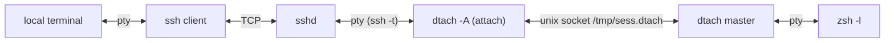
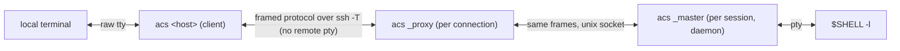
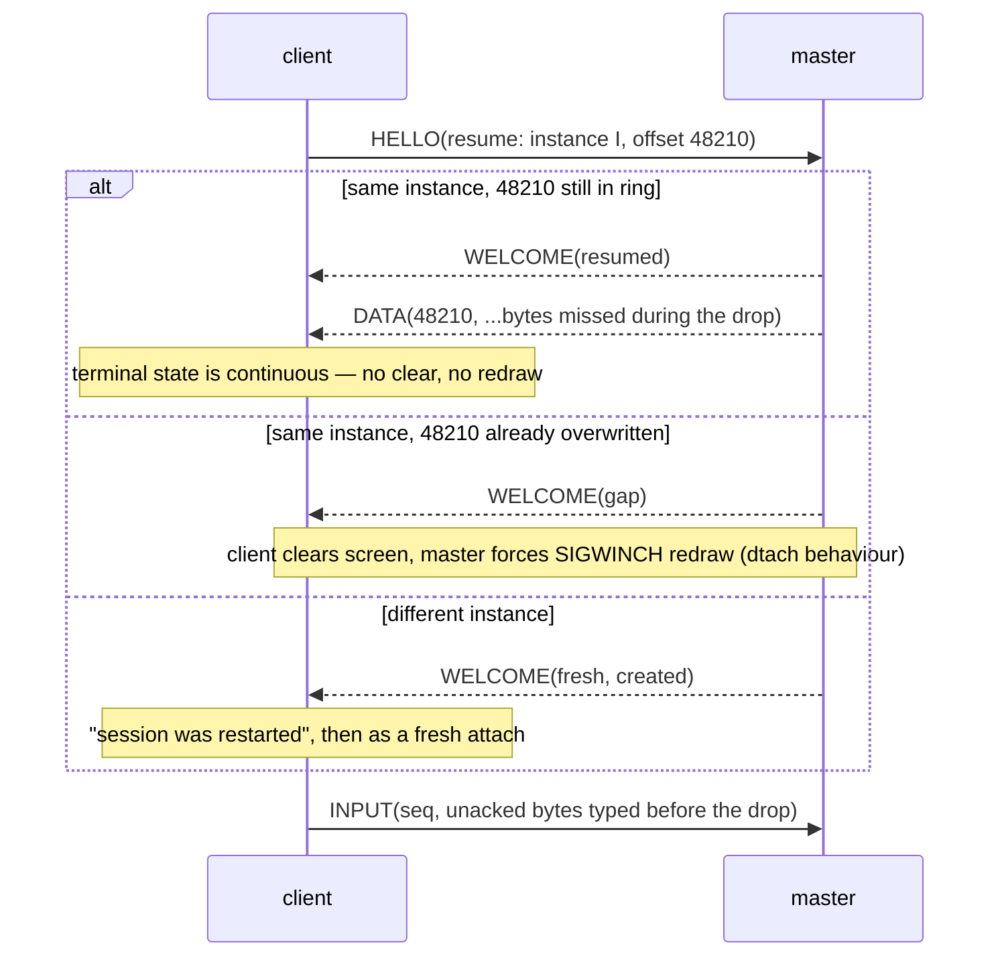
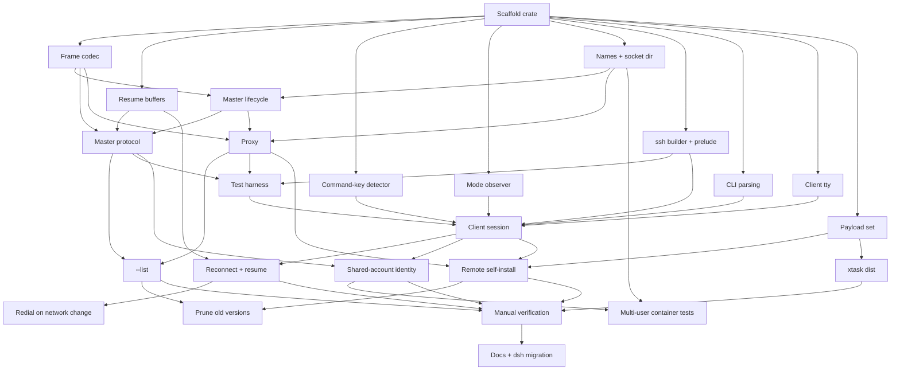

# acs — design

**Status:** Built — acs v1 implemented and verified (see
[VERIFICATION.md](VERIFICATION.md)).

`acs` (*Ad-hoc Connectivity Shell*) replaces the `dsh` shell function (`ssh` +
`dtach`) with **one Rust binary** that is both the local client and the remote
session holder. It keeps the property `dsh` exists for — an **unfiltered** byte
stream between the remote program and the local terminal — and adds what `dsh`
cannot do: lossless resume after a network drop, a local command key, and
self-installation on the remote.

## 1. What exists today

### 1.1 `dsh` (`~/.zshrc`)

```text
dsh <host> [session]        attach or create (session defaults to "main")
dsh <host> [session] -r     redial automatically after a drop
dsh <host> --list           list sessions on <host> and whether attached
```

It runs, per connection:

```sh
ssh -t "$host" "dtach -A /tmp/${sess}.dtach -r winch -z zsh -l"
```

- `-A` attach-or-create, `-r winch` redraw by SIGWINCH on attach, `-z` no
  suspend key; detach key is dtach's default **Ctrl-\\**.
- `-r` wraps that in a loop: `ServerAliveInterval=15`, `ServerAliveCountMax=3`,
  exponential backoff 1 s → 30 s (reset after a connection that lasted 30 s),
  and it **guesses** a clean end from the exit code (`0` or `130`).
- `--list` runs a `sh` script on the host that globs `/tmp/*.dtach` and counts
  `dtach` processes in `ps` output per socket: 0 = stale, 1 = detached,
  2+ = attached.
- Session names are restricted to `[A-Za-z0-9._-]`.

The comment above it states the requirement: *dtach proxies the pty
byte-for-byte, so the local terminal's scrollback keeps working — which is the
whole reason for not using mosh/screen/tmux.*

### 1.2 dtach (0.9, ~1.7 kLOC C)



- **Master**: `forkpty`s the command, `setsid`, listens on a unix socket, one
  `select` loop. Output is read in 4 KiB chunks and written raw to every
  *attached* client.
- **Client → master** is a fixed 10-byte packet: `type` (PUSH, ATTACH, DETACH,
  WINCH, REDRAW), `len`, and an 8-byte payload (keystrokes or a `winsize`).
  **Master → client** is the raw pty stream with no framing at all.
- **Attach** puts the local tty in raw mode, clears the screen (`ESC[H ESC[J`),
  sends ATTACH, then REDRAW with the window size; the master sets the size and
  `SIGWINCH`es the foreground process group.
- **With no attached client the master still reads the pty and discards the
  output**, so the program never blocks — and everything it printed while you
  were away is gone.
- **Backpressure**: while a client is attached but not writable, the master
  stops reading the pty, so a slow link slows the producer.
- The socket's `S_IXUSR` bit is set while a client is attached (usable as an
  "attached?" probe, which `dsh --list` does not use).

### 1.3 What that combination gets wrong

| Problem | Cause |
| --- | --- |
| Output while the link was down is lost | dtach discards output with no attached client, and bytes in flight in the dead TCP connection are gone |
| Drop detection takes up to 45 s | Relies on ssh `ServerAlive` (15 s × 3) |
| Clean end vs. drop is a guess | Only the ssh exit code (`0`/`130`) is available |
| Two ptys in the path | `ssh -t` allocates a remote pty just to carry dtach's raw stream |
| `TERM` travels only via `ssh -t` | No explicit negotiation of `TERM`/`COLORTERM` |
| Sessions in world-shared `/tmp` | `/tmp/<sess>.dtach` collides between users and leaks names |
| `--list` parses `ps` | No way to ask the master directly |
| Local terminal left in mouse/alt-screen mode after a drop | Nothing resets the modes the remote TUI turned on |
| Reconnect can hang on a dead ssh multiplexer | `~/.ssh/config` has `ControlMaster auto`; a reconnect can try the dead master's socket |
| Remote needs dtach installed | Package-manager dependency on every host |

## 2. Goals and non-goals

### Goals

1. **Unfiltered stream.** Pty output reaches the local terminal byte-for-byte,
   and keystrokes reach the pty byte-for-byte (except the command key, §6).
   No terminal emulation, no screen model, no rewriting — so local scrollback,
   mouse reporting, OSC 52 clipboard, hyperlinks, kitty graphics and keyboard
   protocols, and terminal queries/replies all work as if you had run `ssh -t`.
2. **One binary** for both sides and for both client platforms (macOS and
   Linux), statically linked on Linux, that can install itself on a remote
   (§8). Slim build < 1 MB; with the embedded Linux payloads < 2 MB.
3. **Survive network interruption** with no lost output, and detect a dead link
   in seconds rather than a minute.
4. **Command mode** on a double-tap of Ctrl-] (§6): `d` detach, `x` exit.
5. Drop-in for `dsh`: same arguments, same session names, same default shell.

### Non-goals

- A multiplexer (no panes, windows, or copy mode — that is tmux).
- Predictive local echo or UDP roaming (mosh). The transport stays ssh.
- Adopting existing dtach sessions — both can run side by side during migration.

## 3. Architecture

One executable, `acs`, with three roles. The user only ever types the first;
the other two are hidden subcommands the binary invokes on the remote.



| Role | Runs where | Lifetime | Job |
| --- | --- | --- | --- |
| **client** | local | one terminal session, across reconnects | raw mode, command key, resize, reconnect loop, renders pty bytes to stdout |
| **proxy** | remote, spawned by `sshd` | one ssh connection | find or start the master, then relay frames between ssh's stdio and the master's socket |
| **master** | remote, daemonised | the session | own the pty and child, keep the output ring, serve one active client |

Why keep a separate proxy rather than have the master talk to ssh: the master
must outlive every ssh connection, and `sshd` must see its channel close when
the connection ends. The proxy is a dumb relay — ~100 lines — so all state
lives in the master and the client.

**Transport** is `ssh -T -e none -o ControlMaster=no -o ControlPath=none
-o ServerAliveInterval=0 -o ConnectTimeout=10 <host> <remote command>`:

- `-T`: no remote pty. The ssh channel is an 8-bit clean pipe carrying frames;
  the only pty is the master's. One pty instead of two.
- `-e none`: ssh's `~.` escape is off (it is already off without a tty; this
  makes it explicit).
- `ControlMaster=no`, `ControlPath=none`: the session gets its own TCP
  connection, so a reconnect never waits on a dead multiplexer. Side commands
  (`--list`, install) keep using the user's multiplexing.
- `ServerAliveInterval=0`: liveness is ours (§5.3), much faster than ssh's.
- `ConnectTimeout=10`: a redial into a dead network fails fast and the
  client returns to its backoff wait, where `d` still detaches (§6.1).
- Everything else — keys, agent, `ProxyJump`, host aliases — comes from the
  user's ssh config unchanged, plus any ssh options given on the `acs`
  command line (`-i`, `-p`, `-J`, `-F`, `-o`; §7.1). `acs` opens no ports
  and has no auth of its own.

**No ssh-side configuration.** The client runs the system `ssh` binary as a
child process; the `-o` options above are per-invocation overrides and never
touch `~/.ssh/config` or `sshd_config`. The remote needs only what `dsh`
needs today — `sshd` allowing a command, and a POSIX `sh` — plus `gzip` and a
writable `~/.local/share/acs` for self-install (§8). Hosts that pin what ssh
may run (`ForceCommand`, `command=` in `authorized_keys`, restricted shells)
cannot work, as they cannot with `dsh`.

**Noise before the protocol.** Shell startup files sometimes print to stdout
even for non-interactive sessions (an `echo` in `.bashrc`, a `motd` script),
and those bytes would arrive ahead of the first frame. The remote side
therefore writes a marker line, `ACS-READY <proto version>\n`, immediately
before its first frame; the client discards everything before the marker (and
shows it on stderr under `-v`), then switches to frames. `ACS-NEED` (§8) is
found the same way.

## 4. Remote side

### 4.1 Session directory and naming

- Directory: `$ACS_SOCKET_DIR` if set, otherwise `/tmp/acs-$UID/` — keyed by
  the numeric uid from `getuid()`, never `$USER`. Not `$TMPDIR`: it can differ
  between login paths for the same user (`pam_tmpdir`, macOS per-session
  values), and a session must be found the same way from every ssh login.
  Created `0700`; see §4.5 for how it is checked.
- Socket: `<dir>/<session>.sock`. Names keep `dsh`'s `[A-Za-z0-9._-]` rule;
  every session has one (§4.4).
- **Not `$XDG_RUNTIME_DIR`**: `systemd-logind` deletes it when the user's last
  login session ends, which would orphan every master. (On hosts with
  `KillUserProcesses=yes` the master itself is killed too — as dtach is today;
  the fix there is `loginctl enable-linger`, which `acs` should mention in its
  error when it detects a master died that way.)
- `systemd-tmpfiles` may age files out of `/tmp`; the master re-checks its
  socket every minute and re-binds it if the path is gone — recreating the
  directory, with the same checks, if that went too (tmux's `SIGUSR1`
  recovery, made automatic).

### 4.2 Master

- Started by the proxy when `connect()` gets `ENOENT`/`ECONNREFUSED` (stale
  socket is unlinked first). Double-fork, `setsid`, stdio to `/dev/null`, bind
  the socket **before** forking the shell, then report readiness to the proxy
  over a pipe so the proxy never races the bind (dtach's `statusfd`).
  Creation holds `flock(<dir>/<session>.lock)` so two simultaneous attaches do
  not start two masters.
- Child: `$SHELL -l` in `$HOME` by default (`dsh` hardcodes `zsh -l`),
  overridable with `acs <host> [session] -- <command…>`. Environment gets
  `TERM` and `COLORTERM` from the client's HELLO (ssh `-T` no longer sends
  `TERM`), plus `ACS_SESSION=<name>`.
- **Output ring**: every byte read from the pty is appended to a ring buffer
  (default 1 MiB, configurable) and given a monotonically increasing `u64`
  offset. The ring is what makes resume lossless (§5.2).
- **Backpressure**: while a client is attached, the master stops reading the
  pty once unsent bytes would overwrite ring data the client has not received —
  the same slow-link backpressure dtach has. **With no client attached** it
  keeps reading and lets the ring wrap, so a detached program never blocks.
- **One active client.** A new attach takes over and the previous client gets
  `TAKEOVER` and exits with a message. Takeover is required anyway: after a
  drop, the old connection can look alive on the server for a while. (dtach
  allows several mirrored clients; nobody uses that with `dsh`, and two
  terminals fighting over the window size is worse than a clean handover.)
  Takeover is silent only when the new client has the **same client
  identity** as the attached one; otherwise it needs confirmation (§4.5).
- **Resize**: `TIOCSWINSZ`, which makes the kernel `SIGWINCH` the foreground
  group when the size changes. To force a redraw when the size is *unchanged*
  (fresh attach), signal `tcgetpgrp(pty)` with `SIGWINCH` directly — dtach's
  `-r winch`.
- **Child exit**: the master reaps it, sends `EXIT{status}` to the client,
  unlinks the socket, and exits.
- **Kill** (`x`, §6): `SIGHUP` to the child's process group, then `SIGKILL`
  after 3 s if it is still alive; then as child exit.
- **Instance id**: a random `u64` minted at creation and sent in `WELCOME`, so
  a client resuming into a *new* master with the same name (the old session
  ended and something recreated it) is told so instead of being handed offsets
  from a different stream.

### 4.3 Proxy

`acs _proxy <session> [--create] [--proto N]` — connect (or start and connect)
the master, then splice bytes both ways until either side closes. It does not
parse frames beyond checking the protocol version in the HELLO. `acs _proxy
--list` enumerates `<dir>/*.sock`, sends each master `STATUS`, and prints name,
attached/detached, the client identity attached (or last attached), created-at,
idle time, child command, and size. Sockets that
refuse connections are reported stale and removed — no `ps` parsing.

### 4.4 Session names and getting back in

"Reconnect" covers two different situations, and only one of them needs you to
know anything:

- **Resume** — the link dropped but the local `acs` process is still running.
  That process already holds the host, the session name, the master's
  instance id and the output offset, so it redials and resumes by itself
  (§5.2, §5.3). You never type a name. This is what "reconnect on by default"
  means.
- **Re-attach** — the local client is gone: you pressed `d`, closed the
  terminal window, rebooted the laptop, or the client was taken over. A new
  client has to name the session, so every session always has a name.

| Command | Session |
| --- | --- |
| `acs <host>` | `main` (or `$ACS_DEFAULT_SESSION`, §4.5) — attach, or create it if absent (as `dsh`) |
| `acs <host> <name>` | `<name>` — attach, or create it if absent |
| `acs <host> --new` | a new session named with the lowest free number: `1`, `2`, … (picked under the directory lock, so two `--new`s never collide) |
| `acs <host> --list` | list sessions: name, attached/detached, idle time, command |

So the unnamed case is covered two ways: plain `acs <host>` always means
`main`, which you never have to remember, and `--new` gives short numeric
names (as tmux does) for when you want a second session without inventing a
name.

To keep a session findable, the client says what it did **outside** the
session's byte stream — on stderr, before raw mode starts or after the
terminal is restored:

- When it **creates** a session (by `--new` or because the name did not exist):
  `acs: new session 'mian' on devbox`. A typo in a name therefore shows up
  immediately instead of as a mystery session in a later `--list`.
- When it **ends without the session ending** (detach, takeover, reconnect
  abandoned with `d`):
  `acs: detached from devbox/2 — reattach with: acs devbox 2`.
- Inside the session `ACS_SESSION=<name>` is set, so the shell prompt or
  `echo $ACS_SESSION` can show it.

If you still lose track, `acs <host> --list` tells you. With exactly one
session, `acs <host>` is still `main`, not "whatever is there" — the default
never depends on what else happens to exist.

### 4.5 Multiple users on one host

Nothing on the remote is shared between invocations except the filesystem:
no system daemon, no root, no shared socket, no port. Each master belongs to
the user who started it. Two cases need care.

#### Different Unix accounts — isolation

| Concern | Handling |
| --- | --- |
| Session names collide (`main` for everyone) | One directory per uid: `/tmp/acs-1000/main.sock` and `/tmp/acs-1001/main.sock` are unrelated |
| Another user pre-creates `/tmp/acs-<my uid>` (squatting, or a symlink to redirect sockets) | After `mkdir` (or on `EEXIST`), `lstat` the path: it must be a real directory, not a symlink, owned by my uid, mode `0700`. Otherwise refuse with an error naming the owner, and suggest `ACS_SOCKET_DIR`. The sticky bit on `/tmp` stops others from deleting it once it is mine |
| Another user connects to my socket | The directory is `0700`, and additionally the master checks the peer's uid on every accepted connection (`SO_PEERCRED` on Linux, `getpeereid` on macOS) and closes anything that is not its own uid. `root` can always get in; nothing can stop that |
| Binaries | Installed per user under `~/.local/share/acs/` (§8); no user runs another's binary |
| `x` kills something else | The master signals only its own child's process group |
| Session names visible to others | `ps` shows `acs _master <name>` to other users unless `/proc` is mounted with `hidepid`; the name is not a secret, but that is where it shows |

#### One account, several people — no accidents

On edge devices and shared lab boxes several people often log in as the same
account (`root`, `ubuntu`). There is no security boundary between them — the
same uid can always read the same sockets — so the aim is only that nobody
steals or breaks someone else's session **by accident**:

- **Client identity.** `HELLO` carries a display identity,
  `<local user>@<local hostname>` (for example `michel@mbp`), overridable with
  `ACS_IDENTITY`. The master records it for the attached client and for the
  session's creator.
- **Takeover across identities needs confirmation.** If the session is attached
  by a different identity, the master answers `BUSY{identity, since}` instead
  of `WELCOME`, and the client asks on the terminal:
  `session 'main' is attached from alice@laptop since 10:02 — take over? [y/N]`.
  `--force` skips the question; without a terminal the attach fails. The same
  identity (your own dropped connection, your own second terminal) takes over
  silently as before.
- **`--list` shows who** is attached and who created each session, so picking
  another name is easy.
- **Default name per person** when an account is shared: `ACS_DEFAULT_SESSION`
  (e.g. set to `$USER` in each person's local shell) replaces `main` as what
  plain `acs <host>` means. `main` stays the default otherwise, for `dsh`
  compatibility.
- **Different `acs` versions side by side.** Binaries are installed per
  version (§8), so a colleague with a newer or older client never overwrites
  the binary your sessions run on, and two clients never ping-pong upgrades.

## 5. Protocol

### 5.1 Frames

Length-prefixed, same format on the ssh leg and the unix-socket leg:

```text
+--------+-----------+-----------------+
| type u8| len u32 BE| payload[len]    |
+--------+-----------+-----------------+
```

| Type | Dir | Payload |
| --- | --- | --- |
| `HELLO` | c→m | proto version, session, mode (`attach`/`create`/`attach-or-create`), client identity, `force` flag, `TERM`, `COLORTERM`, cols, rows, xpixel, ypixel, optional `resume{instance, output_offset}` |
| `BUSY` | m→c | identity attached and since when; the client may retry `HELLO` with `force` (§4.5) |
| `WELCOME` | m→c | proto version, instance id, current output offset, `created` flag, `resumed` / `gap` / `fresh`, input sequence (bytes written to the pty so far — input sequence numbers count in the master's stream, so clients taking turns never collide) |
| `DATA` | m→c | `u64` offset of first byte, then raw pty bytes |
| `INPUT` | c→m | `u64` sequence of first byte, then raw bytes for the pty |
| `ACK` | m→c | highest input sequence written to the pty |
| `RESIZE` | c→m | cols, rows, xpixel, ypixel |
| `PING` / `PONG` | both | `u64` nonce |
| `DETACH` | c→m | — |
| `KILL` | c→m | — |
| `EXIT` | m→c | child wait status |
| `TAKEOVER` | m→c | — (another client attached) |
| `STATUS` / `STATUS_REPLY` | proxy↔m | session metadata for `--list` |
| `ERROR` | m→c | code, message |

Pty bytes are carried as opaque payload and written verbatim; framing is
invisible to the terminal. That is the unfiltered guarantee, restated in wire
terms.

### 5.2 Resume



- **Output**: the client records the offset of the last byte it wrote to its
  stdout. On reconnect the master replays from there. The local terminal has
  seen exactly the stream it would have seen without the drop, so its state —
  alternate screen, modes, scrollback — is correct with no redraw.
- **Input**: the client keeps bytes sent but not yet `ACK`ed and resends them
  on resume; the master discards any sequence it already wrote, so nothing is
  typed twice. Keys typed **while the client knows the link is down** are
  dropped rather than queued: blind typing into a frozen screen replayed
  seconds later is how accidents happen. (Command-mode keys still work — §6.)
- **Fresh attach** (new client, e.g. after an explicit detach or from another
  machine) does **not** replay the ring: the local terminal's state is unknown,
  and replaying mode-changing sequences into it is unsafe. It behaves like
  dtach: clear screen, set size, force redraw.

### 5.3 Liveness and reconnect

- Each side sends `PING` after 3 s of silence. The client declares the link
  dead after **10 s** with no frame received, kills its ssh child, and redials.
  Drop detection falls from dsh's 45 s to 10 s.
- Reconnect is **on by default**: the protocol distinguishes a clean end (`EXIT`,
  `DETACH` acknowledged, `TAKEOVER`) from a drop, so there is nothing to guess.
  `--no-reconnect` restores `dsh`'s default behaviour. Backoff 1 s → 30 s,
  reset after a connection that lasted 30 s (as in `dsh`), plus an immediate
  retry when the local host's default route changes (Wi-Fi switch, laptop
  wake) where the platform exposes that cheaply.
- Authentication prompts on reconnect (password, hardware key touch) are
  passed through, because ssh gets the controlling tty for prompts even with
  `-T`; the client restores cooked mode while ssh is authenticating. With
  keys in an agent, reconnect is silent.

### 5.4 Status while disconnected

Anything the client prints corrupts the screen the remote program drew, and a
lossless resume will not repaint it. So:

1. While the link is merely quiet (< 10 s), print nothing.
2. Once declared dead, write one status line on the bottom row using
   save-cursor / restore-cursor, and set the window title with the xterm title
   stack (push `CSI 22;0 t`, pop `CSI 23;0 t`) so the remote's title comes
   back afterwards.
3. After a successful resume that followed a printed status line, force one
   redraw to clean up the line: the client sends two RESIZE frames (one row
   fewer, then the real size), since an unchanged size raises no `SIGWINCH`.
   Full-screen programs repaint; a plain shell prompt may leave the line in
   scrollback, which is acceptable.

## 6. Command mode

### 6.1 Behaviour

| Keys | Effect |
| --- | --- |
| Ctrl-] | Held for up to **400 ms**. If nothing else arrives, it is sent to the remote. |
| Ctrl-] then any other key within 400 ms | Both keys sent to the remote, in order, immediately. |
| Ctrl-] Ctrl-] within 400 ms | Enter command mode: the next key is a command. |
| … then `d` | **Detach.** `DETACH` to the master, restore the local terminal, exit 0. The session keeps running. Works even while the link is down (it is purely local then). |
| … then `x` | **Exit.** `KILL` to the master, wait for `EXIT`, restore the terminal, exit with the child's status. Needs the link; if it is down the client says so and stays in the session. |
| … then any other key, or nothing for 2 s | All the held keys are sent to the remote as typed. |

The only cost is that a lone Ctrl-] reaches the remote up to 400 ms late. The
window is a setting (`ACS_ESCAPE_TIMEOUT_MS`), and so is the key.

Command mode prints nothing on the screen: the local terminal shows only what
the remote sent. The table is intended to grow — `r` (force redraw) and `?`
(help, followed by a redraw) are obvious next entries — but only `d` and `x`
are in scope.

### 6.2 Is Ctrl-] a good choice?

Ctrl-] is byte `0x1D`. Who uses it:

| Program | Use | Double-tap within 400 ms plausible? |
| --- | --- | --- |
| vim / neovim | jump to tag (`:help` links, ctags, LSP go-to-definition) | Rare. Two jumps in a row is possible but not fast |
| emacs | `abort-recursive-edit` | Rare |
| telnet | escape character | Only if you run telnet inside the session |
| bash / zsh line editors | jump to next occurrence of a character (readline `character-search`, zsh `vi-find-next-char`) | No — rarely used, and a double tap only searches for `^]` |
| Claude Code, less, htop, git TUIs | nothing | No |

The alternatives are worse. **Ctrl-\\** (dtach's default) is SIGQUIT in every
shell. **Ctrl-^** is vim's alternate-buffer switch, which people double-tap
constantly. **Ctrl-_** is undo in readline and emacs. **Ctrl-]** is the
traditional escape for remote-terminal tools (telnet, `virsh console`), and
the double tap makes a clash with vim's tag jump very unlikely.
**Recommendation: keep Ctrl-] Ctrl-]**, configurable.

### 6.3 Recognising the key — three encodings

Modern TUIs change how the local terminal encodes Ctrl-]. The detector must
match all of these, or command mode silently breaks inside exactly the
programs this tool exists for:

| Mode (turned on by the remote program) | Bytes for Ctrl-] |
| --- | --- |
| legacy | `1D` |
| kitty keyboard protocol (`CSI > flags u`) | `CSI 93 ; 5 u`; with event types `CSI 93 ; 5 : 1 u` (press), `: 2` repeat, `: 3` release |
| xterm `modifyOtherKeys` level 2 | `CSI 27 ; 5 ; 93 ~` |

Rules:

- The detector sits on the **input** path and consumes whole escape sequences,
  so it never matches inside a longer sequence, and a sequence split across two
  `read()`s is buffered until complete.
- A release event for a held or consumed Ctrl-] goes where its press went
  (forwarded together, or swallowed together), so the remote never sees an
  unmatched release.
- **Bracketed paste** (`CSI 200 ~` … `CSI 201 ~`) is forwarded untouched: a
  pasted `0x1D 0x1D d` must not detach you.
- Terminal replies to remote queries (DA, OSC 11, `CSI ? u`, XTVERSION) start
  with `ESC`, never with a held key, so they are never delayed. They, mouse
  reports and focus events are forwarded at once and do not break a pending
  double tap.
- One exception to reassembly: a read that ends in a **lone `ESC`** is the Esc
  key and is sent at once — vim users press it constantly, and delaying it is
  worse than missing the rare escape-key sequence split right after its first
  byte. An incomplete `CSI` at the end of a read is held for at most 100 ms.

### 6.4 Restoring the local terminal on detach

The remote program may have turned on terminal modes that should not outlast
the session: mouse reporting, bracketed paste, alternate screen, hidden cursor,
the kitty keyboard stack, `modifyOtherKeys`, focus events. dtach leaves them on,
which is why moving the mouse after a dropped `dsh` prints garbage.

The client runs a **passive observer** over the output stream: it scans for
the few mode-setting sequences above and records what is on. It never modifies,
delays or reorders the stream. On detach, exit, or an abandoned reconnect, the
client writes the matching resets (for example `CSI ? 1000 l`, `CSI ? 1049 l`,
`CSI < u`) and restores the original `termios`. On a successful resume it does
nothing, because the terminal state is still correct.

## 7. Client

- Argument parsing matches `dsh`: `acs [ssh options] [user@]<host> [session]
  [-l|--list] [--new] [--no-reconnect] [-- command…]` (§4.4, §7.1). `-r` is
  accepted and ignored, since reconnecting is the default.
- `cfmakeraw`-equivalent `termios` (dtach's flags), restored on every exit
  path: normal, signal (`SIGHUP`, `SIGTERM`, `SIGINT` before raw mode), and
  panic (`panic = "abort"` plus a restore in a drop guard and a signal handler).
- `SIGWINCH` → `RESIZE`.
- Single-threaded `poll` loop over stdin, the ssh child's pipes, a self-pipe for
  signals, and a timer (escape timeout, pings) — the same shape as dtach.
- Exit status: the child's status after `EXIT` (128+n for signals), 0 on detach,
  and distinct codes for "host unreachable", "remote install failed" and
  "taken over".

### 7.1 ssh options

A handful of ssh's own options are accepted with ssh's spelling and meaning,
and passed **verbatim** to every ssh call `acs` makes — the session transport,
reconnects, `--list` and remote install — so a host reachable as
`ssh -i ~/.ssh/id_work -p 2222 me@box` is reachable as
`acs -i ~/.ssh/id_work -p 2222 me@box`:

| Option | Meaning (as in ssh) |
| --- | --- |
| `-i <identity_file>` | private key to use; repeatable, ssh tries them in order |
| `-p <port>` | port |
| `-J <destination>` | jump host(s) |
| `-F <configfile>` | alternative ssh config file |
| `-o <option=value>` | any ssh config option; repeatable (e.g. `-o IdentitiesOnly=yes` to use **only** the `-i` key rather than the agent's keys first) |
| `[user@]host` | login name in the destination, as with ssh |

- **`-l` stays `--list`**, as in `dsh`; ssh's `-l <login>` is not accepted.
  The login name goes in `user@host` or `-o User=<login>`.
- `acs` does not interpret these values (a `~` in `-i` is expanded by ssh, as
  usual). `ACS_SSH` or `--ssh <path>` picks the ssh binary; default is `ssh`
  on `PATH`.
- **Precedence**: ssh keeps the *first* value it sees for an option, so `acs`
  places the options its transport depends on (§3: `-T`, `-e none`,
  `ControlMaster=no`, `ControlPath=none`, `ServerAliveInterval=0`) **before**
  the user's. A stray `-o ControlMaster=auto` cannot break reconnects; every
  other option, including all `-i` keys, applies as given.

### 7.2 Configuration file

The client reads YAML settings from two files, following the XDG Base
Directory spec; either may be missing:

1. **global** `/etc/acs/config.yaml` (`ACS_GLOBAL_CONFIG` names another file,
   for packagers and tests), then
2. **local** `$XDG_CONFIG_HOME/acs/config.yaml`, by default
   `~/.config/acs/config.yaml`.

```yaml
install_on_remote: true        # install acs on a host that lacks it (§8)
hosts:                         # aliases: acs devbox tries these in order
  devbox:
    - host: devbox.lan
      reachability_check: true # ping once first (the default)
    - host: devbox.example.com
      user: michel             # otherwise ~/.ssh/config decides
```

- **Merging**: a setting in the local file replaces the global one; mappings
  (`hosts`) merge key by key; lists (an alias's hosts) concatenate, global
  entries first. An empty value (`key:`) sets nothing.
- **Errors are not defaults**: a malformed file, an unknown key or a value of
  the wrong type stops the client with the file and line
  (`~/.config/acs/config.yaml:3: install_on_remote: expected true or false`).
  `--help` and `--version` do not read the files.
- **`install_on_remote: false`**: when the prelude reports `ACS-NEED` (§8)
  the client installs nothing; it says which host lacks which version, where
  the setting came from, and exits with the install-failed code (254).
- `hosts` is parsed and validated: `host` is required, `user` and
  `reachability_check` (default `true`) are optional, and one entry may be
  written without the list. How an alias is resolved is §7.3.
- Only the local client reads the files; `_proxy`, `_master` and `_install`
  never do.

**Parser.** The files use a small subset of YAML — block mappings and lists,
plain and quoted scalars, one-line `[…]`/`{…}`, comments — parsed by hand in
`yaml.rs`, which refuses anchors, tags, block scalars and multi-line flow
collections with the line they are on. The tree keeps every node's line and
the comments around it, so a file rewritten by the client keeps its comments
and order. Measured on the release profile, a minimal load-and-dump binary
grows by about 100 KB with `yaml-rust2` and 150 KB with `serde_yaml`, and
neither keeps comments; the hand-written parser adds 17 KB to `acs` (slim
build 490 → 507 KB).

### 7.3 Host aliases

`acs <name>`, where `<name>` has no `user@` part and is a key of `hosts`
(§7.2), connects to one of the alias's entries instead of `<name>`:

- Entries are tried **in order**. One with `reachability_check: true` (the
  default) is pinged once — `ping -c 1` with a 2 s deadline, spelled `-t` on
  macOS and `-W` on Linux (`ACS_PING` names another program, which is how the
  tests avoid ICMP). The first that answers is used. One with
  `reachability_check: false` is used without a ping, for hosts that drop
  ICMP.
- The chosen entry becomes the ssh destination: `user@host` if it has a
  `user`, otherwise `host`, so `~/.ssh/config` decides the login name.
- **None answers**: the client names every host it tried and exits with the
  unreachable code (255) without calling ssh.
- It applies to every ssh call — the session, `--list`, install — since they
  share one destination. `-v` says which entry was chosen and why.
- **Redial**: a reconnect (§5.3) resolves the alias again, so after a network
  change the client reaches the host through whichever address answers now.
  A change of host is always shown (`devbox: now using … (was …)`). The
  session is found only if the new address is the **same machine**: entries
  of one alias should be ways to reach one host; if they are different
  machines, the redial reports that the session has ended.
- Messages and the `reattach with: acs <name>` hints use the alias, not the
  resolved host.
- A name that is not an alias behaves exactly as before; so does
  `user@<alias>`, which is a way to reach a host whose name is also an alias.

## 8. Installing the remote binary

Remote binaries are installed **per version**:
`~/.local/share/acs/<version>/acs`. A client always runs exactly its own
version on the remote, so different users of one account, or one user with
two laptops on different releases, never replace each other's binary. The
remote command is a short POSIX `sh` prelude with the client's version baked
in, so a missing binary is detected in the same ssh round trip:

```sh
v=0.3.1
for b in "$HOME/.local/share/acs/$v/acs" "/usr/local/lib/acs/$v/acs"; do
  [ -x "$b" ] && exec "$b" _proxy main --create
done
printf 'ACS-NEED %s %s\n' "$(uname -s)" "$(uname -m)"
```

- `/usr/local/lib/acs/<version>/` is an optional system-wide location an
  administrator can populate once for all users; `acs` never writes there.
- After an install, `~/.local/bin/acs` is repointed (symlink created under a
  temporary name, then renamed over) at the newest installed version, so the
  remote can be used as a client for the next hop. Nothing in the protocol
  depends on that link.
- `acs _proxy` touches its version directory on start; versions untouched for
  30 days whose sessions have all ended are removed by the next proxy start.

When the client reads `ACS-NEED`, it maps the `uname` pair to a target,
installs a binary for it (below), and redials. Protocol versions are checked in
`HELLO`; a new proxy that finds an older master tells the user to finish or
kill the session rather than guess across versions.

### 8.1 Every copy can install every remote

The rule: **any complete `acs` binary — whether it runs on macOS or Linux —
can install a complete `acs` on any supported Linux remote, with no network
access on either end and no second file.** Linux is a client platform as much
as macOS, and a host reached with `acs` can itself be the client for the next
hop.

Two kinds of build:

- **slim** — just the program. What `cargo build` produces.
- **complete** — a slim binary plus a **payload set** `P`: the slim builds for
  the remote targets, each gzip-compressed. Default remote targets are
  `x86_64-unknown-linux-musl` and `aarch64-unknown-linux-musl` (statically
  linked, so they run on any distribution); `armv7-unknown-linux-musleabihf`
  can be added at build time.

How `P` is attached depends on the executable format:

| Format | Attachment | Why |
| --- | --- | --- |
| ELF (Linux) | appended trailer: `[slim][P entries][index][magic + index offset]`, read back through `current_exe()` | The loader ignores bytes past the last segment, and a trailer lets an installed copy be **reassembled** on the remote from parts (below) |
| Mach-O (macOS) | linked in with `include_bytes!` in a second build stage, before signing | `codesign` refuses a file whose `__LINKEDIT` does not reach the end, so appending is not an option |

Installing on a remote whose target is `r`:

1. **`r` is my own target and I am ELF** — send my own file. It is already the
   complete binary for `r`. (Linux → Linux, same architecture.)
2. **`r` is a Linux target in `P`** — send `slim_r` from `P`, then `P` itself.
   The remote ends up with `slim_r` + `P`, byte-identical to the released
   complete binary for `r`, so it can install onward. (macOS → Linux,
   Linux x86_64 → Linux aarch64.)
3. **`r` is macOS** — macOS remotes are only installed by a macOS client of
   the same architecture copying itself; anything else gets a message to
   install by hand. macOS as a remote is rare, and carrying Mach-O payloads
   would add ~0.4 MB to every binary.

On the wire, with no decompressor needed inside `acs` (gzip is on every
Linux, busybox included), in two ssh calls that may use the user's
multiplexed connection:

```sh
# 1: unpack the slim binary; stdin is gz(slim_r) from P
d=~/.local/share/acs/0.3.1; mkdir -p $d && gzip -dc > $d/acs.new.<token> && chmod 755 $d/acs.new.<token>
# 2: stdin is P; append it as a trailer, check the SHA-256 the client
#    computed, then rename over $d/acs and repoint ~/.local/bin/acs
$d/acs.new.<token> _install --finish --sha256 <digest>
```

Step 2 is skipped in case 1 (the file sent is already complete, and step 1
then uses `cat` rather than `gzip -dc`). `<token>` is random per install, so
two clients installing the same version at once write separate files and the
final atomic rename puts identical content in place either way. A version's
binary is never replaced by different content, so running masters are never
affected by someone else's install.

**Size** (measured with `cargo xtask dist`, release profile):

| Target | Slim | Complete |
| --- | --- | --- |
| `x86_64-unknown-linux-musl` | 602 KB | 1.21 MB |
| `aarch64-unknown-linux-musl` | 553 KB | 1.16 MB |
| `aarch64-apple-darwin` | 473 KB | 1.10 MB |
| `x86_64-apple-darwin` | 494 KB | 1.13 MB |

The payload set (both Linux builds, gzip'd) is 609 KB.

**Build** is `cargo xtask dist`: (1) build slim for every target with
`cargo-zigbuild`; (2) gzip them into `P`; (3) complete the Linux builds by
appending the trailer and the macOS builds by rebuilding with
`--features embed-payloads`, then signing. A plain `cargo build` binary is
slim: it can still self-copy (case 1) and says `cargo xtask dist` is needed
for anything else.

## 9. Implementation

- **Crates, chosen for size**: only `libc` (termios, pty, poll, signals,
  `flock`, peer credentials — wrapped in `sys.rs`) and `lexopt` for arguments
  (clap adds hundreds of KB); hand-written frame codec; no compression crate
  (the remote's `gzip` unpacks payloads, §8.1); an in-crate SHA-256 for the
  install digest; a hand-written parser for the YAML subset of the
  configuration file (§7.2). **No async runtime**: the single-threaded poll
  loops do not need tokio.
- **Profile**: `opt-level = "z"`, `lto = true`, `codegen-units = 1`,
  `panic = "abort"`, `strip = true`.
- **Targets**: `aarch64-apple-darwin` (local, installed), `x86_64-apple-darwin`,
  `x86_64-unknown-linux-musl`, `aarch64-unknown-linux-musl` via
  `cargo-zigbuild` (not installed yet; the installed
  `aarch64-unknown-linux-gnu` target would produce a glibc-linked binary, which
  is not what a copy-anywhere remote needs).
- **Layout** (single crate plus `xtask`):

```text
src/
  lib.rs        role dispatch (client | _proxy | _master | _install), --version
  cli.rs        dsh-compatible arguments, ssh option passthrough
  client.rs     dial, handshake, session loop, detach/exit, messages
  reconnect.rs  liveness, backoff, offline status line, takeover prompt
  keys.rs       Ctrl-] Ctrl-] command-key detector
  modes.rs      passive terminal-mode observer and resets
  netwatch.rs   network-change watcher (PF_ROUTE / NETLINK_ROUTE)
  tty.rs        raw mode and emergency restore
  proto.rs      frames, messages, ACS-READY / ACS-NEED markers
  resume.rs     output ring, input ack tracking
  ssh.rs        ssh argv builder, remote prelude, quoting
  session.rs    session names, per-uid socket directory, locks
  proxy.rs      acs _proxy: connect-or-spawn, relay, --list
  master.rs     acs _master: pty, child, ring, protocol
  list.rs       --list table
  config.rs     configuration files: locations, merging, validation
  alias.rs      host aliases: ping check and fallback hosts
  yaml.rs       the YAML subset those files use, parsed and written back
  install.rs    remote self-install and _install --finish
  payload.rs    payload set format, ELF trailer, Mach-O embed
  prune.rs      pruning of unused remote versions
  sha256.rs     SHA-256 for install checks
  sys.rs        libc wrappers
xtask/          cargo xtask dist
tests/          integration tests (tests/common: fake remote, pty runner)
scripts/        verify.sh, test_linux.sh, e2e_ssh.sh
```

### 9.1 Testing

- **Unit**: frame codec round-trips and truncation; ring buffer offsets and
  wrap-around; the command-key detector as a table of `(bytes, timings) →
  (forwarded bytes, action)` over an injected clock, covering all three
  encodings, split reads, key release events and bracketed paste; the mode
  observer on sequences split at every byte boundary; the ssh argv builder
  (session calls put the transport options first; the user's
  `-i`/`-p`/`-J`/`-F`/`-o` follow in order and are identical for session,
  `--list` and install calls).
- **Integration** (no ssh): `--transport-cmd` makes the client exec
  `acs _proxy …` locally instead of `ssh host acs _proxy …`. Tests start a
  session running a deterministic producer, kill the transport mid-stream,
  and assert that the bytes on the client's stdout are identical to the
  producer's output — lossless resume as a byte-for-byte equality check.
  Plus: detach and re-attach, `x` killing the child's process group, takeover,
  a stale socket, two concurrent creates racing on the lock, and a gap after
  ring overflow.
- **Multi-user** (integration, needs a second test uid or root in CI):
  a squatted or symlinked socket directory is refused; a peer with another
  uid is disconnected; same-identity takeover is silent and cross-identity
  takeover returns `BUSY` until `force`; two versions installed side by side
  each serve their own clients; concurrent same-version installs converge.
- **Manual matrix**: vim (tag jump, mouse), Claude Code, htop, `less`, OSC 52
  copy, kitty-protocol TUIs, over a link broken with `pfctl` or by switching
  Wi-Fi.

## 10. Migration

`acs` uses its own socket directory and does not touch `/tmp/*.dtach`, so both
run side by side. Once it has been in use for a while, `dsh` becomes
`alias dsh=acs` and the function and the dtach dependency are deleted.

## 11. Implementation plan

Tracked as beads (`br`) under the epic **"acs v1: single-binary persistent ssh
sessions"** — `br show` on it, or `bv --robot-plan`, gives the live state.
Every bead carries its DESIGN section references and acceptance tests.
Blocking order:



The first usable milestone is **Client session**: attach, detach and exit
over ssh to a host where `acs` was installed by hand. **Reconnect + resume**
and **Remote self-install** make it a `dsh` replacement.

## 12. Decisions

| # | Question | Decision |
| --- | --- | --- |
| 1 | Name | `acs`, after the repository |
| 2 | Remote binary provisioning | Every complete binary, macOS or Linux, carries slim Linux payloads and can install a complete copy on any Linux remote; ELF self-copies (§8.1) |
| 3 | Reconnect on by default | Yes. Resume after a drop is automatic because the running client knows the session; re-attaching from a new client uses the session name, which always exists — `main` by default, numbered with `--new` (§4.4) |
| 4 | Takeover vs. mirrored clients | Takeover (§4.2) |
| 5 | Escape key | Ctrl-] Ctrl-] with a 400 ms window, configurable (§6.2) |
| 6 | Multiple users per host | Per-uid socket directory with ownership and peer-uid checks; per-version installs; on shared accounts, client identity with confirmed cross-identity takeover (§4.5) |
