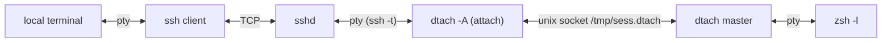
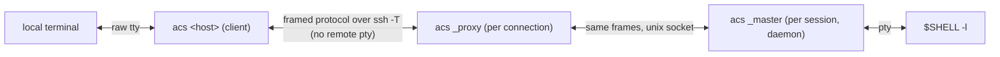
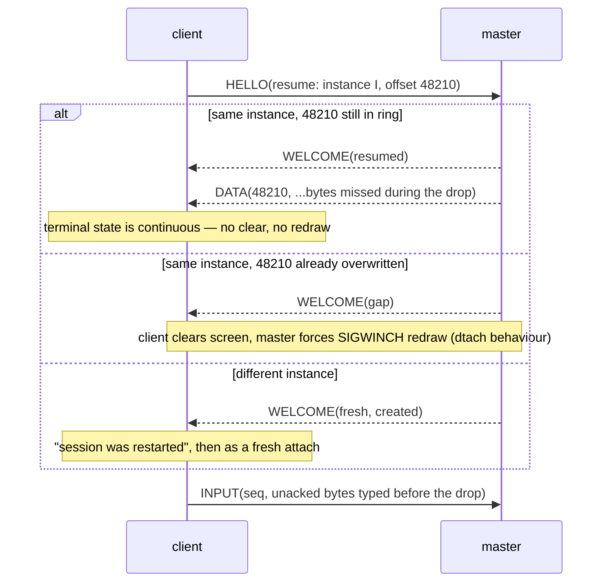

# acs — design

**Status:** Proposed — design only, nothing built.

`acs` replaces the `dsh` shell function (`ssh` + `dtach`) with **one Rust
binary** that is both the local client and the remote session holder. It keeps
the property `dsh` exists for — an **unfiltered** byte stream between the remote
program and the local terminal — and adds what `dsh` cannot do: lossless resume
after a network drop, a local command key, and self-installation on the remote.

## 1. What exists today

### 1.1 `dsh` (`~/.zshrc`)

```text
dsh <host> [session]        attach or create (session defaults to "main")
dsh <host> [session] -r     redial automatically after a drop
dsh <host> --list           list sessions on <host> and whether attached
```

It runs, per connection:

```sh
ssh -t "$host" "dtach -A /tmp/${sess}.dtach -r winch -z zsh -l"
```

- `-A` attach-or-create, `-r winch` redraw by SIGWINCH on attach, `-z` no
  suspend key; detach key is dtach's default **Ctrl-\\**.
- `-r` wraps that in a loop: `ServerAliveInterval=15`, `ServerAliveCountMax=3`,
  exponential backoff 1 s → 30 s (reset after a connection that lasted 30 s),
  and it **guesses** a clean end from the exit code (`0` or `130`).
- `--list` runs a `sh` script on the host that globs `/tmp/*.dtach` and counts
  `dtach` processes in `ps` output per socket: 0 = stale, 1 = detached,
  2+ = attached.
- Session names are restricted to `[A-Za-z0-9._-]`.

The comment above it states the requirement: *dtach proxies the pty
byte-for-byte, so the local terminal's scrollback keeps working — which is the
whole reason for not using mosh/screen/tmux.*

### 1.2 dtach (0.9, ~1.7 kLOC C)



- **Master**: `forkpty`s the command, `setsid`, listens on a unix socket, one
  `select` loop. Output is read in 4 KiB chunks and written raw to every
  *attached* client.
- **Client → master** is a fixed 10-byte packet: `type` (PUSH, ATTACH, DETACH,
  WINCH, REDRAW), `len`, and an 8-byte payload (keystrokes or a `winsize`).
  **Master → client** is the raw pty stream with no framing at all.
- **Attach** puts the local tty in raw mode, clears the screen (`ESC[H ESC[J`),
  sends ATTACH, then REDRAW with the window size; the master sets the size and
  `SIGWINCH`es the foreground process group.
- **With no attached client the master still reads the pty and discards the
  output**, so the program never blocks — and everything it printed while you
  were away is gone.
- **Backpressure**: while a client is attached but not writable, the master
  stops reading the pty, so a slow link slows the producer.
- The socket's `S_IXUSR` bit is set while a client is attached (usable as an
  "attached?" probe, which `dsh --list` does not use).

### 1.3 What that combination gets wrong

| Problem | Cause |
| --- | --- |
| Output while the link was down is lost | dtach discards output with no attached client, and bytes in flight in the dead TCP connection are gone |
| Drop detection takes up to 45 s | Relies on ssh `ServerAlive` (15 s × 3) |
| Clean end vs. drop is a guess | Only the ssh exit code (`0`/`130`) is available |
| Two ptys in the path | `ssh -t` allocates a remote pty just to carry dtach's raw stream |
| `TERM` travels only via `ssh -t` | No explicit negotiation of `TERM`/`COLORTERM` |
| Sessions in world-shared `/tmp` | `/tmp/<sess>.dtach` collides between users and leaks names |
| `--list` parses `ps` | No way to ask the master directly |
| Local terminal left in mouse/alt-screen mode after a drop | Nothing resets the modes the remote TUI turned on |
| Reconnect can hang on a dead ssh multiplexer | `~/.ssh/config` has `ControlMaster auto`; a reconnect can try the dead master's socket |
| Remote needs dtach installed | Package-manager dependency on every host |

## 2. Goals and non-goals

### Goals

1. **Unfiltered stream.** Pty output reaches the local terminal byte-for-byte,
   and keystrokes reach the pty byte-for-byte (except the command key, §6).
   No terminal emulation, no screen model, no rewriting — so local scrollback,
   mouse reporting, OSC 52 clipboard, hyperlinks, kitty graphics and keyboard
   protocols, and terminal queries/replies all work as if you had run `ssh -t`.
2. **One binary** for both sides, statically linked on Linux, ideally < 1 MB.
3. **Survive network interruption** with no lost output, and detect a dead link
   in seconds rather than a minute.
4. **Command mode** on a double-tap of Ctrl-] (§6): `d` detach, `x` exit.
5. Drop-in for `dsh`: same arguments, same session names, same default shell.

### Non-goals

- A multiplexer (no panes, windows, or copy mode — that is tmux).
- Predictive local echo or UDP roaming (mosh). The transport stays ssh.
- Adopting existing dtach sessions — both can run side by side during migration.

## 3. Architecture

One executable, `acs`, with three roles. The user only ever types the first;
the other two are hidden subcommands the binary invokes on the remote.



| Role | Runs where | Lifetime | Job |
| --- | --- | --- | --- |
| **client** | local | one terminal session, across reconnects | raw mode, command key, resize, reconnect loop, renders pty bytes to stdout |
| **proxy** | remote, spawned by `sshd` | one ssh connection | find or start the master, then relay frames between ssh's stdio and the master's socket |
| **master** | remote, daemonised | the session | own the pty and child, keep the output ring, serve one active client |

Why keep a separate proxy rather than have the master talk to ssh: the master
must outlive every ssh connection, and `sshd` must see its channel close when
the connection ends. The proxy is a dumb relay — ~100 lines — so all state
lives in the master and the client.

**Transport** is `ssh -T -e none -o ControlMaster=no -o ControlPath=none
-o ServerAliveInterval=0 <host> <remote command>`:

- `-T`: no remote pty. The ssh channel is an 8-bit clean pipe carrying frames;
  the only pty is the master's. One pty instead of two.
- `-e none`: ssh's `~.` escape is off (it is already off without a tty; this
  makes it explicit).
- `ControlMaster=no`, `ControlPath=none`: the session gets its own TCP
  connection, so a reconnect never waits on a dead multiplexer. Side commands
  (`--list`, install) keep using the user's multiplexing.
- `ServerAliveInterval=0`: liveness is ours (§5.3), much faster than ssh's.
- Everything else — keys, agent, `ProxyJump`, host aliases — comes from the
  user's ssh config unchanged. `acs` opens no ports and has no auth of its own.

## 4. Remote side

### 4.1 Session directory and naming

- Directory: `${TMPDIR:-/tmp}/acs-$UID/`, created `0700`; the master refuses to
  start if it exists and is not owned by the user or is group/other writable.
- Socket: `<dir>/<session>.sock`. Names keep `dsh`'s `[A-Za-z0-9._-]` rule;
  default `main`.
- **Not `$XDG_RUNTIME_DIR`**: `systemd-logind` deletes it when the user's last
  login session ends, which would orphan every master. (On hosts with
  `KillUserProcesses=yes` the master itself is killed too — as dtach is today;
  the fix there is `loginctl enable-linger`, which `acs` should mention in its
  error when it detects a master died that way.)
- `systemd-tmpfiles` may age files out of `/tmp`; the master re-checks its
  socket every minute and re-binds it if the path is gone (tmux's `SIGUSR1`
  recovery, made automatic).

### 4.2 Master

- Started by the proxy when `connect()` gets `ENOENT`/`ECONNREFUSED` (stale
  socket is unlinked first). Double-fork, `setsid`, stdio to `/dev/null`, bind
  the socket **before** forking the shell, then report readiness to the proxy
  over a pipe so the proxy never races the bind (dtach's `statusfd`).
  Creation holds `flock(<dir>/<session>.lock)` so two simultaneous attaches do
  not start two masters.
- Child: `$SHELL -l` in `$HOME` by default (`dsh` hardcodes `zsh -l`),
  overridable with `acs <host> [session] -- <command…>`. Environment gets
  `TERM` and `COLORTERM` from the client's HELLO (ssh `-T` no longer sends
  `TERM`), plus `ACS_SESSION=<name>`.
- **Output ring**: every byte read from the pty is appended to a ring buffer
  (default 1 MiB, configurable) and given a monotonically increasing `u64`
  offset. The ring is what makes resume lossless (§5.2).
- **Backpressure**: while a client is attached, the master stops reading the
  pty once unsent bytes would overwrite ring data the client has not received —
  the same slow-link backpressure dtach has. **With no client attached** it
  keeps reading and lets the ring wrap, so a detached program never blocks.
- **One active client.** A new attach takes over and the previous client gets
  `TAKEOVER` and exits with a message. Takeover is required anyway: after a
  drop, the old connection can look alive on the server for a while. (dtach
  allows several mirrored clients; nobody uses that with `dsh`, and two
  terminals fighting over the window size is worse than a clean handover.)
- **Resize**: `TIOCSWINSZ`, which makes the kernel `SIGWINCH` the foreground
  group when the size changes. To force a redraw when the size is *unchanged*
  (fresh attach), signal `tcgetpgrp(pty)` with `SIGWINCH` directly — dtach's
  `-r winch`.
- **Child exit**: the master reaps it, sends `EXIT{status}` to the client,
  unlinks the socket, and exits.
- **Kill** (`x`, §6): `SIGHUP` to the child's process group, then `SIGKILL`
  after 3 s if it is still alive; then as child exit.
- **Instance id**: a random `u64` minted at creation and sent in `WELCOME`, so
  a client resuming into a *new* master with the same name (the old session
  ended and something recreated it) is told so instead of being handed offsets
  from a different stream.

### 4.3 Proxy

`acs _proxy <session> [--create] [--proto N]` — connect (or start and connect)
the master, then splice bytes both ways until either side closes. It does not
parse frames beyond checking the protocol version in the HELLO. `acs _proxy
--list` enumerates `<dir>/*.sock`, sends each master `STATUS`, and prints name,
attached/detached, created-at, idle time, child command, and size. Sockets that
refuse connections are reported stale and removed — no `ps` parsing.

## 5. Protocol

### 5.1 Frames

Length-prefixed, same format on the ssh leg and the unix-socket leg:

```text
+--------+-----------+-----------------+
| type u8| len u32 BE| payload[len]    |
+--------+-----------+-----------------+
```

| Type | Dir | Payload |
| --- | --- | --- |
| `HELLO` | c→m | proto version, session, mode (`attach`/`create`/`attach-or-create`), `TERM`, `COLORTERM`, cols, rows, xpixel, ypixel, optional `resume{instance, output_offset}` |
| `WELCOME` | m→c | proto version, instance id, current output offset, `created` flag, `resumed` / `gap` / `fresh` |
| `DATA` | m→c | `u64` offset of first byte, then raw pty bytes |
| `INPUT` | c→m | `u64` sequence of first byte, then raw bytes for the pty |
| `ACK` | m→c | highest input sequence written to the pty |
| `RESIZE` | c→m | cols, rows, xpixel, ypixel |
| `PING` / `PONG` | both | `u64` nonce |
| `DETACH` | c→m | — |
| `KILL` | c→m | — |
| `EXIT` | m→c | child wait status |
| `TAKEOVER` | m→c | — (another client attached) |
| `STATUS` / `STATUS_REPLY` | proxy↔m | session metadata for `--list` |
| `ERROR` | m→c | code, message |

Pty bytes are carried as opaque payload and written verbatim; framing is
invisible to the terminal. That is the unfiltered guarantee, restated in wire
terms.

### 5.2 Resume



- **Output**: the client records the offset of the last byte it wrote to its
  stdout. On reconnect the master replays from there. The local terminal has
  seen exactly the stream it would have seen without the drop, so its state —
  alternate screen, modes, scrollback — is correct with no redraw.
- **Input**: the client keeps bytes sent but not yet `ACK`ed and resends them
  on resume; the master discards any sequence it already wrote, so nothing is
  typed twice. Keys typed **while the client knows the link is down** are
  dropped rather than queued: blind typing into a frozen screen replayed
  seconds later is how accidents happen. (Command-mode keys still work — §6.)
- **Fresh attach** (new client, e.g. after an explicit detach or from another
  machine) does **not** replay the ring: the local terminal's state is unknown,
  and replaying mode-changing sequences into it is unsafe. It behaves like
  dtach: clear screen, set size, force redraw.

### 5.3 Liveness and reconnect

- Each side sends `PING` after 3 s of silence. The client declares the link
  dead after **10 s** with no frame received, kills its ssh child, and redials.
  Drop detection falls from dsh's 45 s to 10 s.
- Reconnect is **on by default**: the protocol distinguishes a clean end (`EXIT`,
  `DETACH` acknowledged, `TAKEOVER`) from a drop, so there is nothing to guess.
  `--no-reconnect` restores `dsh`'s default behaviour. Backoff 1 s → 30 s,
  reset after a connection that lasted 30 s (as in `dsh`), plus an immediate
  retry when the local host's default route changes (Wi-Fi switch, laptop
  wake) where the platform exposes that cheaply.
- Authentication prompts on reconnect (password, hardware key touch) are
  passed through, because ssh gets the controlling tty for prompts even with
  `-T`; the client restores cooked mode while ssh is authenticating. With
  keys in an agent, reconnect is silent.

### 5.4 Status while disconnected

Anything the client prints corrupts the screen the remote program drew, and a
lossless resume will not repaint it. So:

1. While the link is merely quiet (< 10 s), print nothing.
2. Once declared dead, write one status line on the bottom row using
   save-cursor / restore-cursor, and set the window title with the xterm title
   stack (push `CSI 22;0 t`, pop `CSI 23;0 t`) so the remote's title comes
   back afterwards.
3. After a successful resume that followed a printed status line, send one
   forced redraw (`SIGWINCH`) to clean up the line. Full-screen programs
   repaint; a plain shell prompt may leave the line in scrollback, which is
   acceptable.

## 6. Command mode

### 6.1 Behaviour

| Keys | Effect |
| --- | --- |
| Ctrl-] | Held for up to **400 ms**. If nothing else arrives, it is sent to the remote. |
| Ctrl-] then any other key within 400 ms | Both keys sent to the remote, in order, immediately. |
| Ctrl-] Ctrl-] within 400 ms | Enter command mode: the next key is a command. |
| … then `d` | **Detach.** `DETACH` to the master, restore the local terminal, exit 0. The session keeps running. Works even while the link is down (it is purely local then). |
| … then `x` | **Exit.** `KILL` to the master, wait for `EXIT`, restore the terminal, exit with the child's status. Needs the link; if it is down the client says so and stays in the session. |
| … then any other key, or nothing for 2 s | All the held keys are sent to the remote as typed. |

The only cost is that a lone Ctrl-] reaches the remote up to 400 ms late. The
window is a setting (`ACS_ESCAPE_TIMEOUT_MS`), and so is the key.

Command mode prints nothing on the screen: the local terminal shows only what
the remote sent. The table is intended to grow — `r` (force redraw) and `?`
(help, followed by a redraw) are obvious next entries — but only `d` and `x`
are in scope.

### 6.2 Is Ctrl-] a good choice?

Ctrl-] is byte `0x1D`. Who uses it:

| Program | Use | Double-tap within 400 ms plausible? |
| --- | --- | --- |
| vim / neovim | jump to tag (`:help` links, ctags, LSP go-to-definition) | Rare. Two jumps in a row is possible but not fast |
| emacs | `abort-recursive-edit` | Rare |
| telnet | escape character | Only if you run telnet inside the session |
| bash / zsh line editors | jump to next occurrence of a character (readline `character-search`, zsh `vi-find-next-char`) | No — rarely used, and a double tap only searches for `^]` |
| Claude Code, less, htop, git TUIs | nothing | No |

The alternatives are worse. **Ctrl-\\** (dtach's default) is SIGQUIT in every
shell. **Ctrl-^** is vim's alternate-buffer switch, which people double-tap
constantly. **Ctrl-_** is undo in readline and emacs. **Ctrl-]** is the
traditional escape for remote-terminal tools (telnet, `virsh console`), and
the double tap makes a clash with vim's tag jump very unlikely.
**Recommendation: keep Ctrl-] Ctrl-]**, configurable.

### 6.3 Recognising the key — three encodings

Modern TUIs change how the local terminal encodes Ctrl-]. The detector must
match all of these, or command mode silently breaks inside exactly the
programs this tool exists for:

| Mode (turned on by the remote program) | Bytes for Ctrl-] |
| --- | --- |
| legacy | `1D` |
| kitty keyboard protocol (`CSI > flags u`) | `CSI 93 ; 5 u`; with event types `CSI 93 ; 5 : 1 u` (press), `: 2` repeat, `: 3` release |
| xterm `modifyOtherKeys` level 2 | `CSI 27 ; 5 ; 93 ~` |

Rules:

- The detector sits on the **input** path and consumes whole escape sequences,
  so it never matches inside a longer sequence, and a sequence split across two
  `read()`s is buffered until complete.
- A release event for a held or consumed Ctrl-] goes where its press went
  (forwarded together, or swallowed together), so the remote never sees an
  unmatched release.
- **Bracketed paste** (`CSI 200 ~` … `CSI 201 ~`) is forwarded untouched: a
  pasted `0x1D 0x1D d` must not detach you.
- Terminal replies to remote queries (DA, OSC 11, `CSI ? u`, XTVERSION) start
  with `ESC`, never with a held key, so they are never delayed.

### 6.4 Restoring the local terminal on detach

The remote program may have turned on terminal modes that should not outlast
the session: mouse reporting, bracketed paste, alternate screen, hidden cursor,
the kitty keyboard stack, `modifyOtherKeys`, focus events. dtach leaves them on,
which is why moving the mouse after a dropped `dsh` prints garbage.

The client runs a **passive observer** over the output stream: it scans for
the few mode-setting sequences above and records what is on. It never modifies,
delays or reorders the stream. On detach, exit, or an abandoned reconnect, the
client writes the matching resets (for example `CSI ? 1000 l`, `CSI ? 1049 l`,
`CSI < u`) and restores the original `termios`. On a successful resume it does
nothing, because the terminal state is still correct.

## 7. Client

- Argument parsing matches `dsh`: `acs <host> [session] [-l|--list]
  [--no-reconnect] [-- command…]`. `-r` is accepted and ignored, since
  reconnecting is the default.
- `cfmakeraw`-equivalent `termios` (dtach's flags), restored on every exit
  path: normal, signal (`SIGHUP`, `SIGTERM`, `SIGINT` before raw mode), and
  panic (`panic = "abort"` plus a restore in a drop guard and a signal handler).
- `SIGWINCH` → `RESIZE`.
- Single-threaded `poll` loop over stdin, the ssh child's pipes, a self-pipe for
  signals, and a timer (escape timeout, pings) — the same shape as dtach.
- Exit status: the child's status after `EXIT` (128+n for signals), 0 on detach,
  and distinct codes for "host unreachable", "session not found" (`--attach`
  only) and "taken over".

## 8. Installing the remote binary

The remote command is a short POSIX `sh` prelude, so a missing or outdated
binary is detected in the same ssh round trip:

```sh
b="$HOME/.local/bin/acs"
[ -x "$b" ] && "$b" _version-check 1 && exec "$b" _proxy main --create
printf 'ACS-NEED %s %s\n' "$(uname -s)" "$(uname -m)"
```

When the client reads `ACS-NEED`, it maps `Linux x86_64` / `Linux aarch64` /
`Darwin arm64` to a target, pipes the matching binary to
`cat > ~/.local/bin/acs.new && chmod 755 … && mv -f … acs` (an atomic rename, so
running masters keep their already-mapped old binary), and redials. Protocol
versions are checked in `HELLO`; a new proxy that finds an older master tells
the user to finish or kill the session rather than guess across versions.

Where the client gets the remote binary — **decision needed**, see §11:

- **(a) Embedded**: the macOS build carries zstd-compressed static musl builds
  for `x86_64-unknown-linux-musl` and `aarch64-unknown-linux-musl`
  (`include_bytes!`, roughly +1 MB). One file to copy around; always matching
  versions.
- **(b) Side-by-side**: `~/.local/share/acs/<version>/<target>/acs`, populated
  by `acs install-targets` or the release tarball.
- **(c) Manual**: the user installs on each host; `acs` only reports mismatches.

## 9. Implementation

- **Crates, chosen for size**: `rustix` (termios, pty, poll, signals, `flock`)
  or `nix`; `lexopt` for arguments (clap adds hundreds of KB); hand-written
  frame codec; `zstd` decoder only if option (a) is chosen. **No async
  runtime**: two single-threaded poll loops do not need tokio.
- **Profile**: `opt-level = "z"`, `lto = true`, `codegen-units = 1`,
  `panic = "abort"`, `strip = true`.
- **Targets**: `aarch64-apple-darwin` (local, installed), `x86_64-apple-darwin`,
  `x86_64-unknown-linux-musl`, `aarch64-unknown-linux-musl` via
  `cargo-zigbuild` (not installed yet; the installed
  `aarch64-unknown-linux-gnu` target would produce a glibc-linked binary, which
  is not what a copy-anywhere remote needs).
- **Layout** (single crate):

```text
src/
  main.rs        role dispatch: client | _proxy | _master | _version-check
  proto.rs       frame codec, HELLO/WELCOME types
  client/        tty, command-key detector, mode observer, reconnect loop, ssh spawn
  master/        pty, ring buffer, child lifecycle, socket/lock handling
  proxy.rs       connect-or-spawn, splice, --list
  install.rs     ACS-NEED handling, target mapping
```

### 9.1 Testing

- **Unit**: frame codec round-trips and truncation; ring buffer offsets and
  wrap-around; the command-key detector as a table of `(bytes, timings) →
  (forwarded bytes, action)` over an injected clock, covering all three
  encodings, split reads, key release events and bracketed paste; the mode
  observer on sequences split at every byte boundary.
- **Integration** (no ssh): `--transport-cmd` makes the client exec
  `acs _proxy …` locally instead of `ssh host acs _proxy …`. Tests start a
  session running a deterministic producer, kill the transport mid-stream,
  and assert that the bytes on the client's stdout are identical to the
  producer's output — lossless resume as a byte-for-byte equality check.
  Plus: detach and re-attach, `x` killing the child's process group, takeover,
  a stale socket, two concurrent creates racing on the lock, and a gap after
  ring overflow.
- **Manual matrix**: vim (tag jump, mouse), Claude Code, htop, `less`, OSC 52
  copy, kitty-protocol TUIs, over a link broken with `pfctl` or by switching
  Wi-Fi.

## 10. Migration

`acs` uses its own socket directory and does not touch `/tmp/*.dtach`, so both
run side by side. Once it has been in use for a while, `dsh` becomes
`alias dsh=acs` and the function and the dtach dependency are deleted.

## 11. Open decisions

1. **Name.** This doc assumes `acs`, after the repository.
2. **Remote binary provisioning** (§8): embedded (recommended — it is the
   only option that keeps "one binary" true for the user), side-by-side, or
   manual.
3. **Reconnect on by default** (§5.3) — recommended, since drops and clean ends
   can now be told apart.
4. **Takeover vs. mirrored clients** (§4.2) — recommended: takeover.
5. **Escape key**: Ctrl-] Ctrl-] with a 400 ms window (§6.2) — recommended as is.
